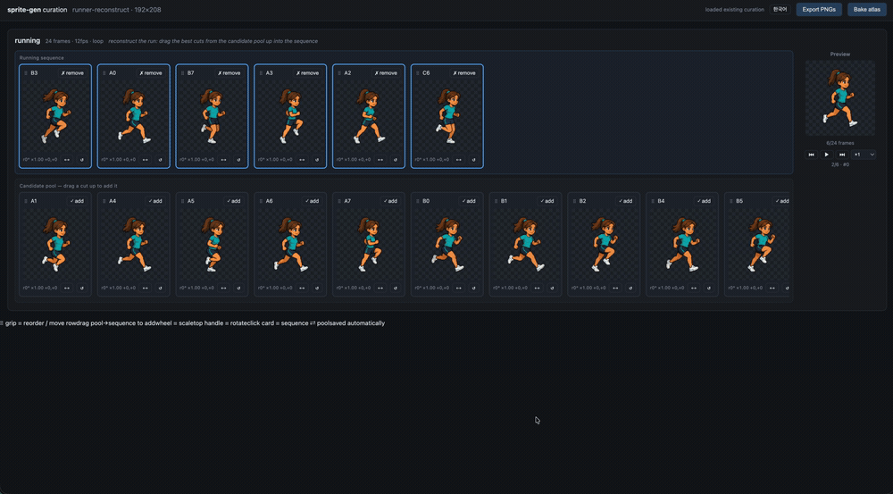

# Changelog

> Version policy (2026-07-11, Soohong): pinned to **1.56.x** — the minor stays at 56 as a Sol (5.6) homage; only the patch number increases.
> The three releases that shipped as v1.57.0/v1.58.0/v1.59.0 were retroactively renumbered to v1.56.7/8/9 (the old labels remain in commit messages for history).

All notable changes to `sprite-gen` are recorded here. Versions track the `version:` field in `SKILL.md`.

## v1.56.23 "Sol Atelier" - Base pixel editor with grid snap, curator session hardening

A day of live curation with Soohong drove ten fixes/features straight from real
usage. Full suite passes.

- **Base pixel editor** — an edit button on the base reference row opens a dedicated
  modal (pen/eraser/eyedropper/undo). Saving bakes into `base-source` itself
  (`POST /api/base-edit`; original backed up once as `.orig`; eraser restores the
  chroma background) because the base is generation identity truth — edits affect
  FUTURE generation, never already-extracted frames.
- **Grid-snapped base editing** — `GET /api/base-grid` runs the extraction detection
  chain (chroma removal → solid bbox → detect_pixel_grid → cut lines) and the editor
  paints whole logical blocks with a grid overlay, matching the rows' pixel-perfect
  feel; raw-pixel fallback (observable) when no confident grid.
- **Pixel-edit display = bake order** — edits composite in source space before the
  transform (same as apply_pixel_edits → apply_transform), so moving a frame now
  carries its edits; plain-view movement behavior unified (smooth CSS for all frames;
  re-quantized preview only on the pixel-perfect view, by design).
- **Generative tween scale normalization** — the mid frame's content height is
  rescaled to the reference pair's mean before the take is written (a codex tween had
  come out 14% larger than its siblings).
- **Heal-loop fix** — `engine_revision` cache is keyed by source mtimes; a
  long-running server no longer ping-pongs full re-extractions with fresh
  subprocesses after an engine update.
- Curator UX: tween button is row-header-only (removed from the zoom modal), inline
  spinner on Generate, save-failure banner (dead-tab edits can't be lost silently),
  final-atlas JSON pane pinned to the sheet's measured height, duplicate button moved
  to the card header's left, margin-zone badge and pixel-edit toolbar note removed.

## v1.56.22 "Sol Atelier" - fit.conform fully removed (loud rejection)

Soohong's 2026-07-14 decision was "no forced squash to logical_height" — but the
opt-in `fit.conform: true` flag survived in code, and on 2026-07-17 a
height-normalization attempt regressed straight through it. A removed decision must
not be revivable by one leftover flag: the option is now deleted, and a request that
still declares `conform` aborts loudly with the decision reference. The physical cap
(cell minus bottom margin) and the informational safe-area notice are unchanged —
`logical_height` remains a generation target / warning baseline, never an enforcement
mechanism. Regression: `test_pixel_snap.py::test_conform_flag_rejected` (the old
`test_conform_true_squeezes_to_contract` guarded the removed behavior and is gone).

## v1.56.21 "Sol Atelier" - Generative in-betweens (codex/grok), RIFE retired

The interpolation backend switches from flow-based VFI to the engine's own
generation layer (Soohong decided 2026-07-17 after a live 3-way comparison on the
founder down_action arm swing — sheet `tween-3way-compare.png` in the solvell tray):
codex drew the mid-pose in clean discrete pixels with identity intact, grok drifted
off-model, RIFE cross-faded into blur. Full suite passes; plumbing tests updated.

- **`--provider codex|grok`** (default codex) on `interpolate_frames.py` and
  `POST /api/interpolate`; the curator popover gains a GPT/Grok select. The two
  aligned frames attach as generation refs and `tween_prompt` composes the prompt
  deterministically from request truth (character description, chroma, t).
- **RIFE removed** — no ONNX model download, no onnxruntime dependency (the
  `[interpolate]` extra is gone). Unknown providers are rejected loudly.
- **Auth contract documented** — generation always runs on the server machine's
  provider CLI (machine-local OAuth); the browser never carries credentials, which
  is why the GUI button works without any browser-side auth. Prereqs + failure modes
  in `docs/frame-interpolation.md`.
- `/api/run` during a post-tween full re-extraction now reports busy (503,
  "re-extraction in progress") instead of a manifest-consistency error the view
  showed as corruption.

## v1.56.20 "Sol Atelier" - Tween popover on demand + frame-pair pick mode

Two UX fixes on the tween button (Soohong 2026-07-17): the parameter popover no
longer sits permanently open, and the interpolation pair is picked by clicking
frame cards instead of typing indices.

- **Popover visibility bug** — `.tween-pop { display: flex }` overrode the `hidden`
  attribute's UA `display: none`, so the popover was always visible. Fixed with
  `.tween-pop[hidden] { display: none !important; }`; the popover now opens on the
  tween button click only, and opening one row's popover closes any other.
- **Pick mode** — while a row's popover is open, that row's frame cards become
  pickable (crosshair cursor): clicking a card selects it as the interpolation pair
  (blue border + ring, max 2, third pick replaces the oldest, click again to unpick),
  filling from/to automatically. The row's normal sequence-selection blue border is
  suppressed during pick mode so only the picked pair reads blue.

## v1.56.19 "Sol Atelier" - Curator tween button (in-betweens from the GUI)

The interpolation feature surfaces in the curation view (Soohong: "GUI 표시하고").
Full suite **227 passed**; live e2e through the endpoint regenerated the founder_v7
blink take byte-identical and re-extracted all 36 rows (HTTP 200).

- **Row-header "Tween" button** — each state row (and the zoom modal) gets a tween
  button next to GIF; a small popover takes from/to frame indices and t, then
  `POST /api/interpolate` writes the take and re-extracts the FULL batch (~1-2 min),
  and the view reloads into the new run generation. Errors surface in the status bar.
- **`POST /api/interpolate`** — validates state/index/t (400 with reason) and runs
  `interpolate_frames.py --extract` through the existing script-runner path, so the
  run-dir single-writer lock and staging/atomic-swap guarantees apply unchanged.
- Note: the server process needs onnxruntime for the real model (launch with an
  interpreter that has `sprite-gen[interpolate]` installed); without it the endpoint
  fails loudly with the install hint.

## v1.56.18 "Sol Atelier" - AI frame interpolation (RIFE in-betweens as takes)

Frame interpolation as a first-class pipeline feature (Soohong requested 2026-07-17:
"put it in as a capability, not a one-off"). A new in-between frame — canonically a
half-closed eyelid between an open-eye and closed-eye idle frame — is generated by
RIFE and recorded through the existing take contract, so AI still touches only the
raw stage and the deterministic extraction path bakes the logical frame. Full suite
**227 passed**; the founder_v7 blink take regenerated **byte-identical** through the
new CLI (deterministic e2e).

- **`sprite_gen/interpolate.py` (`scripts/interpolate_frames.py`)** —
  `--run-dir --state --between A B [--t 0.5] [--label L] [--extract]`. Aligns the two
  frame components by upper-body registration (static pixels coincide → the model
  morphs only the moving part), pads /32 on the request chroma, runs RIFE 4.9 ensemble
  ONNX (same model artkit uses; auto-downloads to `~/.cache/sprite-gen/`, truncation
  aborts loudly), and writes the mid frame as `raw/<state>.takes/<label>.png` +
  `states.<state>.takes` (same-label rerun is idempotent).
- **Full-batch-only `--extract`** — partial extraction is deliberately not offered:
  the run-wide shared palette is per-batch (v1.56.17 known limitation), so a
  single-state extract would shade that row from a different palette.
- **Optional dependency** — `pip install 'sprite-gen[interpolate]'` (onnxruntime).
  Missing runtime aborts with the install hint; no silent skip.
- Docs: `docs/frame-interpolation.md` (+ SKILL.md script map / docs tree). Tests:
  `tests/test_frame_interpolation.py` (stub-injected plumbing: alignment canvas
  contract, take write, request idempotency, loud rejections).

## v1.56.17 "Sol Atelier" - Pixel-perfect fringe crop fix, palette default 48

Two pixel-perfect quality defects found by Soohong while curating founder_v7 at zoom
(2026-07-17): stray edge pixels / smeared detail after the pixel-perfect toggle. Root
causes measured on the real run, both fixed with regression tests. Full suite
**225 passed** (one pre-existing local-env version-metadata failure healed by editable
reinstall).

- **Solid-alpha grid crop** (`solid_alpha_bbox`) — `tighten_components` and
  `pixel_snap_logical` now crop components to the α>=128 bbox before pitch/phase
  detection and grid snap, matching the opacity rule used by `grid_snap_downscale` /
  `binarize_alpha` / `apply_palette`. The any-alpha `getbbox()` crop let sub-128
  chroma-matte AA fringe shift the grid origin and inflate `_grid_edges` cell-count
  rounding by one — every cell sampled off the true block (color mixing), and
  fringe-only edge cells solidified into debris pixels outside the silhouette
  (founder_v7: bbox +1~4px on most frames). Degenerate all-fringe components fall back
  to the any-alpha bbox. Regression: `test_pixel_snap.py::test_fringe_does_not_inflate_grid`.
- **Run-wide palette default 24 → 48** — the shared median-cut palette is split across
  every row in one extraction batch; 24 starved rare point colors in multi-state
  batches. Measured on founder_v7's 36-state batch: nearest palette entry to the gold
  hair-tie/medallion color was ΔRGB 59 at 24 (detail absorbed into brown) vs 5.5 at 48.
  Retro-constrained runs opt back down via request `fit.palette_size`. Regression:
  `test_pixel_snap.py::test_shared_palette_preserves_rare_saturated_color`.
- **Known limitation (observed, not yet fixed)** — the shared palette is built from the
  states present in the current extraction batch, so a partial re-extract (single-row
  heal after a reroll) shades colors from a different palette than a full-batch run:
  same inputs, batch-composition-dependent output (idempotency gap). Full-batch heals
  are consistent; the planned fix is a run-level palette derived from all raws with its
  own cache key.

## v1.56.16 "Sol Atelier" - Per-state GIF export, atlas cell reuse, clone origin badges

A patch polishing the curation view's export and clone experience. A single state row
can be exported straight to GIF, frame clones no longer grow the atlas texture, and a
clone card shows at a glance which original it came from. Full regression suite
**222 passed**.

- **Per-row GIF download** — a GIF button on each row header. The server computes that
  row's current composed sequence (selection/order/transforms/pixel edits, clone
  instances included) on the spot and returns a raw GIF file
  (`GET /download/gif?state=<name>`, not a zip). `compose_sprite_gif` gains a `--state`
  filter — a single-state export replaces only that state's entry in `gif-manifest.json`
  and preserves the other states' records. Unknown states fail loud. Single GIFs bake at
  **4x nearest-neighbor** by default (`--scale`, `?scale=` to adjust) — prevents viewer
  upscaling blur; pixel data unchanged.
- **Atlas cell reuse + `durations_ms` frame-timing contract** — clone instances that
  bake to the same (source frame, transform, pixel edits) share one atlas cell. Rects in
  `frame_layout.rows` repeat in playback order (the Aseprite-JSON-isomorphic pattern),
  so frame clones/loop delays don't grow the texture. Atlas width = the maximum
  unique-bake count per row. `animation.rows.<state>.durations_ms` is the SSoT for
  per-frame display time (currently uniform from fps — when a per-frame editing UI
  lands, only this field goes non-uniform).
- **Clone origin badge + final atlas section** — a clone card's badge shows its source's
  unique display name (take label first, else #index); clicking it scrolls to and
  highlights the original card. A final-atlas section at the bottom of the page
  (sheet | runtime `manifest.json` split view, with a computed-at timestamp)
  auto-refreshes after an atlas download. Also blocked the event conflict where
  ± scrubber clicks leaked into the stage zoom modal.

## v1.56.15 "Sol Atelier" - Eyedropper color-sampling tool

Added an **eyedropper** to pixel editing in the curator's zoom-edit modal. Built for
the request to pick a color already used in the sprite and paint with exactly that
color.

- Eyedropper button in the pixel-edit toolbar (next to pencil/eraser). Once active,
  clicking a pixel samples the **currently displayed color** at that point (base frame
  plus already-applied pixel edits take precedence) into the color picker/pen, then
  **switches straight to the pencil** so the sampled color can be painted immediately.
- Transparent/erased pixels are ignored (nothing to sample). Eyedropper mode is
  distinguished by a `copy` cursor, with an SVG icon and the shared `data-tip` tooltip.
- Frontend-only change (`curator.js`/`curator.css`) — no engine/extraction-path
  regression; sampling and pencil hand-off verified end-to-end in the browser.

## v1.56.14 "Sol Atelier" - Curation view matures, generation identity/isolation hardening, per-row preservation, frame clones

The release that turns the curation view into the proper workbench for character
review. It converges the 84 commits since v1.56.13 under one contract
(run-contract.md): live view, generation identity, isolation, pixel-perfect, file
taxonomy, takes, per-row curation preservation, and frame clones. Full regression
suite **221 passed**; the existing extraction golden path is unchanged.

- **Structural contract SSoT (`docs/run-contract.md`)** — one document owns the
  pipeline stage I/O, the run-dir folder tree, the curation-view display contract, and
  the `--pngs-dir` import-source rules; SKILL/architecture/curation point at it instead
  of restating it. On startup the view self-reports, via the `contract` field of
  `/api/run`, that the four display elements (base reference row, generation-material
  chips, pixel grid, original-quality toggle) are satisfied.
- **Live contract** — the "re-extract" concept is removed from the view. `frames/` is a
  derived cache of (raw + request + engine), keyed per row by `engine_revision`.
  `/api/run`, `/api/progress`, compose, and downloads re-derive stale rows automatically
  via `heal_run` on entry; when the engine changes, an open page recomputes and reloads
  on the next poll. The three top buttons now mean **atlas/PNG/GIF download**
  (`GET /download/{atlas,pngs,gifs}`) rather than "apply to game".
- **Generation identity + isolation hardening** — the run-generation fingerprint
  `run_revision` rejects stale autosaves/sidecars (HTTP 409, No Silent Fallback).
  `--force` re-imports and re-extractions build in staging and publish via atomic swap
  under `publish_guard` (reader/writer isolation); a failed extraction never publishes
  partial frames (whole-generation atomicity). The manifest↔frameset↔request
  consistency gate, canonical-JSON schema validation, payload URL percent-encoding, and
  XSS escaping are enforced fail-loud.
- **File taxonomy layout (taxonomy/v1)** — a directional character's raw/frames split
  into `raw/<dir>/<pose>.png` and `frames/<dir>/<pose>/`, so flat folders no longer
  bloat as poses grow. The base → directional anchor (single crop) → rows → mirror
  ownership chain is scaffolded into the pipeline structure.
- **Pixel-perfect maturation** — per-row pixel-perfect toggles plus a global toggle,
  twin (plain/orig) equal footprint plus grid-snapped transform baking plus a live snap
  preview, a high-resolution original-quality display for pp-off, and input-grid
  (actual cut lines) / final-mapping grid overlays on the original view.
  `fit.conform=false` (native logical size, no squash) is the default; conform is
  opt-in. Margin encroachment is an informational notice (not a reroll).
- **Pipeline-view sidebar** — the generation structure recomposed as a file-tree dock
  (Kuma-picker style): pipeline/files as two blocks, flow animation with elbow
  connectors, live progress sync (`/api/progress`, 3-second polling), collapse/expand
  animation.
- **Curator editing tools** — color-palette pixel editing (pencil/eraser; sidecar-only,
  originals untouched), a stash pool modal, a hover scrubber at the stage's bottom
  right, and a zoom-edit modal (⛶/double-click).
- **Takes as a first-class contract** — candidate/supplement strips for the same state
  are declared as `states.<state>.takes` plus `raw/<...>.takes/<label>.png`; extraction
  appends them after the primary and consumers count row size via `state_frame_total`.
- **Per-row curation preservation (salvage)** — root fix for user selections/stash
  being wiped wholesale whenever an engine change re-derived frames. With a per-row
  `revision` (a segment fingerprint of the source raw/take content; a prefix rule
  allows take appends), salvageable rows are salvaged; dropped rows are first backed up
  verbatim to `curation.stale-<hash>.json` and surfaced in a view banner (no silent
  loss).
- **Frame clones** — sidecar first-class `clones` {clone idx: source idx}. A clone is a
  full instance with its own transforms/pixel edits/order, and compose/GIF/PNG/cycle
  read the source file via `source_frame_index` (no files created in the derived
  cache).
- **Curator UX cleanup** — removed the mistake-prone card-click toggle between
  sequence↔pool (add/remove buttons and title drag only), removed the ⠿ grip (the
  title is the drag handle), three-tier card layout (header/info/buttons), removed the
  directional SVGs and color emphasis on add/remove, moved the preview position
  indicator below the canvas. A shared `data-tip` tooltip component replaces native
  titles — hovering a title pops the frame's full name, draggable and copyable (agent
  collaboration).

## v1.56.13 "Sol Forge" - PerfectPixel integration complete, real-generation correction loop proven

Closed the PerfectPixel port as one verifiable release. The deterministic
post-processing, automatic inspection/correction, and Codex/Grok generation layers
added across v1.56.7 through v1.56.12 are wired to a real Sol Valley row, reproducing
convergence and best-candidate preservation within the 3-pass contract.

- A real Grok `up_idle` generate-extract-inspect-hint-regenerate loop converged from
  score **91 -> 100** on the 2nd attempt. `min_attempts=2` was set explicitly so the
  correction loop itself is exercised even when the first candidate clears the gate.
- The best/candidate request, raw, and manifest SHA-256 all match, confirming
  best-candidate preservation. The per-attempt three-image proof set
  (original/grid/pixel-perfect) auto-inspection also passed.
- On the representative row, projection separation held at 4/4, x-centroid sigma
  improved **0.302 -> 0.108**, YCbCr errors stayed at 0, and run-length warnings went
  **3 -> 0**.
- User docs were aligned with the actual engine contract: projection, alpha-centroid,
  YCbCr, run-length cross-check, inspect/score/correction-loop, `gen`, and the
  image-gen shuttle are reflected in the translated READMEs and the architecture doc.
- Full regression suite **128 passed**. The existing extraction golden path is
  unchanged.

## v1.56.12 "Sol Forge" - Generation SSoT unified (`sprite_gen/gen/`, perfectpixel-studio C-gen)

Unified the generation layer into a single engine module. The `image-gen` skill's
standalone implementation (codex `image_gen` session extraction plus chroma
post-processing) was ported into the engine, and a grok Imagine adapter was added.
Gemini/OpenRouter/fal/BytePlus providers are deliberately left out.

- **New `sprite_gen/gen/` + CLI `gen` + `scripts/generate_sprite_image.py`** —
  prompt (+ optional ref) → one validated raw PNG. `--provider codex|grok`,
  `--transparent --chroma-key magenta|green` (the deterministic transparency contract,
  ported), `--report` (provider, `elapsed_seconds`, `session_id`, chroma metrics).
- **codex adapter** (`codex_provider.py`) — fresh `codex exec --json` (prompt-cache
  isolation), rollout resolution via `thread.started.thread_id` (legacy `session id:`
  text also supported), deterministic inline-base64 decode (both
  `image_generation_call` and `image_generation_end`), distrust of model-reported
  paths, session jsonl cleanup after extraction.
- **grok adapter** (`grok_provider.py`) — `grok -p --sandbox workspace
  --always-approve` instructed to save to an exact path, then PNG magic validation
  (`--effort` not passed — media models 400 on it). `--ref` takes the `image_edit`
  path.
- **Transparency contract ported** (`chroma.py`) — image-gen's
  `chroma_key_transparent.py` becomes an engine function. Residual RGB on transparent
  pixels is fail-loud (No Silent Fallback).
- The `sprite_gen.generate_image` placeholder is replaced by a `sprite_gen.gen`
  redirect shim (no two generation surfaces — SSoT). The `image-gen` skill is reworked
  into an engine shuttle; its implementation is DEPRECATED/archived.
- **Real e2e**: the same row prompt generated on both codex (39.02s) and grok (18.42s);
  the speed comparison and side-by-side proof are preserved in
  `docs/reports/perfectpixel-c-gen/` (grok ~2.1x faster).
- New tests `tests/test_gen.py` (extraction, chroma, prompt, orchestrator fake
  provider; no network) plus `gen` added to the package surface. Docs: `docs/gen.md`.
  Zero regression on the existing golden extraction path.

## v1.56.11 "Sol Edge Runner" - Automatic inspect/score/correction loop (perfectpixel-studio B-loop)

Ported the closed-loop structure of perfectpixel-studio's `inspect.go` / `score.go`
into the sprite-gen engine. Generation calls still belong to the C-gen stage, so this
release closes only deterministic measurement, correction-hint generation, and a
provider-less dry-run loop.

- **`sprite_gen.inspect` + `scripts/inspect_sprite_run.py` + CLI `inspect`** — merges
  into one report: expected/found frame counts against `sprite-request.json`, a 64-bin
  RGB histogram, dHash silhouette similarity, motion presence, centroid σ, and the
  per-state warnings/errors from the existing `frames-manifest.json`. With no extracted
  frames it reads the raw strip and measures the natural pose count from the projection
  signal.
- **`sprite_gen.score` + `scripts/score_sprite_run.py` + CLI `score`** — takes only an
  inspect report and produces a 0-100 score, `candidate_rank`
  (`found*100-errors*10-warnings`), and provider-ready correction hints. Duplicate
  hints are deduped order-preserving.
- **`sprite_gen.correction_loop` + `scripts/run_correction_loop.py` + CLI
  `correction-loop`** — up to 3 passes of inspect → score → hint. Dry-run leaves
  reports only, no generation; actual regeneration runs only when a
  `--provider-command` is given explicitly (fail-loud otherwise). Best-candidate
  preservation is pinned by a small fixture test.
- **founder_v7 real-data dry-run**: `docs/reports/perfectpixel-b-loop-founder-v7/`
  preserves the `up_idle` A-runlen warning (collapsed pitch/outlier) → score 91 →
  pixel-grid correction-hint log.
- 3 new tests plus a package surface update. The existing golden extraction path is
  referenced read-only; default extract/compose behavior is unchanged.

## v1.56.10 "Sol Edge Runner" - Run-length-mode pitch estimator (perfectpixel-studio port, cross-check only)

Ported unfake from perfectpixel-studio's `internal/sprite/pixelize.go` (MIT) —
estimating the real block size from the mode of same-color run lengths.
`detect_pixel_grid` (edge histogram) refines the fractional pitch only within a ±0.75
window around an integer seed, so it fails silently when the seed lottery fails — real
accident: on the Sol Valley protagonist component, the y pitch collapsed to the x value
(29.52; measured 30.56; refinement score 0.78 for the true value vs 0.07 for the
collapsed one — outside the window, it never even became a candidate). Run length is a
signal independent of the edge histogram (distance between edges, not edge positions),
so it serves as a second opinion.

- **New `estimate_pixel_grid_runlen` (estimation only)** — unlike the original:
  per-axis separated histograms (required to catch axis collapse), run-length weighting
  `hist[s]·s` (same as the original; prevents short-run dominance), and
  fractionalization via the weighted centroid of the mode ±1 window (true 30.56 → a
  44:56 mix of 30/31 runs → the centroid recovers it). Confidence gates: too few runs,
  harmonic-family (k·mode±k) mass under half, or under 32px → gives up observably as
  (1.0, 1.0).
- **New `crosscheck_pitch_runlen` + a hook right after the pixel-perfect consensus
  (default on, warning-only)** — disagreement surfaces only as report `warnings` plus
  stderr `[pitch-crosscheck]`. Snapping keeps using the `detect_pixel_grid` consensus
  alone (no auto-replacement, No Silent Fallback — which one to use is for a human or
  an upper gate to decide). The runlen error model (AA nibbles both ends of runs → a
  downward per-pixel bias) shapes the rules:
  - Divisor misdetection (runlen ≫ grid, slack 2px): the mode where true 29.5 is caught
    as 14.73.
  - Multiple/harmonic misdetection (grid ≫ runlen, slack 12%+3px).
  - Axis-ratio (y/x) disagreement > max(2%, 0.7/pitch): the axis-collapse mode — a 3.5%
    per-axis gap hides under the per-axis rules, but the shared AA bias cancels in the
    ratio, so it is caught. The 0.7/pitch floor absorbs the small-pitch amplification
    of per-axis bias deviation (subpixel) — the indeterminate 3-9% drift in
    founder_v7's 8-15px band stays silent while the hero-scale (30px) real-collapse
    signal (2.8%) fires.
- **Measured (founder_v7, 22 states, read-only)**: 0 warnings across the 20 healthy
  states; warnings land exactly on the 2 real failures — down_carry_run grid
  (4.00, 4.00) vs runlen (6.91, 7.96) (plan-recorded truth ~9, divisor collapse), and
  side_carry_idle grid x=6.00 vs runlen 10.99.
- 110 tests OK (10 new: integer/fractional per-axis ground truth · noise/tiny
  no-confidence · 2 healthy-consensus silences · divisor fixture (20x36 @ 29.5/30.6) ·
  y-axis collapse fixture (28x60 @ 29/30.3, deterministic reproduction of the accident
  mechanism) · confidence gate · pipeline integration: warning surfacing plus
  bit-identical frames when runlen is neutralized = zero snap impact pinned). Zero
  regression on the existing 100 tests.
- MIT attribution added to NOTICE (perfectpixel-studio internal/sprite/pixelize.go).

## v1.56.9 "Sol Edge Runner" - chroma.mode: ycbcr (perfectpixel-studio port, opt-in)

Ported the chrominance (CbCr) plane matting from perfectpixel-studio's
`internal/sprite/chroma.go` (MIT). The current RGB path classifies by RGB distance to
the key, so background shading, gradients, and JPEG 4:2:0 chroma noise survive once
they leave the erase radius (96) — this path ignores luma entirely and separates in the
CbCr plane only, robust to lightness changes.

- **New `chroma.mode: "ycbcr"` value (opt-in; default "rgb" unchanged)** — CLI
  `--chroma-mode {rgb,ycbcr}` is an explicit override over the request; the effective
  value is written back into the request. The default path is bit-identical (0 golden
  regressions).
- Pipeline: background key = the **CbCr histogram mode** of corner patches plus a thin
  border (never the mean — it doesn't get dragged by gradients; if the declared key
  family makes up 12%+ of border samples, that cluster wins) → Hermite smoothstep soft
  matting (24→72) → **despill that subtracts only the key-direction component**
  (orthogonal colors preserved) → border 4-connected flood fill (interior isolated
  key-family pixels preserved) → isolated-dot removal and pinhole filling →
  **self-diagnosing fallback**: on an opacity spike (subject over-erased) or a
  declared-key-residue spike (background not removed), re-matte with the pure declared
  key and adopt whichever is better — the fallback is observable via extraction
  warnings (No Silent Fallback).
- **Measured (green key)**: on a degraded-source synthetic fixture (a shaded green band
  with only luma lowered — RGB distance 115, outside the erase radius, beyond unmix
  reach), green tint residue **1728 → 0**, band opacity residue **1920 → 0**. Meanwhile
  on founder_v7's clean flat-key raws (22 states total): fringe (RGB≤150) 0→0 and CbCr
  residue 0→0 (tie); green-tint edge residue rgb 9 vs ycbcr 2779 (the 0.92 fixed-scale
  despill cannot fully remove tint, unlike the current exact-solve unmix; not subject
  loss — the -1 to -2.3% opacity coverage delta is an edge-convergence difference).
  **Conclusion: keep rgb as the default for clean sources; ycbcr is an opt-in for
  degraded sources (shading/gradients/JPEG)** — stated in `docs/chroma-alpha.md`.
- 100 tests OK (7 new: shaded-background rgb/ycbcr contrast · both branches of
  mode-based key detection · key-direction despill/orthogonal preservation · flood
  interior preservation · self-diagnosing fallback observability · CLI e2e ·
  default-rgb pinning).
- NOTICE: MIT attribution.

## v1.56.8 "Sol Edge Runner" - segmentation: projection (perfectpixel-studio port, opt-in)

Ported the projection-profile + DP optimal-cut frame separation from
perfectpixel-studio's `internal/sprite/segment.go` (MIT) into `sprite_gen/segment.py`.
connected-components merges touching poses into one blob when an arm or prop touches
the neighboring frame, failing extraction — the vertical alpha projection P[x]=Σα
counts natural poses by its valleys (gutters), and when the valleys vanish, DP finds
the minimal cut of `Σ P[cut] + λ·(width−ideal)²` to split into exactly the expected
frame count.

- **New `fit.segmentation: "projection"` value (opt-in; default components unchanged)**
  — CLI `--segmentation {components,projection}` is an explicit override over the
  request. When active it is a pre-pass that splits the strip at cut boundaries right
  after chroma removal and reassembles it with transparent gutters, so the downstream
  connected-components, satellite-merging, and pixel-perfect paths run unchanged. A
  failed separation leaves the strip untouched and reports to stderr — downstream fails
  observably with the existing errors (No Silent Fallback).
- **Fused fixture golden** (`tests/fixtures/run-fused/`) — a 3-pose strip fused into
  one blob by touching arms: components fails (error recorded), projection separates
  3/3 (golden manifest pinned).
- **Fully transparent for already-separated strips** — enabling projection on the
  existing golden runs is pinned by test to produce bit-identical manifests.
- founder_v7 measured: zero regression across the 8 carry/action states (natural
  valleys keep the expected counts). On real fused strips rebuilt by overlapping
  down_carry_walk frames at 16/24/32px, components collapses 3→1 blobs (extraction
  fails) while projection separates 6/6 in every case.
- 93 tests OK (10 new: fused golden, opt-in-absent failure, CLI enable/disable,
  bit-identity, pure functions).

## v1.56.7 "Sol Edge Runner" - align_x: alpha-centroid (perfectpixel-studio port, opt-in)

Ported the alpha-weighted centroid alignment from perfectpixel-studio's
`internal/sprite/extract.go` (MIT) into fit. A bbox center pushes the torso the other
way on frames with an extended arm or weapon, creating horizontal jitter in playback;
cx=Σ(x·α)/Σα is dominated by the large-area torso, so the axis stays stable (upstream
measured σ 27.2px→0.2px).

- **New `fit.align_x: "alpha-centroid"` value (opt-in; default foot-centroid
  unchanged)** — aligns to cell center the alpha-weighted centroid that excludes
  soft-matting fringe (α ≤ 10) from the weights. All three paths are supported —
  `fit_to_cell` / `fit_pixel_perfect` / `row_placement` — with source attribution
  comments.
- **Per-frame placement in the pixel-perfect row path** — the existing modes use one
  shared row-union left for all frames, so the registration residual of
  `register_row_frames` stays as jitter regardless of the align_x choice (measured:
  bbox-center and foot-centroid have identical σ). Only alpha-centroid seats each
  frame's centroid at cell center (the logical grid snap preserves flip symmetry). Jump
  arcs remain the job of the existing `ground_frames: false` (same role as the
  upstream baseline offset).
- **`scripts/measure_align_sigma.py`** — reports the σ of per-frame centroid X for
  each align_x variant (the source run is read-only; it is copied to scratch and
  re-extracted). founder_v7 measured: down_run σ 0.53px→0.17px (−68%); down_walk was
  already saturated at 0.03px (unchanged).
- 83 tests OK (5 new: fringe insensitivity, opt-in guarantee, per-frame jitter
  cancellation, grid snap/clamp).

## v1.56.6 "Sol Edge Runner" - Collapsed frames no longer poison the row consensus pitch + span double-counting

In Sol Valley's `down_carry_run`, 3 of 6 frames collapsed to pitch 3.00 (true value
8.56), poisoning the median consensus to **5.00** and mis-snapping the whole row.
v1.56.5's axis-mismatch guard cannot catch it when both axes collapse **together**
(3.00/3.00).

- **Collapsed frames are dropped from the row consensus pitch**: within a row the true
  pitch is nearly constant, so per-frame detections under 60% of the maximum are
  treated as collapsed and excluded before taking the median. How many were dropped is
  left as a warning (no silent fixing). Measured: consensus 5.00 → 8.56 recovered.
- **`_axis_refine`'s span could exceed bins** — the circular window counted the same
  bin twice, making `frac > 1.0` and inflating scores for small pitches. Clamped with
  `span = min(bins, ...)`.
- 78 tests OK.

## v1.56.5 "Sol Edge Runner" - Axis-mismatch guard: when one axis collapses to a divisor, use the trusted axis

On Sol Valley's `down_carry_walk` row, one frame's per-axis pitch came out
**9 horizontal / 3 vertical** (true value 9; independent measurement = edge-spacing
mode). The snap result was crushed horizontally. An arms-overhead pose fills the frame
with vertically uniform bars, **starving vertical edges**, and on that axis a divisor
of the true pitch (3 = 9/3) wins.

- **The guard**: if the per-axis pitches diverge by more than 1.5x, the pitch of the
  axis with more total edges is used for both. Real axis differences from non-uniform
  rescaling are around 2% (Sol Valley chibi base 30.38 / 30.92), so a 3x gap is
  physically impossible — it is a detection failure on one axis.
- Divisor candidates (`s/2`, `s/3`) stay — in practice the integer seed often grabs
  2x/3x/5x harmonics of the true pitch (seeds 19 / 28 / 29 / 48 in the same row, true
  value 9). Removing divisors would strand the search on the harmonic.
- **Reproduction limits**: the raw from the accident was discarded, so that frame could
  not be reproduced. Synthetic input (random dots + gaussian blur) does not produce the
  collapse — p=3's score ceiling is 0.25 while p=9's is 0.75. So this release is **a
  guard against the observed failure pattern, not a root-cause isolation**. It reacts
  only to the observable axis-mismatch signal, so healthy images are unaffected.
- 2 regression tests: a synthetic frame with starved vertical edges, and a small-block
  (9px) round trip. 78 tests OK.

## v1.56.4 "Sol Edge Runner" - Measure pitch per axis (horizontal/vertical block sizes can differ)

`detect_pixel_grid` forced one pitch onto both axes. Output rescaled at non-uniform
ratios has mismatched horizontal and vertical block sizes — the Sol Valley protagonist
chibi base is 30.38px horizontal / 30.92px vertical. Using one pitch (30.92) on both
axes gets the vertical right while **the horizontal slides wholesale**: the fraction of
real block boundaries sitting on grid lines was 11.7% horizontal / 92.6% vertical. The
snapped face shattered as a result.

- `detect_pixel_grid` now returns `((pitch_x, pitch_y), (phase_x, phase_y))`.
- `grid_snap_downscale(pitch=...)` accepts both a scalar and an (x, y) pair (existing
  calls stay compatible).
- Seeds include **both per-axis seeds and the two-axis combined seed**. Per-axis alone
  lets one axis's integer detection wobble into a divisor on noise (true 17.24 -> seed
  9); combined alone puts one axis's true value outside the ±0.75 refinement window on
  images whose blocks differ per axis. Keeping both blocks both failures.
- The integer scorer is split into `_axis_int_score` / `_axis_int_seed`, shared with
  `detect_pixel_pitch`.
- **Measured (Sol Valley chibi base)**: horizontal alignment 11.7% -> 75.7%; vertical
  stays at 92.6%.
- **Regression test**: on dots upscaled non-uniformly at 24 horizontal / 30 vertical,
  the per-axis pitches are each detected and snapping restores the original logical
  dots pixel-exactly. v1.56.3 fails this test.
- 76 tests OK.

## v1.56.3 "Sol Edge Runner" - hotfix: even-division grid stretched over bbox remainder

v1.56.2's "divide the length evenly by cell count" in `_grid_edges` stretched the grid
whenever the sprite bbox is not an integer multiple of the block. Found on the Sol
Valley protagonist chibi base — bbox 849px = 27.46 blocks (AA fringe); dividing by 27
gives 31.44px cells, off by 0.52px per cell from the true 30.92px block, drifting half
a block by the right edge — and the snapped face shattered (one eye lost, outline
fragmented).

- **Even division is used only when the body is close to an integer multiple of the
  pitch** (residual <= 1/4 block). In that case it absorbs small pitch-measurement
  error (measuring 16.00 as 15.96) so the grid lands exactly.
- Otherwise grid lines are placed directly at `lead + i*pitch` and the leftover
  remainder is **absorbed by the last cell alone**. Either way the pitch is never
  accumulated by repeated addition, so floating-point error does not build up.
- **Regression test**: with non-integer remainders (1/7/14/20px) appended to the right
  of the bbox, every cell width except the last must be within ±1px of the true pitch.
  v1.56.2 fails this test.
- All existing fractional-scale round-trip tests kept. 74 tests OK.

## v1.56.2 "Sol Edge Runner" - pixel-grid detection: fractional pitch, phase, divisor collapse

Patch release in the Sol Edge Runner line. Three real bugs in `detect_pixel_pitch` / grid snapping, all found while rebuilding the Sol Valley protagonist base and all pinned by synthetic ground-truth tests (`tests/test_pitch_ground_truth.py`).

- **The true pitch lost to its own divisor.** The window width was `w = 1 if p >= 8 else 0`, so true pitches with an open window (p>=8) had their chance expectation inflated to 3/p while closed-window divisors (p<8) only carried 1/p. Even with edges 100% on the grid, p=4 (0.75) beat p=8 (0.625), so k=8,10,12,14 collapsed to exactly k/2. The window width is now identical for every p and residue classes are counted as sets (no double-counting): integer detection accuracy 7/11 -> 11/11.
- **Pitch is measured fractionally.** AI-drawn pixel art does not have integer block widths (Sol Valley protagonist base = 17.22px). Rounding to an integer accumulates error per cell — 5.5px after 23 cells, a third of a block — so cell boundaries crossed block centers and small details were averaged away. The new `detect_pixel_grid()` produces a (fractional pitch, fractional phase) pair, and `_grid_edges()` divides the length evenly by cell count instead of accumulating the pitch: **fractional measurement, always-integer output grid.** Divisors (2,3) of the seed are also scored, stopping the harmonic 33 being picked at true 16.5; the refinement search includes the seed value itself (previously it only looked at 15.99/16.01 and missed exactly-integer grids); and phase comes from the weighted centroid of the edges inside the window, not the window's geometric center (which sat half a window off on perfectly aligned grids).
- **The curation-view grid was fake.** The overlay drew a line per cell pixel, but pixel-perfect snaps in logical-pixel units (`pp_scale = cell_height // logical_height`). founder_v4 had 64px cells at logical 30 -> lines shown exactly 2x denser than the real grid. The server now ships `pixelPerfect{logicalHeight, scale}` in the payload and the curator draws at that spacing. Runs that are not pixel-perfect have no snap grid, so the toggle is hidden.
- **Measured results** (Sol Valley protagonist base; fraction of real block boundaries sitting on grid lines): horizontal 30% -> 58%, vertical 5% -> 55%. Mean error horizontal 2.10px -> 1.74px, vertical 5.04px -> 1.59px.
- **Regression tests**: fractional-scale (12.0/14.35/16.0/16.2/17.24/20.0/23.7) round trips — upscale then snap restores the original logical dots. Size recovery 3/8 -> 8/8, exact pixel restoration 3/8 -> 6/8. (Exact half-pixel scales like 16.5 put block boundaries in the middle of screen pixels, a principled residual limit.) All existing 62 tests pass — assets produced with integer grids have unchanged output, so no re-extraction is needed.

## v1.56.1 "Sol Edge Runner" - slice-sheet: variant grid sheets to per-cell standing cuts

Patch release in the Sol Edge Runner line. Adds the `slice-sheet` tool, distilled from the Sol Valley dialogue cut-in overhaul (2026-07-09): one generated image holding a COLSxROWS grid of the same character's expressions becomes per-cell 512x768 RGBA cuts with a shared feet baseline and normalized body height.

- **New module `sprite_gen.slice_sheet`** + wrapper `scripts/slice_sheet_cells.py` + CLI subcommand `sprite_gen.cli slice-sheet`. Alpha truth stays `remove_chroma_background` (v1.13 4-pass); the module owns only cell geometry.
- **Geometry rules encode the field failures**: centroid component-to-cell assignment (grid cropping imported neighbour fragments), merged-figure split with in-cell re-label (a kunai-fused neighbour's hair shipped as a floating clothes fragment without it), border-touching debris drop at `--debris-fraction` 0.30 (in-cell effects like hearts survive), per-cell height normalization (a sheet shipped rows at visibly different body sizes under sheet-wide max scaling), feet pinned to `--baseline-y`, fail-loud empty cells.
- **Manifest path separators are POSIX-stable on Windows**: frames manifests, selected-cycle manifests, and unpack manifests now serialize run-relative frame paths with `/` separators instead of host separators, reported and first fixed by @bokjk in #2.
- **Docs**: new leaf `docs/sheet-slicing.md` (usage, geometry rules with their field accidents, sheet prompting guidance including the cream-background flood-fill ban); SKILL.md Script Map + Docs Topology entries.
- **Tests**: `tests/test_slice_sheet.py` synthetic-sheet coverage — height/baseline normalization, neighbour-overhang drop vs effect survival, zero chroma residue; `slice_sheet` registered in the package-surface run() guard.

## v1.56.0 "Sol Edge Runner" - Importable package SSoT, behavior unchanged

This is a behavior-preserving structural release. The public pipeline scripts remain backwards-compatible CLI entrypoints, while the algorithm implementation now has one importable `sprite_gen` package SSoT. The release is minor because `sprite_gen` is a new public import surface for downstream apps and MCP hosts.

- **`sprite_gen` package added.** The current script bodies were modularized into package modules instead of copying older desktop-v2 algorithm bodies, so v1.13.0 chroma unmix, despill, auto-key, fit, and pixel/plain frame behavior remains the algorithm truth.
- **`scripts/*.py` are compatibility wrappers.** Existing script commands delegate to package modules and preserve the previous CLI surface; wrapper `--help` output diffed 0 against the pre-wrapper baseline.
- **`runio` reentrant lock adopted from v2.** Same-process package calls can re-enter the run-dir lock without self-deadlocking, while atomic write/replace behavior stays unchanged.
- **Curation schema merged both sides.** The main `frame_variant` / `frame_filename` selection and v2 `deleted` state now coexist, so plain-vs-pixel frame choice and permanent deletion both survive.
- **Unified CLI added.** `sprite_gen.cli` exposes 8 subcommands: `prepare`, `extract`, `compose-atlas`, `preview`, `compose-cycle`, `compose-gif`, `unpack-atlas`, and `export-pngs`.
- **Packaging activated.** `pyproject.toml` now includes the `sprite_gen` package for editable installs and keeps the package metadata version synchronized with `SKILL.md`.
- **Behavior identity evidence.** The refactor regenerated the SSoT baseline commands and produced 118/118 identical output sha256 hashes against the pre-refactor baseline.

## v1.13.0 — Chroma peel removal, key-depth unmix, safer auto key sampling

This release removes the legacy fringe erase peel that became harmful after v1.12.0's soft-alpha unmix. The peel ran before unmix, deleted the original 1.1-1.3 px antialias band wholesale, turned silhouettes into binary stair-steps, and could erode thin outlines or hair strands by 1-2 px. Soft-alpha unmix now owns chroma boundary cleanup.

- **Fringe erase peel removed completely.** `--fringe-reach` and the `remove_chroma_background(..., fringe_reach=...)` parameter are gone; old CLI use fails loudly with `unrecognized arguments` instead of silently re-enabling a destructive path.
- **In-band unmix guard changed from subject-neighbor to key-depth.** In-band key blends are unmixed only when their distance from the keyed region is `<= 2`; out-of-band blends still use `--fringe-unmix-reach` (default 4). This fixes blend pockets whose inner pixels had no untinted `_SUBJECT` 8-neighbor and previously survived as `alpha=255` warm grey/brown crust.
- **`--fringe-unmix-reach 0` now disables all chroma boundary cleanup beyond the hard key cut.** Before the peel removal, `unmix_reach=0` still allowed the independent fringe erase peel to remove boundary fringe; in v1.13.0, the peel is gone, so `0` means no soft-alpha unmix and no peel cleanup. On the downscaled fixture `tests/fixtures/moe/moe_heart.png`, measured mid-alpha is `204` at reach 4, `196` at reach 2, and `0` at reach 0.
- **Optional unmix tunables are keyword-only.** `unmix_reach` and `spill_max_fraction` can no longer be passed as ambiguous positional arguments, preventing old six-argument calls from silently changing meaning after `fringe_reach` was removed.
- **Package metadata version synchronized.** `pyproject.toml` now mirrors `SKILL.md` at `1.13.0`; future releases must update both fields in the same release commit because editable installs and CI consume `pyproject.toml`, while the changelog treats `SKILL.md` as the release SSoT.
- **`--chroma-key auto` no longer counts opaque chroma background as subject** (commit `83b269b`). Candidate scoring excludes the detected flat background, records candidate `score` / `min_subject_distance` / `clears_erase_radius` / `background` metadata, and keeps the nearest-subject erase-radius guard.
- **Measured cleanup impact.** Sources are labelled per line. The full-resolution raw inputs live under `assets/chroma-repro/` (local-only, gitignored, not shipped); the downscaled fixtures under `tests/fixtures/` ship with the repo:
  - moe-heart raw, magenta key: mid-alpha `5,391 -> 11,621`; `6,274` former peel-band pixels, `alpha=255` residue `0`.
  - moe-mirror raw, green key: mid-alpha `1,971 -> 6,835`; `4,877` former peel-band pixels, `alpha=255` residue `0`.
  - accident fixtures: opaque subject pixels improve from herb `4,254 -> 4,415`, seed `4,501 -> 4,513`.
  - pixel-art after `binarize_alpha`: pixel-heart silhouette `+115 px`, pixel-mirror `+1,781 px`, discarded pixels `0`; recovered pixels are key-distant black outline colors on average `(35,26,19)` / `(7,9,11)`.
- **Tests and fixtures**: `tests/fixtures/moe/moe_heart.png` and `tests/fixtures/moe/moe_mirror.png` pin the green/magenta mirror cases; `tests/test_chroma_extraction.py` pins former peel-band soft alpha, heart material byte-identity, accident opaque baselines, and keyword-only fail-loud behavior; `tests/test_chroma_key_auto.py` covers the auto-key background exclusion.

## v1.12.0 — Soft-alpha chroma edges, trapped-spill despill, fit CLI parity

Non-pixel-target extraction produced binary alpha (0 or 255) — antialiasing died at the hard key cut, so every silhouette read as a staircase, and key-colored blend pixels trapped between hair strands survived as opaque magenta/green residue (351/339 px on the two repro runs). Extraction alpha cleanup in `extract_sprite_row_frames.py` is now a four-pass chain; the v1.10.1 guarantee (key-tinted subject interiors like hot-pink packets and purple crystals survive byte-identical) is regression-tested and unchanged.

- **Pass 1 — hard key cut** (unchanged): pixels within `--key-threshold` of the key erased, alpha=0 RGB cleared to `(0,0,0)`.
- **Pass 2 — fringe erase peel** (unchanged v1.10.1 semantics): in-band key-tinted pixels chain-adjacent to the keyed region erased, at most `--fringe-reach` layers. Erase set is byte-identical to v1.10.1, so the accident-fixture protections hold.
- **Pass 3 — soft-alpha unmix** (new): key-tinted blends the erase pass cannot represent — out-of-band boundary blends, and in-band specks touching untinted subject — within `--fringe-unmix-reach` (default 4) of the keyed region are solved against the blend model `observed = (1-k)·subject + k·key` and rewritten as despilled RGB + **partial alpha**. Silhouettes keep their antialiased coverage ramp; blend pockets inside interior holes (between hair strands) stop surviving as opaque residue. Measured on the repro runs: mid-alpha 0 → 2,092/2,263 px.
- **Pass 4 — trapped-spill despill** (new): small connected key-tinted clusters buried deep inside the subject (generator spill drawn into the hair, unreachable by any bounded peel) are detected by cluster size (≤ `--spill-max-fraction` of the subject, default 0.005, floor 32 px) plus one strongly tinted pixel (tint > 40), and color-corrected in place with alpha kept — no pinholes. Large key-tinted regions (real material, 7–20× above the threshold on the accident fixtures) and marginally warm skin tones never qualify. Key-tint residue on the repro runs: 351/339 → **0**.
- **Request JSON SSoT**: the extractor reads `chroma.unmix_reach` / `chroma.spill_max_fraction` from `sprite-request.json`, CLI flags override, and effective values are written back. Pixel-perfect path unaffected (downstream α≥128 binarize).
- **`prepare_sprite_run.py` fit CLI parity** (docs promised these since v1.10.0): `--fit-resample` gains `kcentroid`, `--fit-align-x` gains `foot-centroid`, and the `pixel_perfect` family is exposed — `--fit-pixel-perfect`, `--fit-logical-height`, `--fit-palette-size`, `--fit-detail-bias`, `--fit-outline {on,off,STRENGTH}`, `--fit-pitch-hint`. CLI overrides merge over `--request` JSON and the merged `fit` object is recorded in the run's `sprite-request.json`.
- **Tests**: new `tests/test_chroma_soft_alpha.py` on 1/8-NEAREST repro fixtures (`tests/fixtures/moe/`) pins boundary partial alpha, zero key-tint residue, deep-interior byte-identity, and the trapped-spill pass; `tests/test_pipeline_smoke.py` pins fit-CLI-to-request recording. The extraction golden manifest needed no update: the synthetic fixture strips contain no key-blend pixels, so passes 3–4 are no-ops there and the manifest matches bit-for-bit.

## v1.11.0 — SKILL.md becomes a thin hub; scenario detail moves to a `docs/` leaf network

Docs-only topology split (no script changes). A 589-line SKILL.md front-loaded every scenario's detail into every session; it is now a 299-line hub — BLOCKING gates, workflow commands, contract summaries, and one-click links into leaf docs read only when their scenario comes up. The split is lossless: every rule, number, and prohibition lives in exactly one place, hub or leaf.

- **SKILL.md hub (589 → 299 lines, `version: 1.11.0`).** Keeps verbatim the mandatory raw→deterministic gate, the Base Lock Gate criteria, the Motion Continuity BLOCKING declaration, the prompt/output/runtime contracts, and the step 0–5 command blocks. Adds a `## Docs Topology` section listing each leaf with a one-line "read when" trigger. The only deletion is the License And Attribution section (duplicated in README).
- **Five new leaf docs** carved out of the hub: `docs/pixel-perfect.md` (the `fit` object, `pixel_perfect` mode, stage ownership, role contract), `docs/states-and-frames.md` (MVP state scope, quick-path request, frame-count guidance), `docs/curation.md` (standalone curation-view recipe, webview usage, finished-sheet editing, multi-agent launch rules, `curation.json` schema), `docs/chroma-alpha.md` (key-selection branching, `auto` scoring, extraction internals, slot fallback), `docs/qa-motion.md` (full motion-continuity judgment criteria).
- **`reference/` folder retired**: `directional-anchor-workflow.md` and `locomotion-curation.md` moved under `docs/` (content unchanged, internal links updated).
- **`docs/architecture.md` refreshed to v1.10.x reality**: absorbs the base-frame ownership ASCII flow from the hub, documents the pixel-perfect fit path against the actual `extract_sprite_row_frames.py` call order, and replaces the retired HTML/PNG diagrams with embedded mermaid.
- **Retired files deleted**: `docs/architecture-diagram{,.ko}.{html,png}` (4 files, ~1.6 MB of hand-maintained diagrams superseded by mermaid) and `docs/skill-improvement-plan.md` (stale 2026-06-02 draft, absorbed by v1.10.x).
- **README** swaps the PNG diagram embed for a GitHub-native mermaid pipeline block plus a `docs/architecture.md` link; all five translated READMEs (ko/ja/es/fr/zh-Hans) regenerated from the English source.

## v1.10.2 — Dependency source declared for `image-gen`

Docs-only. A fresh installer could not resolve the `kuma:image-gen` dependency from its name alone.

- **`SKILL.md` `depends_on.required_skills`** now declares the public source alongside the name: `name: kuma:image-gen`, `source: github:aldegad/image-gen`.
- **README `## Install`** gains a "Required skill dependency" subsection with the `install-skill-from-github.py --repo aldegad/image-gen` command; all five translated READMEs (ko/ja/es/fr/zh-Hans) regenerated from the English source.

## v1.10.1 — Boundary-limited fringe cut (key-tinted subjects survive) + mandatory raw→deterministic gate

Fixes the third way extraction destroyed real subject colors, and hardens the skill contract that a prior worker shortcut violated.

- **The fringe tint-gate no longer erases key-tinted subject material.** `remove_chroma_background` cut every pixel with `distance <= 180` and `key_tint_score >= 18` *anywhere in the image*, so hot pink (~129 from magenta) and purple (~153) subjects fell inside the band and were bleached wholesale — real accidents: solvell `seed_flower_pink` (hot-pink seed packet rendered three times as a white flower) and `herb_plant_star_bloom` (purple star bloom turned white), both on a magenta key, 2026-07-07. Fringe is boundary antialiasing by definition, so the cut is now limited to pixels spatially adjacent to the keyed-out background, peeled at most `--fringe-reach` layers (default 2). Measured on the accident raws: 98.7% / 98.9% of the key-tinted subject pixels survive (previously 0%), while a green-subject control (`herb_plant_wind_leaf`) removes the exact same 2,582 fringe pixels as before — no quality regression.
- **Regression tests** in `tests/test_chroma_extraction.py`: boundary fringe still removed, isolated fringe-band colors treated as subject, hot-pink/purple interiors survive, and 1/8-size NEAREST copies of both accident raws (`tests/fixtures/accident/`) must keep >= 90% of their fringe-band subject pixels.
- **SKILL.md leads with a BLOCKING gate**: AI touches raw generation only; the final asset must go through the deterministic extraction transform — a plain `PIL.resize()` downscale shortcut is a failed result (the shortcut a worker actually took on 2026-07-07, degrading edges). Chroma key selection by subject color (pink/purple → green, green plants → magenta) is part of the gate; the branch-table SSoT lives in image-gen's SKILL.md top gate.
- **History moved out of the SKILL.md body** (per skill-hook-authoring): dated redesign narratives now live here. For the record — the pixel-pitch detector replaced a run-length-mode approach that antialiased 2px runs dominated; per-frame phase snapping replaced a strip-global grid that always let some frames slide (inter-frame phase drift); the `logical_height` default changed from half the usable height (which mushed a protagonist to ~logical 30) to cell-height 1:1 (2026-07-05); the style-contract prose ("compact chibi / chunky / thick outline") that kept polluting a slim base was removed in favor of reference-image style SSoT; a 64px-locked anchor re-input erased eyes while the raw anchor preserved them (double-degradation proof, 2026-07-05).

## v1.10.0 — Pixel-perfect row pipeline (`fit`), auto-outline, light-theme curator

Game-ready pixel-art output for animation rows, built while shipping the Sol Valley protagonist (Godot 4, 64px cells). The headline: extraction no longer treats each frame as an independent image — pixel-perfect is a *row* methodology.

- **New `fit` object in `sprite-request.json`** (opt-in; absent = legacy behavior), exposed via `prepare_sprite_run.py --fit-*`:
  - `resample`: `lanczos` (default) | `nearest` | `kcentroid` — kCentroid (dominant-cluster) downscale keeps 1px outlines readable.
  - `align_x`: `bbox-center` (default) | `centroid` | `foot-centroid` — bbox-centering shifts the body whenever a pose's content width changes (per-frame horizontal jitter); `foot-centroid` anchors the leg axis so trailing hair/capes don't pull the body off the runtime flip pivot.
  - `align_y`: `center` (default) | `bottom` — shared foot baseline.
  - `pixel_perfect` mode (with `logical_height`, `palette_size`, `detail_bias`, `outline`): runs-based pixel-pitch detection → **strip-shared grid phase** snap downscale → row-uniform conform scale → **inter-frame registration** (upper-body alpha overlap; measured jitter <=1 logical px) → union-bbox crop (no more cell-bottom clipping) → run-wide shared median-cut palette (kills frame-to-frame color flicker) → alpha binarization → `enforce_outline` (uniform 1px silhouette outline; `detail_bias` keeps eyes/outlines that dominant voting erases) → **integer NEAREST upscale** with row-constant placement. No non-integer resampling anywhere.
- **Curation webview restyled to a clean light theme** (white base, neutral greys, single blue accent); dark mode removed.
- Lessons baked in from the field: don't rely on engine negative-rect flipping (Godot 4 renders negative dest rects displaced and negative src rects empty past the first cell — pre-mirror rows into the atlas instead), and never anchor locomotion frames on per-frame foot centroids (feet are the moving part; register on the stable upper body).

## v1.9.2 — Chroma extraction no longer eats subject colors

Extraction fixes for subjects whose colors share a channel with the chroma key (e.g. a red/orange body under magenta, or any subject with small green/teal features).

- **Despill no longer destroys colors far from the key.** `remove_chroma_background` ran its "neutralize key tint" pass on every pixel whose channels leaned toward the key's, with *no distance gate* — so a saturated red/orange/blue subject was clamped toward olive/grey under a magenta key even at color-distance 200+. The destructive pass is removed (it only ever fired on pixels the fringe stage had already decided to keep); near-key antialias fringe is still removed as before. `neutralize_key_tint` is dropped.
- **`--chroma-key auto` stops silently deleting small features.** Candidate scoring ranked by the 1st-percentile distance to subject pixels, which discards sub-1% features (eyes, gems, ear lamps): a key could look "safe" while its nearest subject pixel was still inside the erase radius. `auto` now prefers candidates that clear *every* subject pixel, records `min_subject_distance`, and warns on stderr when none do.
- Regression coverage in `tests/test_chroma_extraction.py`; the golden extraction manifest is unchanged.

## v1.9.1 — Docs sync & polish

Catch the docs and repo up to the v1.8–v1.9 curator (from an evaluator-grade consistency audit).

- Documented the `order` field and the `flipX` / shear transforms in the `curation.json` schema (`SKILL.md` + `curation.py`), and the two-row sequence/candidate-pool, grip reorder, flip, and preview transport in the README.
- Removed a stray `console.log` and a hardcoded `/tmp` path in the curation-view snippet.
- Backfilled changelog entries for v1.5–v1.7.0.

## v1.9.0 — Pool arrangement persistence + sweep hardening

Adds full arrangement persistence and the hardening from a second adversarial sweep (which also caught a regression from v1.8.1).

- **Candidate pool arrangement persists.** `curation.json` now records the full display `order` (sequence then pool) alongside `selected`, so reopening the curator restores exactly how you arranged *both* rows — not just the sequence. The bake is unchanged: compose/export key off `selected`; `order` is webview-only and documented in `curation.py` (the schema SSoT).
- **Robust against corrupt / hand-edited sidecars.** Frame indices in `selected` and `order` are coerced to integers and de-duplicated on load; `curation.py` now skips non-integer / out-of-range `selected` entries instead of crashing the bake.
- **Fixed a duplicate-render regression** (introduced in v1.8.1): missing/unextracted frames now render once (they already live in `order`) — removed the redundant second render loop that doubled them and could leak duplicate indices into the atlas.
- **Label escaping.** State names, actions, and imported frame labels are HTML-escaped before display, so an imported set's `meta.json` can't inject markup; over-long labels truncate instead of breaking the card.

## v1.8.2 — Preview UX polish

Remaining low-severity items from the v1.8.0 adversarial review.

- **Preview re-anchors on edits.** Reordering or moving frames no longer jumps the preview to a different frame — it keeps the on-screen frame in view (tracked by frame index), so a paused inspection stays put while you rearrange the sequence.
- **Transport disabled when the sequence is empty.** Play/step buttons grey out (and the position reads `0/0`) when no frames are in the sequence, instead of looking active but doing nothing.

## v1.8.1 — Cross-platform hardening

Fixes from an adversarial cross-platform / blast-radius review of the v1.8.0 curator.

- **FLIP animation reliable on Safari/Firefox.** The reorder and settle animations now force a layout reflow between applying the inverted transform and enabling the transition (instead of a bare `requestAnimationFrame`), so cards slide instead of teleporting on non-Chromium engines. `.missing` cards are excluded from the FLIP.
- **Missing frames preserved.** `commitZones` and `seedEntries` keep not-yet-extracted frame slots in `order`, so a reorder during incremental extraction can't silently drop them.
- **Multi-touch guard.** The reorder grip ignores secondary pointers (`ev.isPrimary`), so a second finger can't start a parallel drag on touch devices.

## v1.8.0 — Curator: drag reorder + candidate pool

The standalone curation webview (`serve_curation.py`) gets a full frame-curation pass: reorder the play sequence by hand, scrub the preview, and reconstruct a run from several generated takes by dragging the cuts you like.

- **Drag-to-reorder frames.** Grab the `⠿` grip on a frame card to change the play order. The grabbed card lifts and follows the cursor while the others slide aside (FLIP animation), and it eases into its slot on drop. The new order saves to `curation.json.selected` and is baked left-to-right by `compose_sprite_atlas.py` — no backend change, fully non-destructive.
- **Two-row curation: sequence + candidate pool.** Each state now renders a **sequence** row (the selected play order, on top) and a **candidate pool** row below it (unselected frames — e.g. a second or third generated take of the same row). Drag a cut from the pool up into the sequence to add it, or a sequence cut down to drop it; a card click sends it to the other row. This makes it easy to reconstruct one clean run loop from the best cuts across multiple takes.
- **Preview transport.** The live preview gains play/pause, frame-by-frame stepping (`⏮`/`⏭`, auto-pauses), and a 0.25×–4× speed control, plus a `cursor/total · #frame` readout. Display-only — these never touch `curation.json`, so paused inspection and stepping don't disturb the selection.
- Selection is now a flag with a separate display order, so toggling a frame no longer re-sorts the sequence. i18n (en/ko) throughout.

Curator UI: `scripts/curator/curator.js`, `scripts/curator/curator.css`.

## v1.7.0 — README rewrite + standalone curation view

- README rewritten for humans (problem hook, what-you-get, honest labels) with an EN/KO architecture diagram.
- `SKILL.md`: standalone curation-view triggers (큐레이션 / curation keywords) and a generic image-candidate path, so the webview serves any PNG set (icons, logos, drafts), not just sprites.
- Version SSoT unified across `SKILL.md` and `pyproject.toml`.

## v1.6 — Concurrency-safe pipeline

Hardening so the pipeline is safe to run from multiple agents at once (e.g. Claude Code and Codex side by side).

- **Run-dir single-writer lock** (`runio.py`): extract/compose/export/unpack take a `.sprite-gen.lock` per run dir — a second writer on the same character folder fails loudly with the holder's pid instead of interleaving output; a dead holder's lock is reclaimed automatically.
- **Atomic outputs**: frames, atlas, manifests, and reports write via temp file + `os.replace`, so a concurrent reader never sees a half-written file.
- Curator flip (↔) `ReferenceError` fix; path-traversal guard on all curator-server routes; auto-launch the curation webview as the closing workflow step.
- Japanese, Simplified Chinese, Spanish & French READMEs.

## v1.5 — Curation webview

- Standalone local **curation webview** (`serve_curation.py`): compare a state's frames side by side, select/reject, non-destructive per-frame move/scale/rotate/shear, saved to a `curation.json` sidecar; bilingual UI (`--lang en|ko`).
- `unpack_atlas_run.py` — rebuild frames from a finished sheet (`--grid` › `--manifest` › alpha auto-detect), or import a loose PNG set (`--pngs-dir`).
- `export_curated_pngs.py` — bake corrections back to named PNGs.
- Isometric ground-grid overlay (from `meta.json` tile/anchor) + shear handle for aligning furniture to the floor.

Releases before v1.5 (v0.1.0–v1.4) predate this changelog; see the [GitHub releases](https://github.com/aldegad/sprite-gen/releases).
