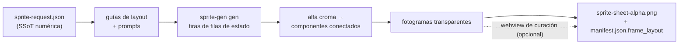
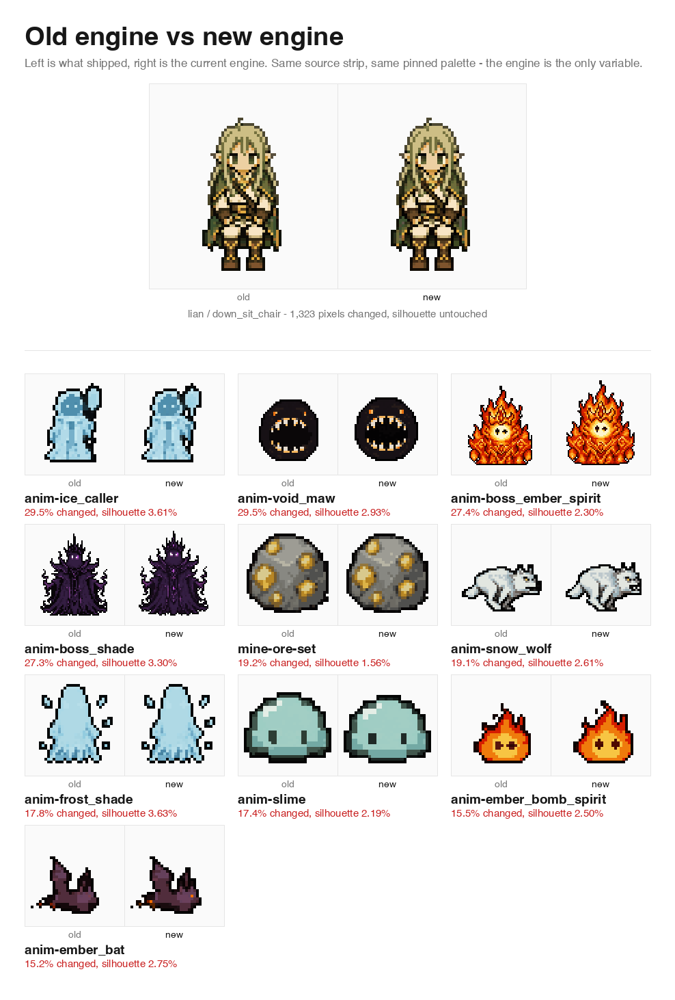

<h1 align="center">sprite-gen</h1>

<p align="center"><b>Entra un dibujo. Sale un atlas de sprites listo para juegos.</b></p>

<p align="center">

**English** · [한국어](README.ko.md) · [日本語](README.ja.md) · [简体中文](README.zh-Hans.md) · [Español](README.es.md) · [Français](README.fr.md)

</p>

---

Pídele a un modelo de imagen una "hoja de sprites" y ya sabes lo que obtendrás: un personaje cuyo rostro cambia en cada fotograma, un fondo que no se puede eliminar por clave, poses que se superponen y se desplazan fuera de la cuadrícula, y un PNG que tu motor de juego en realidad no puede consumir. Demo bonita, asset inútil.

`sprite-gen` es una skill de Codex/Claude que cierra esa brecha. Dale **una imagen base** y una lista de acciones: impulsa la generación fila por fila, bloquea la identidad del personaje, elimina el fondo croma hasta alfa real, extrae cada pose como un fotograma transparente limpio y hornea un atlas de runtime **con un `manifest.json.frame_layout` legible por máquina**.

Y para ese último 10% que la generación nunca acierta, hay una **webview de curación**: compara fotogramas lado a lado, rechaza los rotos, ajusta rotación/escala/posición de forma no destructiva, mira el bucle en vivo y luego hornea. El pipeline hace el trabajo; tú conservas el criterio.

```text
sprite-request.json → guías de layout + prompts → sprite-gen gen filas de estado
→ alfa croma → componentes conectados → fotogramas transparentes
→ sprite-sheet-alpha.png + manifest.json.frame_layout
```



> Arquitectura completa: [`docs/architecture.md`](docs/architecture.md)

## Lo que realmente obtienes

- **Un atlas de sprites transparente** (`sprite-sheet-alpha.png`): alfa real, sin restos de borde croma, verificado contra fondos blancos.
- **Un manifiesto de runtime** (`manifest.json.frame_layout`): rectángulos absolutos de fotogramas, fps por estado y flags de bucle. Tu motor muestrea rectángulos; nunca adivina una cuadrícula.
- **QA que puedes ver**: GIFs por estado y hojas de contacto, para juzgar el movimiento como movimiento antes de enviar nada.
- **Etiquetas honestas**: las acciones cortas y legibles (idle, jump, attack, wave) son la ruta estable; la locomoción cíclica (walk/run) se marca como experimental salvo que el QA de movimiento realmente pase. Sin promesas excesivas silenciosas.

## Calidad del alfa croma

El extractor mantiene la limpieza croma determinista: la separación soft-alpha conserva mechones de pelo antialias y contornos finos en lugar de arrancarlos antes de poder resolver la cobertura.

<p align="center">
  <br />
  <em>Ilustración, clave magenta: fuente, v1.12.0 peel, v1.13.0 soft-alpha unmix.</em>
</p>

<p align="center">
  <br />
  <em>Ilustración, clave verde: fuente, v1.12.0 peel, v1.13.0 soft-alpha unmix.</em>
</p>

<p align="center">
  <br />
  <em>Pixel art, clave magenta: fuente, v1.12.0 peel, salida binarizada v1.13.0.</em>
</p>

<p align="center">
  <br />
  <em>Pixel art, clave verde: fuente, v1.12.0 peel, salida binarizada v1.13.0.</em>
</p>

Los recortes de primer plano de abajo muestran el detalle de borde detrás de las comparaciones de cuerpo completo.


## Recuperación de la retícula de píxeles

El "pixel art" generado por IA no es pixel art. Los bloques oscilan, los bordes arrastran antialiasing y la retícula se desplaza incluso dentro de una misma fila, así que cortar con una cuadrícula uniforme mancha un bloque sobre el siguiente. El extractor mide la retícula real en lugar de suponerla: detección de paso por fotograma, un consenso de fila que impone su criterio sobre las detecciones armónicas erróneas, cortes ajustados a los bordes de color reales y un ancho mínimo de celda proporcional al paso medido, de modo que dos cortes vecinos nunca pueden colapsar sobre la misma banda.

La misma tira de origen, la misma paleta fijada. El motor es la única variable.

Se verificó sobre un proyecto entero y no sobre un fotograma escogido a mano: las 94 ejecuciones pixel_perfect de un juego real se volvieron a derivar desde sus propias tiras de origen y se compararon píxel a píxel con lo que ya estaba publicado.

<p align="center">
  
</p>

Sobre 26.690.432 píxeles canónicos, la silueta se movió un 1,41%. La forma que aprobaste sigue siendo la forma que recibes; lo que cambia es dónde caen los contornos y el sombreado, que es justamente lo que decide la retícula.

## Webview de curación

La generación te lleva al 90%. La webview es donde una persona lo lleva a *enviado*: independiente, sin dependencia de Studio ni de framework, funciona en cualquier lugar donde esté instalada la skill (Claude Code Desktop, la app Codex, una terminal simple).


- **Dos filas por estado:** la **secuencia de reproducción** arriba y un **pool de candidatos** abajo (por ejemplo, una segunda o tercera toma generada). Arrastra el grip ⠿ de un fotograma para reordenar la secuencia, o sube un corte desde el pool: reconstruye un bucle de carrera limpio con los mejores fotogramas de varias tomas. La disposición se guarda, así que al reabrir se restaura.
- **Transformación no destructiva** por fotograma: arrastrar = mover, rueda = escalar, manija superior = rotar, inferior izquierda = sesgar, más un toggle de volteo horizontal para salida invertida izquierda-derecha. Las ediciones viven en un sidecar `curation.json`: los PNG fuente nunca se reescriben, y el paso de composición hornea el resultado de forma determinista. La previsualización y el horneado comparten una matriz afín, así que lo que alineas es lo que obtienes.
- **Previsualización en vivo** anima la secuencia a los fps del estado, con reproducir/pausar, avance fotograma a fotograma y control de velocidad 0.25×–4×.
- No solo para sprites: apúntalo a cualquier carpeta de candidatos de imagen (iconos, logos, borradores generados) con `unpack_atlas_run.py --pngs-dir` y úsalo como una vista general para elegir el ganador.

### Cuadrícula de suelo isométrica

Para conjuntos isométricos, la webview superpone la cuadrícula de suelo (desde el tile/ancla de `meta.json`) para que puedas ajustar muebles a los ejes de diamante con la manija de sesgo.


### Idiomas

La webview incluye inglés y coreano. Pasa `--lang en|ko` al lanzarla, o usa el toggle dentro de la app:

```bash
python3 scripts/serve_curation.py --run-dir <run-dir> --lang en   # o ko
```

## Compatibilidad con Python

`sprite-gen` es compatible con CPython 3.10+. CI ejecuta la versión mínima compatible (3.10) y la última versión cubierta (3.14) en runners alojados en GitHub.

El inicio rápido requiere una instalación de Python con `venv`/`ensurepip` funcional. Si `python3 -m venv` falla antes de la instalación de paquetes en una distribución local, usa una build estándar de CPython para cualquier versión compatible y vuelve a ejecutar los mismos comandos.

## Inicio rápido

```bash
# 0. instalar dependencias (Pillow) en un virtualenv nuevo
python3 -m venv .venv && source .venv/bin/activate
pip install -e .

# 1. preparar una ejecución desde una imagen base
python3 scripts/prepare_sprite_run.py --out-dir <run-dir> --character-id <id> --base-image base.png

# 2. generar una imagen de fila por estado con el CLI de proveedor propiedad del motor
python3 scripts/generate_sprite_image.py --provider codex \
  --prompt-file <run-dir>/prompts/<state>.txt \
  --out <run-dir>/raw/<state>.png \
  --ref <run-dir>/base-source.png \
  --ref <run-dir>/references/layout-guides/<state>.png
# 3. extraer fotogramas
python3 scripts/extract_sprite_row_frames.py --run-dir <run-dir>

# 4. (opcional) curar fotogramas en la webview
python3 scripts/serve_curation.py --run-dir <run-dir>

# 5. hornear el atlas de runtime
python3 scripts/compose_sprite_atlas.py --run-dir <run-dir>
```

### Editar una hoja terminada

Cuando solo sobrevive la hoja combinada, reconstruye un run dir listo para el curador, luego cura y exporta:

```bash
# reconstruir fotogramas: --grid explícito, rectángulos --manifest, o autodetección por alfa (por defecto)
python3 scripts/unpack_atlas_run.py --atlas sheet.png            # autodetectar
python3 scripts/unpack_atlas_run.py --manifest manifest.json     # rectángulos exactos
python3 scripts/unpack_atlas_run.py --pngs-dir furniture/        # importar un conjunto PNG suelto

# después de curar, hornear correcciones de vuelta a PNGs con nombre
python3 scripts/export_curated_pngs.py --run-dir <run-dir>
```

La salida por defecto va a una carpeta fácil de encontrar `<source>-curator` junto a la entrada.

### Recortar el fondo de una imagen importada

Los sprites generados se recortan por clave sobre su propio fondo magenta/verde dentro del
pipeline, así que nunca necesitan esto. `cutout` es la utilidad de importación/postedición: una
imagen que llegó *con* un fondo uniforme opaco (un icono dibujado a mano, un
sprite descargado, una captura de pantalla) se convierte en un PNG transparente limpio.

<p align="center">
  
</p>

```bash
# enruta según el color de la esquina: blanco/marfil -> matte, magenta/verde -> motor extract
python3 -m sprite_gen.cli cutout icon.png --white-check
```

Lee el color de fondo de la esquina y enruta (`--key auto|white|magenta|green`):

- **blanco / marfil / sólido** → matte de posición. Un flood-fill desde la esquina mantiene solo el
  fondo conectado (los brillos intensos *dentro* del objeto sobreviven, no se
  agujerean), luego un alfa suave descontaminado suaviza el borde. Ajusta con
  `--strength` (eliminación de bisel), `--band` (profundidad de borde), `--erode`.
- **clave magenta / verde** → el motor croma `extract` verificado del proyecto se
  reutiliza tal cual. Los colores de clave nunca aparecen en los objetos, así que su corte solo por color es
  seguro ahí: exactamente donde la guarda flood-fill de un matte blanco *no* es necesaria.

`--white-check` escribe composiciones cian/magenta/amarillo para que cualquier borde residual
salte a la vista. Para fondos uniformes; no para fondos complejos/no uniformes.

El flujo de trabajo completo orientado a agentes y los contratos viven en [`SKILL.md`](SKILL.md).

## Instalación

Desde flujos de trabajo del instalador de skills de Codex, instala este repositorio como una skill raíz:

```bash
python3 ~/.codex/skills/.system/skill-installer/scripts/install-skill-from-github.py \
  --repo aldegad/sprite-gen --path .
```

### Propiedad de la generación de imágenes

La generación respaldada por proveedores forma parte de este motor (`sprite_gen.gen`), con
`codex` y `grok` como proveedores compatibles. La skill general `image-gen` es
solo un puente delgado hacia el mismo comando, así que no necesita una segunda implementación
de proveedor. Consulta [`docs/gen.md`](docs/gen.md) para el contrato de CLI y verificación.

## Atribución

El flujo de trabajo por filas de componentes está inspirado en la skill `hatch-pet` con licencia Apache-2.0, pero se dirige a atlas de sprites de juego genéricos y no incluye paquetes de mascotas ni assets visuales de mascotas.

## Licencia

Apache-2.0