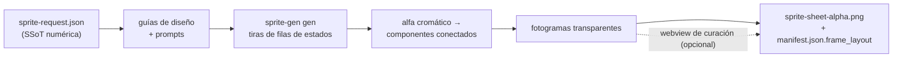

<p align="center">
  
  
  
  
  
  
  
</p>

<h1 align="center">sprite-gen</h1>

<p align="center"><b>Un dibujo entra. Un atlas de sprites listo para juego sale.</b></p>

<p align="center">

**English** · [한국어](README.ko.md) · [日本語](README.ja.md) · [简体中文](README.zh-Hans.md) · [Español](README.es.md) · [Français](README.fr.md)

</p>

---

Pídele a un modelo de imagen una "sprite sheet" y ya sabes lo que obtienes: un personaje cuya cara cambia en cada fotograma, un fondo que no se puede eliminar con clave, poses que se superponen y se desplazan fuera de la cuadrícula, y un PNG que tu motor de juego en realidad no puede consumir. Demo bonita, recurso inútil.

`sprite-gen` es una skill de Codex/Claude que cierra esa brecha. Dale **una imagen base** y una lista de acciones: conduce la generación fila por fila, bloquea la identidad del personaje, elimina el fondo cromático hasta alfa real, extrae cada pose como un fotograma transparente limpio, y hornea un atlas de runtime **con un `manifest.json.frame_layout` legible por máquina**. Todos los sprites de arriba se hicieron así.

Y para ese último 10% que la generación nunca acierta, hay una **webview de curación**: compara fotogramas lado a lado, rechaza los rotos, ajusta rotación/escala/posición de forma no destructiva, mira el bucle en vivo; luego hornea. La tubería hace el trabajo; tú conservas el criterio.

```text
sprite-request.json → guías de diseño + prompts → sprite-gen gen filas de estados
→ alfa cromático → componentes conectados → fotogramas transparentes
→ sprite-sheet-alpha.png + manifest.json.frame_layout
```



> Arquitectura completa: [`docs/architecture.md`](docs/architecture.md)

## Lo que realmente obtienes

- **Un atlas de sprites transparente** (`sprite-sheet-alpha.png`): alfa real, sin restos de borde cromático, verificado contra fondos blancos.
- **Un manifiesto de runtime** (`manifest.json.frame_layout`): rectángulos absolutos de fotogramas, fps por estado y banderas de bucle. Tu motor muestrea rectángulos; nunca adivina una cuadrícula.
- **QA que puedes ver**: GIFs por estado y hojas de contacto, para que el movimiento se juzgue como movimiento antes de enviar nada.
- **Etiquetas honestas**: acciones cortas y legibles (idle, jump, attack, wave) son la ruta estable; la locomoción cíclica (walk/run) se marca como experimental salvo que el QA de movimiento realmente pase. Sin promesas silenciosas de más.

## Calidad del alfa cromático

El extractor mantiene la limpieza cromática determinista: la desmezcla de alfa suave conserva mechones de cabello antialias y contornos finos en lugar de arrancarlos antes de que la cobertura pueda resolverse.

<p align="center">
  <br />
  <em>Ilustración, clave magenta: fuente, pelado v1.12.0, desmezcla de alfa suave v1.13.0.</em>
</p>

<p align="center">
  <br />
  <em>Ilustración, clave verde: fuente, pelado v1.12.0, desmezcla de alfa suave v1.13.0.</em>
</p>

<p align="center">
  <br />
  <em>Pixel art, clave magenta: fuente, pelado v1.12.0, salida binarizada v1.13.0.</em>
</p>

<p align="center">
  <br />
  <em>Pixel art, clave verde: fuente, pelado v1.12.0, salida binarizada v1.13.0.</em>
</p>

Los recortes en primer plano de abajo muestran el detalle de los bordes detrás de las comparaciones de cuerpo completo.


## Webview de curación

La generación te lleva al 90%. La webview es donde una persona lo lleva a *enviado*: independiente, sin dependencia de Studio ni de framework, funciona en cualquier lugar donde la skill esté instalada (Claude Code Desktop, la app de Codex, una terminal simple).


- **Dos filas por estado:** la **secuencia de reproducción** arriba y un **grupo de candidatos** abajo (por ejemplo, una segunda o tercera toma generada). Arrastra el agarre ⠿ de un fotograma para reordenar la secuencia, o sube un corte desde el grupo: reconstruye un bucle de carrera limpio con los mejores fotogramas de distintas tomas. La disposición se guarda, así que al reabrirla se restaura.
- **Transformación no destructiva** por fotograma: arrastrar = mover, rueda = escalar, manejador superior = rotar, inferior izquierdo = inclinar, además de un interruptor de volteo horizontal para salida invertida izquierda-derecha. Las ediciones viven en un sidecar `curation.json`: los PNG de origen nunca se reescriben, y el paso de composición hornea el resultado de forma determinista. La vista previa y el horneado comparten una única matriz afín, así que lo que alineas es lo que obtienes.
- **Vista previa en vivo** anima la secuencia a los fps del estado, con reproducir/pausar, avance fotograma a fotograma y un control de velocidad de 0.25×–4×.
- No solo para sprites: apúntala a cualquier carpeta de candidatos de imagen (iconos, logos, borradores generados) con `unpack_atlas_run.py --pngs-dir` y úsala como una vista general para elegir el ganador.

### Cuadrícula de suelo isométrica

Para conjuntos isométricos, la webview superpone la cuadrícula del suelo (desde `meta.json` tile/anchor) para que puedas encajar muebles a los ejes del diamante con el manejador de inclinación.


### Idiomas

La webview viene con inglés y coreano. Pasa `--lang en|ko` al lanzarla, o usa el interruptor dentro de la app:

```bash
python3 scripts/serve_curation.py --run-dir <run-dir> --lang en   # o ko
```

## Soporte de Python

`sprite-gen` soporta CPython 3.10+. CI ejecuta la versión mínima soportada (3.10) y la última versión cubierta (3.14) en runners alojados en GitHub.

El inicio rápido requiere una instalación de Python con `venv`/`ensurepip` funcional. Si `python3 -m venv` falla antes de la instalación de paquetes en una distribución local, usa una compilación estándar de CPython para cualquier versión soportada y vuelve a ejecutar los mismos comandos.

## Inicio rápido

```bash
# 0. instalar dependencias (Pillow) en un virtualenv nuevo
python3 -m venv .venv && source .venv/bin/activate
pip install -e .

# 1. preparar una ejecución desde una imagen base
python3 scripts/prepare_sprite_run.py --out-dir <run-dir> --character-id <id> --base-image base.png

# 2. generar una imagen de fila por estado con la CLI del proveedor propiedad del motor
python3 scripts/generate_sprite_image.py --provider codex \
  --prompt-file <run-dir>/prompts/<state>.txt \
  --out <run-dir>/raw/<state>.png \
  --ref <run-dir>/base-source.png \
  --ref <run-dir>/references/layout-guides/<state>.png
# 3. extraer fotogramas
python3 scripts/extract_sprite_row_frames.py --run-dir <run-dir>

# 4. (opcional) curar fotogramas en la webview
python3 scripts/serve_curation.py --run-dir <run-dir>

# 5. hornear el atlas de runtime
python3 scripts/compose_sprite_atlas.py --run-dir <run-dir>
```

### Editar una hoja terminada

Cuando solo sobrevive la hoja combinada, reconstruye un directorio de ejecución listo para el curador, luego cura y exporta:

```bash
# reconstruir fotogramas: --grid explícito, rectángulos --manifest, o autodetección alfa (predeterminado)
python3 scripts/unpack_atlas_run.py --atlas sheet.png            # autodetección
python3 scripts/unpack_atlas_run.py --manifest manifest.json     # rectángulos exactos
python3 scripts/unpack_atlas_run.py --pngs-dir furniture/        # importar un conjunto PNG suelto

# después de curar, hornear correcciones de vuelta a PNGs con nombre
python3 scripts/export_curated_pngs.py --run-dir <run-dir>
```

La salida por defecto va a una carpeta fácil de encontrar `<source>-curator` junto a la entrada.

El flujo de trabajo completo orientado a agentes y los contratos viven en [`SKILL.md`](SKILL.md).

## Instalación

Desde los flujos de trabajo del instalador de skills de Codex, instala este repositorio como una skill raíz:

```bash
python3 ~/.codex/skills/.system/skill-installer/scripts/install-skill-from-github.py \
  --repo aldegad/sprite-gen --path .
```

### Propiedad de la generación de imágenes

La generación respaldada por proveedores forma parte de este motor (`sprite_gen.gen`), con
`codex` y `grok` como proveedores soportados. La skill general `image-gen` es
solo un puente delgado hacia el mismo comando, así que no necesita una segunda
implementación de proveedor. Consulta [`docs/gen.md`](docs/gen.md) para la CLI y el contrato de
verificación.

## Atribución

El flujo de trabajo de filas de componentes está inspirado en la skill `hatch-pet` con licencia Apache-2.0, pero apunta a atlas genéricos de sprites para juegos y no incluye paquetes de mascotas ni recursos visuales de mascotas.

## Licencia

Apache-2.0