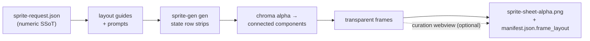

<p align="center">
  
  
  
  
  
  
  
</p>

<h1 align="center">sprite-gen</h1>

<p align="center"><b>Entra un dibujo. Sale un atlas de sprites listo para juego.</b></p>

<p align="center">

**Inglés** · [한국어](README.ko.md) · [日本語](README.ja.md) · [简体中文](README.zh-Hans.md) · [Español](README.es.md) · [Français](README.fr.md)

</p>

---

Pídele a un modelo de imagen una "hoja de sprites" y ya sabes lo que obtienes: un personaje cuya cara cambia en cada frame, un fondo que no se puede eliminar por clave, poses que se superponen y se desplazan fuera de la cuadrícula, y un PNG que tu motor de juego en realidad no puede consumir. Demo linda, asset inútil.

`sprite-gen` es una skill de Codex/Claude que cierra esa brecha. Dale **una imagen base** y una lista de acciones: dirige la generación fila por fila, bloquea la identidad del personaje, elimina el fondo chroma para convertirlo en alfa real, extrae cada pose como un frame transparente limpio, y hornea un atlas de runtime **con un `manifest.json.frame_layout` legible por máquina**. Todos los sprites de arriba se hicieron así.

Y para el último 10% que la generación nunca acierta, hay una **webview de curación**: compara frames lado a lado, rechaza los rotos, ajusta rotación/escala/posición de forma no destructiva, mira el loop en vivo; luego hornea. El pipeline hace el trabajo; tú conservas el criterio.

```text
sprite-request.json → layout guides + prompts → sprite-gen gen state rows
→ chroma alpha → connected components → transparent frames
→ sprite-sheet-alpha.png + manifest.json.frame_layout
```



> Arquitectura completa: [`docs/architecture.md`](docs/architecture.md)

## Lo que realmente obtienes

- **Un atlas de sprites transparente** (`sprite-sheet-alpha.png`): alfa real, sin restos de borde chroma, verificado contra fondos blancos.
- **Un manifiesto de runtime** (`manifest.json.frame_layout`): rectángulos de frame absolutos, fps por estado y flags de loop. Tu motor toma muestras de rectángulos; nunca adivina una cuadrícula.
- **QA que puedes ver**: GIFs y hojas de contacto por estado, para que el movimiento se juzgue como movimiento antes de enviar nada.
- **Etiquetas honestas**: acciones cortas y legibles (idle, jump, attack, wave) son la ruta estable; la locomoción cíclica (walk/run) se marca como experimental salvo que el QA de movimiento realmente pase. Sin promesas silenciosas de más.

## Calidad de chroma alpha

El extractor mantiene la limpieza chroma determinista: soft-alpha unmix preserva mechones de cabello antialias y contornos finos en vez de arrancarlos antes de poder resolver la cobertura.

<p align="center">
  <br />
  <em>Ilustración, clave magenta: fuente, v1.12.0 peel, v1.13.0 soft-alpha unmix.</em>
</p>

<p align="center">
  <br />
  <em>Ilustración, clave verde: fuente, v1.12.0 peel, v1.13.0 soft-alpha unmix.</em>
</p>

<p align="center">
  <br />
  <em>Pixel art, clave magenta: fuente, v1.12.0 peel, salida binarizada v1.13.0.</em>
</p>

<p align="center">
  <br />
  <em>Pixel art, clave verde: fuente, v1.12.0 peel, salida binarizada v1.13.0.</em>
</p>

Los recortes de acercamiento de abajo muestran el detalle de borde detrás de las comparaciones de cuerpo completo.


## Webview de curación

La generación te lleva al 90%. La webview es donde una persona lo lleva a *enviado*: independiente, sin dependencia de Studio ni de frameworks, funciona en cualquier lugar donde la skill esté instalada (Claude Code Desktop, la app de Codex, una terminal simple).


- **Dos filas por estado:** la **secuencia de reproducción** arriba y un **pool de candidatos** abajo (por ejemplo, una segunda o tercera toma generada). Arrastra el agarre ⠿ de un frame para reordenar la secuencia, o sube un corte desde el pool: reconstruye un loop de carrera limpio con los mejores frames de varias tomas. La disposición se guarda, así que al reabrir se restaura.
- **Transformación no destructiva** por frame: arrastrar = mover, rueda = escalar, asa superior = rotar, abajo a la izquierda = sesgar, más un toggle de volteo horizontal para salida invertida izquierda-derecha. Las ediciones viven en un sidecar `curation.json`: los PNG fuente nunca se reescriben, y el paso de composición hornea el resultado de forma determinista. La vista previa y el horneado comparten una sola matriz afín, así que lo que alineas es lo que obtienes.
- **Vista previa en vivo** anima la secuencia a los fps del estado, con reproducir/pausar, avance frame a frame y control de velocidad de 0.25× a 4×.
- No es solo para sprites: apúntala a cualquier carpeta de candidatos de imagen (iconos, logos, borradores generados) con `unpack_atlas_run.py --pngs-dir` y úsala como una vista general para elegir el ganador.

### Cuadrícula de suelo isométrica

Para sets isométricos, la webview superpone la cuadrícula del suelo (desde tile/anchor en `meta.json`) para que puedas encajar muebles a los ejes del rombo con el asa de sesgo.


### Idiomas

La webview incluye inglés y coreano. Pasa `--lang en|ko` al lanzarla, o usa el toggle dentro de la app:

```bash
python3 scripts/serve_curation.py --run-dir <run-dir> --lang en   # or ko
```

## Soporte de Python

`sprite-gen` admite CPython 3.10+. CI ejecuta la versión mínima soportada (3.10) y la versión cubierta más reciente (3.14) en runners alojados en GitHub.

El quickstart requiere una instalación de Python con `venv`/`ensurepip` funcionando. Si `python3 -m venv` falla antes de la instalación de paquetes en una distribución local, usa una compilación estándar de CPython para cualquier versión soportada y vuelve a ejecutar los mismos comandos.

## Quickstart

```bash
# 0. install dependencies (Pillow) into a fresh virtualenv
python3 -m venv .venv && source .venv/bin/activate
pip install -e .

# 1. prepare a run from a base image
python3 scripts/prepare_sprite_run.py --out-dir <run-dir> --character-id <id> --base-image base.png

# 2. generate one row image per state with the engine-owned provider CLI
python3 scripts/generate_sprite_image.py --provider codex \
  --prompt-file <run-dir>/prompts/<state>.txt \
  --out <run-dir>/raw/<state>.png \
  --ref <run-dir>/base-source.png \
  --ref <run-dir>/references/layout-guides/<state>.png
# 3. extract frames
python3 scripts/extract_sprite_row_frames.py --run-dir <run-dir>

# 4. (optional) curate frames in the webview
python3 scripts/serve_curation.py --run-dir <run-dir>

# 5. bake the runtime atlas
python3 scripts/compose_sprite_atlas.py --run-dir <run-dir>
```

### Editar una hoja terminada

Cuando solo sobrevive la hoja combinada, reconstruye un run dir listo para el curador, luego cura y exporta:

```bash
# rebuild frames: explicit --grid, --manifest rectangles, or alpha auto-detect (default)
python3 scripts/unpack_atlas_run.py --atlas sheet.png            # auto-detect
python3 scripts/unpack_atlas_run.py --manifest manifest.json     # exact rectangles
python3 scripts/unpack_atlas_run.py --pngs-dir furniture/        # import a loose PNG set

# after curating, bake corrections back to named PNGs
python3 scripts/export_curated_pngs.py --run-dir <run-dir>
```

La salida por defecto va a una carpeta localizable `<source>-curator` junto a la entrada.

### Recortar el fondo de una imagen importada

Los sprites generados se eliminan por clave desde su propio fondo magenta/verde dentro del
pipeline, así que nunca necesitan esto. `cutout` es la utilidad de importación/postedición: una
imagen que llegó *con* un fondo uniforme opaco (un icono dibujado a mano, un
sprite descargado, una captura de pantalla) se convierte en un PNG transparente limpio.

```bash
# uniform white / ivory / solid background -> transparent RGBA
python3 -m sprite_gen.cli cutout icon.png --white-check
```

Estima el color de fondo desde las esquinas, rellena por inundación el fondo conectado
por posición (así los brillos claros *dentro* del objeto se preservan,
no se perforan como agujeros), y luego suaviza el borde con un alfa suave descontaminado.
`--white-check` escribe composiciones cian/magenta/amarillo para que cualquier borde
remanente se vea claramente. Ajusta con `--strength` (eliminación de bisel), `--band` (profundidad de borde)
y `--erode`. No es para fondos complejos/no uniformes.

El flujo de trabajo y los contratos completos orientados a agentes viven en [`SKILL.md`](SKILL.md).

## Instalación

Desde los flujos de trabajo del instalador de skills de Codex, instala este repositorio como una skill raíz:

```bash
python3 ~/.codex/skills/.system/skill-installer/scripts/install-skill-from-github.py \
  --repo aldegad/sprite-gen --path .
```

### Propiedad de la generación de imágenes

La generación respaldada por proveedores es parte de este motor (`sprite_gen.gen`), con
`codex` y `grok` como proveedores soportados. La skill general `image-gen` es
solo un shuttle fino hacia el mismo comando, así que no necesita una segunda implementación
de proveedor. Consulta [`docs/gen.md`](docs/gen.md) para el contrato de CLI y verificación.

## Atribución

El flujo de trabajo por filas de componentes está inspirado en la skill `hatch-pet` con licencia Apache-2.0, pero apunta a atlas genéricos de sprites para juegos y no incluye paquetes de mascotas ni assets visuales de mascotas.

## Licencia

Apache-2.0