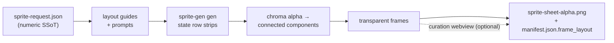

<h1 align="center">sprite-gen</h1>

<p align="center"><b>Entra un dibujo. Sale un atlas de sprites listo para el juego.</b></p>

<p align="center">

**English** · [한국어](README.ko.md) · [日本語](README.ja.md) · [简体中文](README.zh-Hans.md) · [Español](README.es.md) · [Français](README.fr.md)

</p>

---

Pídele a un modelo de imágenes una «hoja de sprites» y ya sabes lo que obtendrás: un personaje cuyo rostro cambia en cada fotograma, un fondo que no se puede eliminar, poses que se superponen y se desvían de la cuadrícula, y un PNG que tu motor de juego realmente no puede consumir. Una demo bonita, un recurso inútil.

`sprite-gen` es una habilidad de Codex/Claude que cierra esa brecha. Dale **una imagen base** y una lista de acciones: genera fila por fila, mantiene bloqueada la identidad del personaje, elimina el fondo cromático convirtiéndolo en alfa real, extrae cada pose como un fotograma transparente limpio y genera un atlas de ejecución **con un `manifest.json.frame_layout` legible por máquinas**.

Y para ese último 10 % que la generación nunca resuelve bien, existe una **vista web de curación**: compara los fotogramas lado a lado, rechaza los defectuosos, ajusta rotación/escala/posición de forma no destructiva, observa el bucle en directo y luego genera el atlas. El flujo de trabajo hace el esfuerzo; tú conservas el criterio.

```text
sprite-request.json → layout guides + prompts → sprite-gen gen state rows
→ chroma alpha → connected components → transparent frames
→ sprite-sheet-alpha.png + manifest.json.frame_layout
```


```mermaid
flowchart LR
    REQ["sprite-request.json<br/>(numeric SSoT)"] --> GUIDES["layout guides<br/>+ prompts"]
    GUIDES --> GEN["sprite-gen gen<br/>state row strips"]
    GEN --> EXTRACT["chroma alpha →<br/>connected components"]
    EXTRACT --> FRAMES["transparent frames"]
    FRAMES --> ATLAS["sprite-sheet-alpha.png<br/>+ manifest.json.frame_layout"]
    FRAMES -. "curation webview (optional)" .-> ATLAS
```

> Arquitectura completa: [`docs/architecture.md`](docs/architecture.md)

## Lo que realmente obtienes

- **Un atlas de sprites transparente** (`sprite-sheet-alpha.png`): alfa real, sin residuos cromáticos en los bordes, verificado sobre fondos blancos.
- **Un manifiesto de ejecución** (`manifest.json.frame_layout`): rectángulos absolutos de cada fotograma, fps por estado e indicadores de bucle. Tu motor muestrea rectángulos; nunca adivina una cuadrícula.
- **QA que puedes observar**: GIF por estado y hojas de contacto, para juzgar el movimiento como movimiento antes de publicar nada.
- **Etiquetas honestas**: las acciones breves y legibles (idle, jump, attack, wave) son el camino estable; la locomoción cíclica (walk/run) se marca como experimental salvo que la QA de movimiento realmente se apruebe. Sin promesas exageradas silenciosas.

## Calidad del alfa cromático

El extractor mantiene determinista la limpieza cromática: la separación de alfa suave conserva los mechones de cabello antialiasados y los contornos finos, en lugar de arrancarlos antes de poder resolver la cobertura.

<p align="center">
  <br />
  <em>Ilustración, clave magenta: fuente, eliminación v1.12.0, separación de alfa suave v1.13.0.</em>
</p>

<p align="center">
  <br />
  <em>Ilustración, clave verde: fuente, eliminación v1.12.0, separación de alfa suave v1.13.0.</em>
</p>

<p align="center">
  <br />
  <em>Pixel art, clave magenta: fuente, eliminación v1.12.0, salida binarizada v1.13.0.</em>
</p>

<p align="center">
  <br />
  <em>Pixel art, clave verde: fuente, eliminación v1.12.0, salida binarizada v1.13.0.</em>
</p>

Los recortes ampliados de abajo muestran los detalles de los bordes detrás de las comparaciones de cuerpo completo.


## Backbone Lattice

El «pixel art» generado por IA no es pixel art. Los bloques oscilan, los bordes contienen antialiasing y la cuadrícula se desplaza dentro de una misma fila, por lo que cortar sobre una cuadrícula uniforme emborrona un bloque dentro del siguiente. La solución comunitaria consiste en «desfalsificar» la imagen —adivinar el tamaño de bloque a partir de las longitudes de las series y volver a cuantizar—, pero eso mide cada fotograma por separado, de modo que el tamaño de celda de un ciclo de caminar respira de un fotograma al siguiente.

**Backbone Lattice** mide una sola cuadrícula para todo el sujeto y mantiene cada corte ajustado a ella. La detección del paso por fotograma alimenta un consenso de toda la fila y de todos los fotogramas que supera las detecciones armónicas erróneas; esa cuadrícula de consenso es el *backbone* al que se ajusta cada corte. Los cortes caen sobre límites de color reales, y un ancho mínimo de celda proporcional al paso medido evita que dos cortes vecinos colapsen alguna vez en la misma banda. Un solo backbone, para que el mismo bloque conserve el mismo tamaño en toda una animación en lugar de saltar entre fotogramas.

La misma tira de origen, la misma paleta fijada. El motor es la única variable.

Se verificó en un proyecto completo y no en un fotograma seleccionado a mano: las 94 ejecuciones perfectas a nivel de píxel de un juego activo se volvieron a derivar de sus propias tiras de origen y se compararon píxel por píxel con lo que se publicó.

<p align="center">
  
</p>

En 26.690.432 píxeles canónicos, la silueta se movió un 1,41 %. La forma que aprobaste sigue siendo la forma que obtienes; lo que cambia es dónde caen los contornos y el sombreado, que es exactamente lo que decide el backbone.

## Vista web de curación

La generación te lleva al 90 %. La vista web es donde una persona lo convierte en algo *publicable*: independiente, sin dependencia de Studio ni de ningún framework, y funciona dondequiera que esté instalada la habilidad (Claude Code Desktop, la aplicación Codex o un terminal normal).


- **Dos filas por estado:** la **secuencia de reproducción** arriba y un **grupo de candidatos** abajo (por ejemplo, una segunda o tercera toma generada). Arrastra el asa ⠿ de un fotograma para reordenar la secuencia o extrae un corte del grupo: reconstruye un bucle de ejecución limpio con los mejores fotogramas de distintas tomas. La disposición se guarda, por lo que al volver a abrir se restaura.
- **Transformación no destructiva** por fotograma: arrastrar = mover, rueda = escalar, asa superior = rotar, esquina inferior izquierda = inclinar, además de un interruptor de volteo horizontal para salidas invertidas de izquierda a derecha. Las ediciones viven en un archivo lateral `curation.json`: los PNG de origen nunca se reescriben y el paso de composición genera el resultado de forma determinista. La previsualización y la generación usan una misma matriz afín, así que lo que alineas es lo que obtienes.
- **Previsualización en directo**: anima la secuencia a los fps del estado, con reproducción/pausa, avance fotograma a fotograma y control de velocidad de 0,25× a 4×.
- No solo sirve para sprites: apunta a cualquier carpeta de candidatos de imagen (iconos, logotipos, borradores generados) con `unpack_atlas_run.py --pngs-dir` y úsala como una vista general para elegir al ganador.

### Cuadrícula de suelo isométrica

Para conjuntos isométricos, la vista web superpone la cuadrícula del suelo (desde `meta.json` tile/anchor), de modo que puedes ajustar los muebles a los ejes del rombo con el asa de inclinación.


### Idiomas

La vista web se distribuye en inglés y coreano. Pasa `--lang en|ko` al iniciarla o utiliza el interruptor integrado:

```bash
python3 scripts/serve_curation.py --run-dir <run-dir> --lang en   # or ko
```

## Compatibilidad con Python

`sprite-gen` admite CPython 3.10 o posterior. CI ejecuta la versión mínima compatible (3.10) y la última versión cubierta (3.14) en ejecutores alojados por GitHub.

La guía rápida requiere una instalación de Python con `venv`/`ensurepip` funcionales. Si `python3 -m venv` falla antes de la instalación de paquetes en una distribución local, utiliza una compilación estándar de CPython de cualquier versión compatible y vuelve a ejecutar los mismos comandos.

## Guía rápida

```bash
# 0. install dependencies (Pillow) into a fresh virtualenv
python3 -m venv .venv && source .venv/bin/activate
pip install -e .

# 1. prepare a run from a base image
python3 scripts/prepare_sprite_run.py --out-dir <run-dir> --character-id <id> --base-image base.png

# 2. generate one row image per state with the engine-owned provider CLI
python3 scripts/generate_sprite_image.py --provider codex \
  --prompt-file <run-dir>/prompts/<state>.txt \
  --out <run-dir>/raw/<state>.png \
  --ref <run-dir>/base-source.png \
  --ref <run-dir>/references/layout-guides/<state>.png
# 3. extract frames
python3 scripts/extract_sprite_row_frames.py --run-dir <run-dir>

# 4. (optional) curate frames in the webview
python3 scripts/serve_curation.py --run-dir <run-dir>

# 5. bake the runtime atlas
python3 scripts/compose_sprite_atlas.py --run-dir <run-dir>
```

### Editar una hoja terminada

Cuando solo sobrevive la hoja combinada, reconstruye un directorio de ejecución preparado para la curación y, después, cura y exporta:

```bash
# rebuild frames: explicit --grid, --manifest rectangles, or alpha auto-detect (default)
python3 scripts/unpack_atlas_run.py --atlas sheet.png            # auto-detect
python3 scripts/unpack_atlas_run.py --manifest manifest.json     # exact rectangles
python3 scripts/unpack_atlas_run.py --pngs-dir furniture/        # import a loose PNG set

# after curating, bake corrections back to named PNGs
python3 scripts/export_curated_pngs.py --run-dir <run-dir>
```

La salida se guarda por defecto en una carpeta `<source>-curator` localizable junto a la entrada.

### Recortar el fondo de una imagen importada

Los sprites generados se separan de su propio fondo magenta/verde dentro del flujo de trabajo, por lo que nunca necesitan esto. `cutout` es la utilidad de importación/postedición: una imagen que llegó con un fondo opaco y uniforme (un icono dibujado a mano, un sprite descargado o una captura de pantalla) se convierte en un PNG transparente limpio.

<p align="center">
  
</p>

```bash
# routes on the corner colour: white/ivory -> matte, magenta/green -> extract engine
python3 -m sprite_gen.cli cutout icon.png --white-check
```

Lee el color de fondo de la esquina y enruta (`--key auto|white|magenta|green`):

- **blanco / marfil / sólido** → matte posicional. Un relleno por inundación desde la esquina conserva únicamente el fondo conectado (los reflejos brillantes *dentro* del objeto sobreviven, sin crear agujeros); después, un alfa suave descontaminado difumina el borde. Ajusta con `--strength` (eliminación del bisel), `--band` (profundidad del borde) y `--erode`.
- **clave magenta / verde** → el motor cromático `extract` verificado del proyecto se reutiliza tal cual. Los colores clave nunca aparecen en los objetos, por lo que su recorte basado únicamente en el color es seguro allí, exactamente donde no se necesita la protección de relleno de una matte blanca.

`--white-check` escribe composiciones cian/magenta/amarillo para que cualquier residuo en los bordes se muestre claramente. Para fondos uniformes; no para fondos complejos o no uniformes.

El flujo de trabajo completo orientado a agentes y sus contratos se encuentran en [`SKILL.md`](SKILL.md).

## Instalación

Desde los flujos de trabajo del instalador de habilidades de Codex, instala este repositorio como una habilidad raíz:

```bash
python3 ~/.codex/skills/.system/skill-installer/scripts/install-skill-from-github.py \
  --repo aldegad/sprite-gen --path .
```

### Propiedad de la generación de imágenes

La generación respaldada por proveedores forma parte de este motor (`sprite_gen.gen`), con `codex` y `grok` como proveedores compatibles. La habilidad general `image-gen` es únicamente un transporte ligero hacia el mismo comando, por lo que no necesita una segunda implementación de proveedor. Consulta [`docs/gen.md`](docs/gen.md) para conocer el contrato de CLI y verificación.

## Atribución

El flujo de trabajo basado en filas de componentes está inspirado en la habilidad `hatch-pet`, licenciada bajo Apache-2.0, pero está dirigido a atlas de sprites genéricos para juegos y no incluye paquetes ni recursos visuales de mascotas.

## Licencia

Apache-2.0