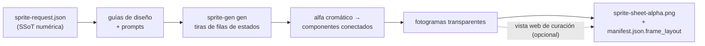

<h1 align="center">sprite-gen</h1>

<p align="center"><b>Entra un dibujo. Sale un atlas de sprites listo para el juego.</b></p>

<p align="center">

**Inglés** · [한국어](README.ko.md) · [日本語](README.ja.md) · [简体中文](README.zh-Hans.md) · [Español](README.es.md) · [Français](README.fr.md)

</p>

---

Sprites generados y curados con esta skill (`claudecy`, `howl`):

<p align="center">
  
  
  
  
  
  
  
</p>

Pídele a un modelo de imágenes una «hoja de sprites» y ya sabes lo que obtienes: un personaje cuyo rostro cambia en cada fotograma, un fondo que no se puede eliminar mediante clave de color, poses que se superponen y se desvían de la cuadrícula, y un PNG que tu motor de juego realmente no puede consumir. Una demo bonita, un recurso inútil.

`sprite-gen` es una skill de Codex/Claude que cierra esa brecha. Dale **una imagen base** y una lista de acciones: controla la generación fila por fila, bloquea la identidad del personaje, elimina el fondo cromático para obtener un alfa real, extrae cada pose como un fotograma transparente limpio y genera un atlas de ejecución **con un `manifest.json.frame_layout` legible por máquinas**.

Y para ese último 10 % que la generación nunca resuelve bien, existe una **vista web de curación**: compara fotogramas lado a lado, rechaza los defectuosos, ajusta rotación/escala/posición de forma no destructiva, observa el bucle en directo y luego genera el atlas. La canalización hace el trabajo; tú conservas el criterio.

```text
sprite-request.json → guías de diseño + prompts → sprite-gen gen filas de estados
→ alfa cromático → componentes conectados → fotogramas transparentes
→ sprite-sheet-alpha.png + manifest.json.frame_layout
```


```mermaid
flowchart LR
    REQ["sprite-request.json<br/>(SSoT numérica)"] --> GUIDES["guías de diseño<br/>+ prompts"]
    GUIDES --> GEN["sprite-gen gen<br/>tiras de filas de estados"]
    GEN --> EXTRACT["alfa cromático →<br/>componentes conectados"]
    EXTRACT --> FRAMES["fotogramas transparentes"]
    FRAMES --> ATLAS["sprite-sheet-alpha.png<br/>+ manifest.json.frame_layout"]
    FRAMES -. "vista web de curación (opcional)" .-> ATLAS
```

> Arquitectura completa: [`docs/architecture.md`](docs/architecture.md)

## Lo que realmente obtienes

- **Un atlas de sprites transparente** (`sprite-sheet-alpha.png`): alfa real, sin restos del borde cromático, verificado sobre fondos blancos.
- **Un manifiesto de ejecución** (`manifest.json.frame_layout`): rectángulos absolutos de los fotogramas, fps por estado e indicadores de bucle. Tu motor muestrea rectángulos; nunca tiene que adivinar una cuadrícula.
- **QA que puedes observar**: GIF por estado y hojas de contacto, para juzgar el movimiento como movimiento antes de publicar nada.
- **Etiquetas honestas**: las acciones cortas y legibles (idle, jump, attack, wave) son el camino estable; la locomoción cíclica (walk/run) se marca como experimental salvo que el QA del movimiento realmente supere la prueba. Sin promesas exageradas silenciosas.

## Calidad del alfa cromático

El extractor mantiene determinista la limpieza cromática: la separación de alfa suave conserva los mechones de pelo antialiasing y los contornos finos en lugar de eliminarlos antes de poder resolver la cobertura.

<p align="center">
  <br />
  <em>Ilustración, clave magenta: fuente, peel de v1.12.0, separación de alfa suave de v1.13.0.</em>
</p>

<p align="center">
  <br />
  <em>Ilustración, clave verde: fuente, peel de v1.12.0, separación de alfa suave de v1.13.0.</em>
</p>

<p align="center">
  <br />
  <em>Pixel art, clave magenta: fuente, peel de v1.12.0, salida binarizada de v1.13.0.</em>
</p>

<p align="center">
  <br />
  <em>Pixel art, clave verde: fuente, peel de v1.12.0, salida binarizada de v1.13.0.</em>
</p>

Los recortes ampliados de abajo muestran los detalles de los bordes detrás de las comparaciones de cuerpo completo.


## Malla troncal

El «pixel art» generado por IA no es pixel art. Los bloques oscilan, los bordes contienen antialiasing y la malla se desplaza dentro de una misma fila, por lo que cortar sobre una cuadrícula uniforme emborrona un bloque con el siguiente. La solución comunitaria consiste en «desfalsificar» la imagen —adivinar el tamaño de los bloques a partir de las longitudes de las secuencias y volver a cuantizar—, pero eso mide cada fotograma por separado, así que el tamaño de celda de un ciclo de caminata respira de un fotograma al siguiente.

**Backbone Lattice** mide una cuadrícula para todo el sujeto y mantiene cada corte ajustado a ella. La detección del paso por fotograma alimenta un consenso entre fotogramas de toda la fila que supera las detecciones armónicas erróneas; esa cuadrícula consensuada es la *malla troncal* a la que se ajusta cada corte. Los cortes caen sobre límites de color reales, y un ancho mínimo de celda proporcional al paso medido evita que dos cortes vecinos colapsen alguna vez sobre la misma banda. Una sola malla troncal garantiza que el mismo bloque conserve el mismo tamaño en toda la animación, en lugar de saltar entre fotogramas.

El resultado se verifica contra lo que se publicó, no se juzga visualmente en un fotograma elegido a mano: cada ejecución pixel-unfake se vuelve a derivar de su propia tira de origen y se compara píxel a píxel. La forma que aprobaste sigue siendo la forma que obtienes; lo único que cambia es dónde caen los contornos y el sombreado, que es exactamente lo que decide la malla troncal.

## Vista web de curación

La generación te lleva al 90 %. La vista web es donde una persona lo convierte en algo *publicable*: independiente, sin dependencia de Studio ni de ningún framework, y funciona en cualquier lugar donde esté instalada la skill (Claude Code Desktop, la aplicación Codex o un terminal normal).


- **Dos filas por estado:** la **secuencia de reproducción** arriba y un **grupo de candidatos** abajo (por ejemplo, una segunda o tercera toma generada). Arrastra el asa ⠿ de un fotograma para reordenar la secuencia o extrae un corte del grupo: reconstruye un bucle de ejecución limpio a partir de los mejores fotogramas de varias tomas. La disposición se guarda, así que al volver a abrirla se restaura.
- **Transformación no destructiva** por fotograma: arrastrar = mover, rueda = escalar, asa superior = rotar, esquina inferior izquierda = sesgar, además de un interruptor de volteo horizontal para salidas invertidas de izquierda a derecha. Las ediciones viven en un archivo sidecar `curation.json`: los PNG de origen nunca se reescriben y el paso de composición genera el resultado de forma determinista. La vista previa y la generación comparten una matriz afín, así que lo que alineas es lo que obtienes.
- **Vista previa en directo**: anima la secuencia al fps del estado, con reproducción/pausa, avance fotograma a fotograma y un control de velocidad de 0.25× a 4×.
- No solo sirve para sprites: apúntala a cualquier carpeta de candidatos de imagen (iconos, logotipos, borradores generados) con `unpack_atlas_run.py --pngs-dir` y úsala como vista general para elegir al ganador.

### Cuadrícula de suelo isométrica

Para conjuntos isométricos, la vista web superpone la cuadrícula del suelo (a partir de `meta.json` tile/anchor), para que puedas ajustar los muebles a los ejes del rombo con el asa de sesgado.


### Idiomas

La vista web incluye inglés y coreano. Pasa `--lang en|ko` al iniciarla o utiliza el interruptor integrado:

```bash
python3 scripts/serve_curation.py --run-dir <run-dir> --lang en   # o ko
```

## Compatibilidad con Python

`sprite-gen` admite CPython 3.10 o superior. CI ejecuta la versión mínima compatible (3.10) y la última versión cubierta (3.14) en runners alojados por GitHub.

La guía rápida requiere una instalación de Python con `venv`/`ensurepip` funcionales. Si `python3 -m venv` falla antes de instalar los paquetes en una distribución local, utiliza una compilación estándar de CPython de cualquier versión compatible y vuelve a ejecutar los mismos comandos.

## Guía rápida

```bash
# 0. instalar dependencias (Pillow, NumPy) en un virtualenv nuevo
python3 -m venv .venv && source .venv/bin/activate
pip install -e .

# 1. preparar una ejecución a partir de una imagen base
python3 scripts/prepare_sprite_run.py --out-dir <run-dir> --character-id <id> --base-image base.png

# 2. generar una imagen de fila por estado con la CLI del proveedor controlada por el motor
python3 scripts/generate_sprite_image.py --provider codex \
  --prompt-file <run-dir>/prompts/<state>.txt \
  --out <run-dir>/raw/<state>.png \
  --ref <run-dir>/base-source.png \
  --ref <run-dir>/references/layout-guides/<state>.png
# 3. extraer fotogramas
python3 scripts/extract_sprite_row_frames.py --run-dir <run-dir>

# 4. (opcional) curar fotogramas en la vista web
python3 scripts/serve_curation.py --run-dir <run-dir>

# 5. generar el atlas de ejecución
python3 scripts/compose_sprite_atlas.py --run-dir <run-dir>
```

### Editar una hoja terminada

Cuando solo sobrevive la hoja combinada, reconstruye un directorio de ejecución listo para el curador, y luego cura y exporta:

```bash
# reconstruir fotogramas: --grid explícito, rectángulos del manifiesto o autodetección de alfa (predeterminado)
python3 scripts/unpack_atlas_run.py --atlas sheet.png            # autodetección
python3 scripts/unpack_atlas_run.py --manifest manifest.json     # rectángulos exactos
python3 scripts/unpack_atlas_run.py --pngs-dir furniture/        # importar un conjunto de PNG sueltos

# después de curar, volver a generar las correcciones en PNG con nombre
python3 scripts/export_curated_pngs.py --run-dir <run-dir>
```

La salida se guarda de forma predeterminada en una carpeta `<source>-curator` fácil de localizar junto a la entrada.

### Recortar el fondo de una imagen importada

Los sprites generados utilizan como clave su propio fondo magenta/verde dentro de la canalización, por lo que nunca necesitan esto. `cutout` es la utilidad de importación/postedición: una imagen que llegó *con* un fondo opaco y uniforme (un icono dibujado a mano, un sprite descargado o una captura de pantalla) se convierte en un PNG transparente limpio.

<p align="center">
  
</p>

```bash
# decide según el color de la esquina: blanco/marfil -> matte, magenta/verde -> motor de extracción
python3 -m sprite_gen.cli cutout icon.png --white-check
```

Lee el color de fondo de la esquina y selecciona la ruta (`--key auto|white|magenta|green`):

- **blanco / marfil / sólido** → matte posicional. Un relleno por inundación desde la esquina conserva únicamente el fondo conectado (los reflejos brillantes *dentro* del objeto sobreviven, sin convertirse en agujeros); después, un alfa suave descontaminado suaviza el borde. Ajusta con `--strength` (eliminación del bisel), `--band` (profundidad del borde) y `--erode`.
- **clave magenta / verde** → el motor cromático `extract` verificado del proyecto se reutiliza tal cual. Los colores clave nunca aparecen en los objetos, por lo que su corte basado únicamente en color es seguro allí —exactamente donde no hace falta la protección de relleno por inundación del matte blanco—.

`--white-check` escribe composiciones cian/magenta/amarillo para que cualquier borde residual se vea claramente. Para fondos uniformes; no para fondos complejos/no uniformes.

El flujo de trabajo completo orientado al agente y los contratos están en [`SKILL.md`](SKILL.md).

## Instalación

Desde los flujos de instalación de skills de Codex, instala este repositorio como una skill raíz:

```bash
python3 ~/.codex/skills/.system/skill-installer/scripts/install-skill-from-github.py \
  --repo aldegad/sprite-gen --path .
```

### Responsabilidad de la generación de imágenes

La generación respaldada por proveedores forma parte de este motor (`sprite_gen.gen`), con `codex` y `grok` como proveedores compatibles. La skill general `image-gen` es solo un transporte ligero hacia el mismo comando, por lo que no necesita una segunda implementación del proveedor. Consulta [`docs/gen.md`](docs/gen.md) para conocer el contrato de CLI y verificación.

## Atribución

El flujo de trabajo de filas de componentes está inspirado en la skill `hatch-pet`, con licencia Apache-2.0, pero está orientado a atlas de sprites genéricos para juegos y no incluye paquetes de mascotas ni recursos visuales de mascotas.

## Licencia

Apache-2.0