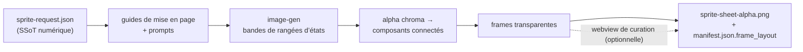

<p align="center">
  
  
  
  
  
  
  
</p>

<h1 align="center">sprite-gen</h1>

<p align="center"><b>Un dessin en entrée. Un atlas de sprites prêt pour le jeu en sortie.</b></p>

<p align="center">

**English** · [한국어](README.ko.md) · [日本語](README.ja.md) · [简体中文](README.zh-Hans.md) · [Español](README.es.md) · [Français](README.fr.md)

</p>

---

Demandez à un modèle d’image une "sprite sheet" et vous savez ce que vous obtenez : un personnage dont le visage change à chaque frame, un arrière-plan impossible à détourer, des poses qui se chevauchent et dérivent hors de la grille, et un PNG que votre moteur de jeu ne peut pas vraiment consommer. Démo mignonne, asset inutilisable.

`sprite-gen` est une skill Codex/Claude qui comble cet écart. Donnez-lui **une image de base** et une liste d’actions — elle pilote la génération rangée par rangée, verrouille l’identité du personnage, retire le fond chroma pour obtenir un vrai alpha, extrait chaque pose sous forme de frame transparente propre, et produit un atlas runtime **avec un `manifest.json.frame_layout` lisible par machine**. Tous les sprites ci-dessus ont été créés de cette façon.

Et pour les derniers 10 % que la génération ne réussit jamais parfaitement, il y a une **webview de curation** : comparez les frames côte à côte, rejetez celles qui sont cassées, ajustez rotation/échelle/position de façon non destructive, regardez la boucle en direct — puis bakez. Le pipeline fait le travail ; vous gardez le goût.

```text
sprite-request.json → guides de mise en page + prompts → rangées d’états image-gen
→ alpha chroma → composants connectés → frames transparentes
→ sprite-sheet-alpha.png + manifest.json.frame_layout
```



> Architecture complète : [`docs/architecture.md`](docs/architecture.md)

## Ce que vous obtenez concrètement

- **Un atlas de sprites transparent** (`sprite-sheet-alpha.png`) — vrai alpha, aucun résidu de frange chroma, vérifié sur fonds blancs.
- **Un manifeste runtime** (`manifest.json.frame_layout`) — rectangles de frames absolus, fps par état et drapeaux de boucle. Votre moteur échantillonne des rectangles ; il ne devine jamais une grille.
- **Une QA observable** — GIFs par état et planches contact, afin que le mouvement soit jugé comme mouvement avant toute livraison.
- **Des libellés honnêtes** — les actions courtes et lisibles (idle, jump, attack, wave) sont le chemin stable ; la locomotion cyclique (walk/run) est marquée expérimentale sauf si la QA du mouvement passe réellement. Pas de promesse excessive silencieuse.

## Qualité de l'alpha chroma

L'extracteur garde le nettoyage chroma déterministe : le soft-alpha unmix préserve l'antialiasing des mèches fines et des contours minces, au lieu de les peler avant de résoudre la couverture.


## Webview de curation

La génération vous amène à 90 %. La webview est l’endroit où un humain l’amène jusqu’à *livré* — autonome, sans dépendance à Studio ni à un framework, fonctionne partout où la skill est installée (Claude Code Desktop, l’app Codex, un terminal simple).


- **Deux rangées par état :** la **séquence de lecture** en haut et un **pool de candidats** en dessous (par exemple une deuxième ou troisième tentative générée). Faites glisser la poignée ⠿ d’une frame pour réordonner la séquence, ou remontez une coupe depuis le pool — reconstruisez une boucle de course propre à partir des meilleures frames entre plusieurs tentatives. L’agencement est sauvegardé, donc il est restauré à la réouverture.
- **Transformation non destructive** par frame : glisser = déplacer, molette = redimensionner, poignée supérieure = pivoter, bas-gauche = cisaillement, plus un bouton de retournement horizontal pour une sortie inversée gauche-droite. Les modifications vivent dans un sidecar `curation.json` — les PNG sources ne sont jamais réécrits, et l’étape de composition bake le résultat de façon déterministe. L’aperçu et le bake partagent une seule matrice affine, donc ce que vous alignez est ce que vous obtenez.
- **L’aperçu en direct** anime la séquence aux fps de l’état, avec lecture/pause, avance frame par frame, et un contrôle de vitesse 0.25×–4×.
- Pas seulement pour les sprites : pointez-la vers n’importe quel dossier de candidats image (icônes, logos, brouillons générés) avec `unpack_atlas_run.py --pngs-dir` et utilisez-la comme vue générale de sélection du meilleur résultat.

### Grille de sol isométrique

Pour les ensembles isométriques, la webview superpose la grille de sol (depuis la tuile/l’ancre `meta.json`) afin que vous puissiez caler les meubles sur les axes du losange avec la poignée de cisaillement.


### Langues

La webview est livrée avec l’anglais et le coréen. Passez `--lang en|ko` au lancement, ou utilisez le sélecteur intégré à l’app :

```bash
python3 scripts/serve_curation.py --run-dir <run-dir> --lang en   # ou ko
```

## Support Python

`sprite-gen` prend en charge CPython 3.10+. La CI exécute la version minimale prise en charge (3.10) et la dernière version couverte (3.14) sur des runners hébergés par GitHub.

Le démarrage rapide exige une installation Python avec `venv`/`ensurepip` fonctionnels. Si `python3 -m venv` échoue avant l’installation des paquets dans une distribution locale, utilisez une build CPython standard de n’importe quelle version prise en charge et relancez les mêmes commandes.

## Démarrage rapide

```bash
# 0. installer les dépendances (Pillow) dans un virtualenv frais
python3 -m venv .venv && source .venv/bin/activate
pip install -e .

# 1. préparer un run depuis une image de base
python3 scripts/prepare_sprite_run.py --out-dir <run-dir> --character-id <id> --base-image base.png

# 2. générer une image de rangée par état avec image-gen, sauvegarder dans raw/<state>.png
# 3. extraire les frames
python3 scripts/extract_sprite_row_frames.py --run-dir <run-dir>

# 4. (optionnel) curer les frames dans la webview
python3 scripts/serve_curation.py --run-dir <run-dir>

# 5. baker l’atlas runtime
python3 scripts/compose_sprite_atlas.py --run-dir <run-dir>
```

### Modifier une sheet terminée

Quand seule la sheet combinée subsiste, reconstruisez un run dir prêt pour le curator, puis curez et exportez :

```bash
# reconstruire les frames : --grid explicite, rectangles --manifest, ou auto-détection alpha (par défaut)
python3 scripts/unpack_atlas_run.py --atlas sheet.png            # auto-détection
python3 scripts/unpack_atlas_run.py --manifest manifest.json     # rectangles exacts
python3 scripts/unpack_atlas_run.py --pngs-dir furniture/        # importer un ensemble PNG libre

# après curation, baker les corrections vers des PNG nommés
python3 scripts/export_curated_pngs.py --run-dir <run-dir>
```

La sortie utilise par défaut un dossier facile à retrouver nommé `<source>-curator`, placé à côté de l’entrée.

Le workflow complet destiné aux agents et les contrats vivent dans [`SKILL.md`](SKILL.md).

## Installation

Depuis les workflows d’installation de skills Codex, installez ce dépôt comme skill racine :

```bash
python3 ~/.codex/skills/.system/skill-installer/scripts/install-skill-from-github.py \
  --repo aldegad/sprite-gen --path .
```

### Dépendance de skill requise

Les images de rangées brutes (étape 2 du démarrage rapide) sont générées par la skill séparée [`image-gen`](https://github.com/aldegad/image-gen) (déclarée comme `kuma:image-gen` dans `depends_on` de `SKILL.md`). Installez-la de la même manière :

```bash
python3 ~/.codex/skills/.system/skill-installer/scripts/install-skill-from-github.py \
  --repo aldegad/image-gen --path .
```

## Attribution

Le workflow par rangées de composants est inspiré de la skill `hatch-pet` sous licence Apache-2.0, mais cible des atlas de sprites de jeu génériques et n’inclut aucun package d’animal ni asset visuel d’animal.

## Licence

Apache-2.0
