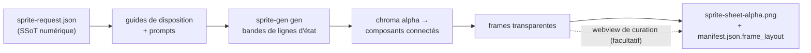
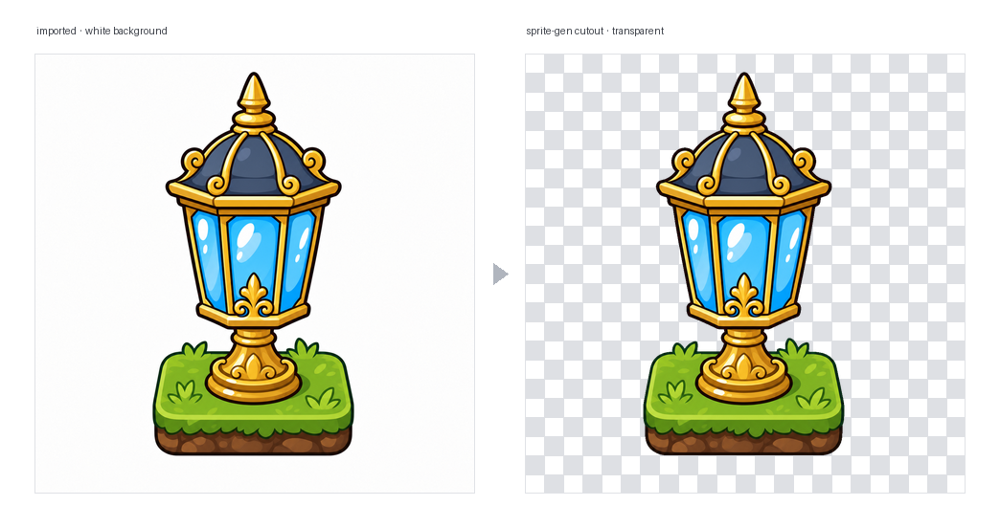

<p align="center">
  
  
  
  
  
  
  
</p>

<h1 align="center">sprite-gen</h1>

<p align="center"><b>Un dessin en entrée. Un atlas de sprites prêt pour le jeu en sortie.</b></p>

<p align="center">

**English** · [한국어](README.ko.md) · [日本語](README.ja.md) · [简体中文](README.zh-Hans.md) · [Español](README.es.md) · [Français](README.fr.md)

</p>

---

Demandez à un modèle d'image une « sprite sheet » et vous savez ce que vous obtenez : un personnage dont le visage change à chaque frame, un arrière-plan impossible à détourer par couleur clé, des poses qui se chevauchent et dérivent hors de la grille, et un PNG que votre moteur de jeu ne peut pas vraiment consommer. Démo mignonne, ressource inutilisable.

`sprite-gen` est une skill Codex/Claude qui comble cet écart. Donnez-lui **une image de base** et une liste d'actions — elle pilote la génération ligne par ligne, verrouille l'identité du personnage, supprime l'arrière-plan chroma en véritable alpha, extrait chaque pose sous forme de frame transparente propre, et produit un atlas runtime **avec un `manifest.json.frame_layout` lisible par machine**. Chaque sprite ci-dessus a été créé ainsi.

Et pour les 10 % finaux que la génération ne réussit jamais parfaitement, il existe une **webview de curation** : comparez les frames côte à côte, rejetez celles qui sont cassées, ajustez rotation/échelle/position de façon non destructive, observez la boucle en direct — puis bakez. Le pipeline fait le travail ; vous gardez le goût.

```text
sprite-request.json → guides de disposition + prompts → sprite-gen gen state rows
→ chroma alpha → composants connectés → frames transparentes
→ sprite-sheet-alpha.png + manifest.json.frame_layout
```



> Architecture complète : [`docs/architecture.md`](docs/architecture.md)

## Ce que vous obtenez réellement

- **Un atlas de sprites transparent** (`sprite-sheet-alpha.png`) — véritable alpha, aucun résidu de frange chroma, vérifié sur fonds blancs.
- **Un manifeste runtime** (`manifest.json.frame_layout`) — rectangles de frames absolus, fps par état et flags de boucle. Votre moteur échantillonne des rectangles ; il ne devine jamais une grille.
- **Une QA que vous pouvez regarder** — GIFs par état et planches-contact, pour juger le mouvement comme mouvement avant toute livraison.
- **Des libellés honnêtes** — les actions courtes et lisibles (idle, jump, attack, wave) sont le chemin stable ; la locomotion cyclique (walk/run) est marquée expérimentale sauf si la QA de mouvement passe réellement. Aucune promesse excessive silencieuse.

## Qualité de l'alpha chroma

L'extracteur garde le nettoyage chroma déterministe : le soft-alpha unmix préserve les mèches de cheveux anticrénelées et les contours fins au lieu de les décoller avant que la couverture puisse être résolue.

<p align="center">
  <br />
  <em>Illustration, clé magenta : source, peel v1.12.0, soft-alpha unmix v1.13.0.</em>
</p>

<p align="center">
  <br />
  <em>Illustration, clé verte : source, peel v1.12.0, soft-alpha unmix v1.13.0.</em>
</p>

<p align="center">
  <br />
  <em>Pixel art, clé magenta : source, peel v1.12.0, sortie binarisée v1.13.0.</em>
</p>

<p align="center">
  <br />
  <em>Pixel art, clé verte : source, peel v1.12.0, sortie binarisée v1.13.0.</em>
</p>

Les recadrages rapprochés ci-dessous montrent le détail des bords derrière les comparaisons plein pied.


## Webview de curation

La génération vous amène à 90 %. La webview est l'endroit où un humain l'amène jusqu'à *livré* — autonome, sans dépendance à Studio ni à un framework, fonctionne partout où la skill est installée (Claude Code Desktop, l'app Codex, un simple terminal).


- **Deux lignes par état :** la **séquence de lecture** en haut et un **pool de candidats** en dessous (par ex. une deuxième ou troisième prise générée). Faites glisser la poignée ⠿ d'une frame pour réordonner la séquence, ou remontez une coupe depuis le pool — reconstruisez une boucle de course propre à partir des meilleures frames de plusieurs prises. L'arrangement est enregistré, donc il est restauré à la réouverture.
- **Transformation non destructive** par frame : glisser = déplacer, molette = mettre à l'échelle, poignée supérieure = faire pivoter, bas gauche = ciseler, plus un toggle de miroir horizontal pour une sortie inversée gauche-droite. Les modifications vivent dans un sidecar `curation.json` — les PNG sources ne sont jamais réécrits, et l'étape de composition bake le résultat de manière déterministe. L'aperçu et le bake partagent une même matrice affine, donc ce que vous alignez est ce que vous obtenez.
- **Aperçu en direct** anime la séquence aux fps de l'état, avec lecture/pause, avancement frame par frame, et un contrôle de vitesse 0.25×–4×.
- Pas seulement pour les sprites : pointez-le vers n'importe quel dossier de candidats image (icônes, logos, brouillons générés) avec `unpack_atlas_run.py --pngs-dir` et utilisez-le comme vue générale pour choisir le gagnant.

### Grille de sol isométrique

Pour les ensembles isométriques, la webview superpose la grille du sol (depuis la tuile/ancre de `meta.json`) afin que vous puissiez accrocher les meubles aux axes du losange avec la poignée de cisaillement.


### Langues

La webview est fournie avec l'anglais et le coréen. Passez `--lang en|ko` au lancement, ou utilisez le toggle intégré à l'app :

```bash
python3 scripts/serve_curation.py --run-dir <run-dir> --lang en   # or ko
```

## Prise en charge de Python

`sprite-gen` prend en charge CPython 3.10+. La CI exécute la version minimale prise en charge (3.10) et la dernière version couverte (3.14) sur des runners hébergés par GitHub.

Le quickstart nécessite une installation Python avec `venv`/`ensurepip` fonctionnels. Si `python3 -m venv` échoue avant l'installation des paquets dans une distribution locale, utilisez un build CPython standard pour n'importe quelle version prise en charge et relancez les mêmes commandes.

## Quickstart

```bash
# 0. install dependencies (Pillow) into a fresh virtualenv
python3 -m venv .venv && source .venv/bin/activate
pip install -e .

# 1. prepare a run from a base image
python3 scripts/prepare_sprite_run.py --out-dir <run-dir> --character-id <id> --base-image base.png

# 2. generate one row image per state with the engine-owned provider CLI
python3 scripts/generate_sprite_image.py --provider codex \
  --prompt-file <run-dir>/prompts/<state>.txt \
  --out <run-dir>/raw/<state>.png \
  --ref <run-dir>/base-source.png \
  --ref <run-dir>/references/layout-guides/<state>.png
# 3. extract frames
python3 scripts/extract_sprite_row_frames.py --run-dir <run-dir>

# 4. (optional) curate frames in the webview
python3 scripts/serve_curation.py --run-dir <run-dir>

# 5. bake the runtime atlas
python3 scripts/compose_sprite_atlas.py --run-dir <run-dir>
```

### Modifier une planche terminée

Quand seule la planche combinée subsiste, reconstruisez un run dir prêt pour le curateur, puis effectuez la curation et exportez :

```bash
# rebuild frames: explicit --grid, --manifest rectangles, or alpha auto-detect (default)
python3 scripts/unpack_atlas_run.py --atlas sheet.png            # auto-detect
python3 scripts/unpack_atlas_run.py --manifest manifest.json     # exact rectangles
python3 scripts/unpack_atlas_run.py --pngs-dir furniture/        # import a loose PNG set

# after curating, bake corrections back to named PNGs
python3 scripts/export_curated_pngs.py --run-dir <run-dir>
```

La sortie va par défaut dans un dossier trouvable `<source>-curator` à côté de l'entrée.

### Découper l'arrière-plan d'une image importée

Les sprites générés sont détourés à partir de leur propre arrière-plan magenta/vert à l'intérieur du
pipeline, ils n'en ont donc jamais besoin. `cutout` est l'utilitaire d'import/post-édition : une
image arrivée *avec* un arrière-plan uniforme opaque (une icône dessinée à la main, un
sprite téléchargé, une capture d'écran) est transformée en PNG transparent propre.

<p align="center">
  
</p>

```bash
# routes on the corner colour: white/ivory -> matte, magenta/green -> extract engine
python3 -m sprite_gen.cli cutout icon.png --white-check
```

Il lit la couleur d'arrière-plan des coins et route (`--key auto|white|magenta|green`) :

- **blanc / ivoire / uni** → matte de position. Un flood-fill depuis les coins garde seulement
  l'arrière-plan connecté (les reflets lumineux *à l'intérieur* de l'objet survivent, sans
  trous), puis un alpha doux décontaminé adoucit la bordure. Ajustez avec
  `--strength` (suppression du biseau), `--band` (profondeur du bord), `--erode`.
- **clé magenta / verte** → le moteur chroma `extract` vérifié du projet est
  réutilisé tel quel. Les couleurs clés n'apparaissent jamais dans les objets, donc sa découpe
  uniquement par couleur y est sûre — exactement là où la garde flood-fill d'un matte blanc n'est *pas* nécessaire.

`--white-check` écrit des composites cyan/magenta/jaune pour que toute frange résiduelle
apparaisse nettement. Pour les arrière-plans uniformes ; pas pour les arrière-plans complexes/non uniformes.

Le workflow et les contrats destinés à l'agent vivent dans [`SKILL.md`](SKILL.md).

## Installation

Depuis les workflows d'installation de skills Codex, installez ce dépôt comme skill racine :

```bash
python3 ~/.codex/skills/.system/skill-installer/scripts/install-skill-from-github.py \
  --repo aldegad/sprite-gen --path .
```

### Propriété de la génération d'images

La génération adossée à des providers fait partie de ce moteur (`sprite_gen.gen`), avec
`codex` et `grok` comme providers pris en charge. La skill générale `image-gen` n'est
qu'une navette fine vers la même commande, elle n'a donc pas besoin d'une deuxième
implémentation de provider. Voir [`docs/gen.md`](docs/gen.md) pour le contrat CLI et de vérification.

## Attribution

Le workflow par lignes de composants est inspiré de la skill `hatch-pet` sous licence Apache-2.0, mais cible des atlas de sprites de jeu génériques et n'inclut aucun paquet pet ni ressource visuelle pet.

## Licence

Apache-2.0