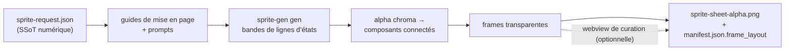

<p align="center">
  
  
  
  
  
  
  
</p>

<h1 align="center">sprite-gen</h1>

<p align="center"><b>Un dessin en entrée. Un atlas de sprites prêt pour le jeu en sortie.</b></p>

<p align="center">

**English** · [한국어](README.ko.md) · [日本語](README.ja.md) · [简体中文](README.zh-Hans.md) · [Español](README.es.md) · [Français](README.fr.md)

</p>

---

Demandez à un modèle d’image une « feuille de sprites » et vous savez ce que vous obtenez : un personnage dont le visage change à chaque frame, un arrière-plan impossible à détourer, des poses qui se chevauchent et dérivent hors de la grille, et un PNG que votre moteur de jeu ne peut pas réellement consommer. Démo mignonne, ressource inutile.

`sprite-gen` est une compétence Codex/Claude qui comble cet écart. Donnez-lui **une image de base** et une liste d’actions — elle pilote la génération ligne par ligne, verrouille l’identité du personnage, retire l’arrière-plan chroma en véritable alpha, extrait chaque pose comme une frame transparente propre, et produit un atlas d’exécution **avec un `manifest.json.frame_layout` lisible par machine**. Tous les sprites ci-dessus ont été créés ainsi.

Et pour les derniers 10 % que la génération ne réussit jamais tout à fait, il existe une **webview de curation** : comparez les frames côte à côte, rejetez celles qui sont cassées, ajustez rotation/échelle/position de façon non destructive, regardez la boucle en direct — puis produisez l’atlas. Le pipeline fait le travail ; vous gardez le goût.

```text
sprite-request.json → guides de mise en page + prompts → sprite-gen gen lignes d’états
→ alpha chroma → composants connectés → frames transparentes
→ sprite-sheet-alpha.png + manifest.json.frame_layout
```



> Architecture complète : [`docs/architecture.md`](docs/architecture.md)

## Ce que vous obtenez réellement

- **Un atlas de sprites transparent** (`sprite-sheet-alpha.png`) — véritable alpha, aucun résidu de frange chroma, vérifié sur arrière-plans blancs.
- **Un manifeste d’exécution** (`manifest.json.frame_layout`) — rectangles de frames absolus, fps par état et indicateurs de boucle. Votre moteur échantillonne des rectangles ; il ne devine jamais une grille.
- **Une QA que vous pouvez regarder** — GIFs par état et planches contact, pour juger le mouvement comme mouvement avant toute livraison.
- **Des libellés honnêtes** — les actions courtes et lisibles (idle, jump, attack, wave) sont le chemin stable ; la locomotion cyclique (walk/run) est marquée expérimentale sauf si la QA du mouvement passe réellement. Pas de promesses silencieuses exagérées.

## Qualité de l’alpha chroma

L’extracteur garde le nettoyage chroma déterministe : le démélange en alpha doux préserve les mèches de cheveux anticrénelées et les contours fins au lieu de les arracher avant que la couverture puisse être résolue.

<p align="center">
  <br />
  <em>Illustration, clé magenta : source, suppression v1.12.0, démélange alpha doux v1.13.0.</em>
</p>

<p align="center">
  <br />
  <em>Illustration, clé verte : source, suppression v1.12.0, démélange alpha doux v1.13.0.</em>
</p>

<p align="center">
  <br />
  <em>Pixel art, clé magenta : source, suppression v1.12.0, sortie binarisée v1.13.0.</em>
</p>

<p align="center">
  <br />
  <em>Pixel art, clé verte : source, suppression v1.12.0, sortie binarisée v1.13.0.</em>
</p>

Les recadrages rapprochés ci-dessous montrent le détail des bords derrière les comparaisons corps entier.


## Webview de curation

La génération vous mène à 90 %. La webview est l’endroit où un humain l’amène jusqu’à *livré* — autonome, sans dépendance à Studio ni à un framework, fonctionne partout où la compétence est installée (Claude Code Desktop, l’application Codex, un terminal simple).


- **Deux lignes par état :** la **séquence de lecture** en haut et un **pool de candidats** en dessous (par ex. une deuxième ou troisième génération). Faites glisser la poignée ⠿ d’une frame pour réordonner la séquence, ou remontez une découpe depuis le pool — reconstruisez une boucle de course propre à partir des meilleures frames de plusieurs essais. L’agencement est enregistré, donc la réouverture le restaure.
- **Transformation non destructive** par frame : glisser = déplacer, molette = redimensionner, poignée supérieure = pivoter, bas gauche = cisaillement, plus un interrupteur de retournement horizontal pour une sortie inversée gauche-droite. Les modifications vivent dans un fichier compagnon `curation.json` — les PNG sources ne sont jamais réécrits, et l’étape de composition produit le résultat de façon déterministe. L’aperçu et la production partagent une seule matrice affine, donc ce que vous alignez est ce que vous obtenez.
- **L’aperçu en direct** anime la séquence au fps de l’état, avec lecture/pause, progression frame par frame, et contrôle de vitesse 0.25×–4×.
- Pas seulement pour les sprites : pointez-le vers n’importe quel dossier de candidats image (icônes, logos, brouillons générés) avec `unpack_atlas_run.py --pngs-dir` et utilisez-le comme vue générale pour choisir le gagnant.

### Grille de sol isométrique

Pour les ensembles isométriques, la webview superpose la grille de sol (depuis les tile/anchor de `meta.json`) afin que vous puissiez accrocher le mobilier aux axes du losange avec la poignée de cisaillement.


### Langues

La webview est fournie avec l’anglais et le coréen. Passez `--lang en|ko` au lancement, ou utilisez l’interrupteur intégré à l’application :

```bash
python3 scripts/serve_curation.py --run-dir <run-dir> --lang en   # ou ko
```

## Prise en charge de Python

`sprite-gen` prend en charge CPython 3.10+. La CI exécute la version minimale prise en charge (3.10) et la dernière version couverte (3.14) sur des runners hébergés par GitHub.

Le démarrage rapide nécessite une installation Python avec `venv`/`ensurepip` fonctionnels. Si `python3 -m venv` échoue avant l’installation des paquets dans une distribution locale, utilisez un build CPython standard pour n’importe quelle version prise en charge et relancez les mêmes commandes.

## Démarrage rapide

```bash
# 0. installer les dépendances (Pillow) dans un virtualenv frais
python3 -m venv .venv && source .venv/bin/activate
pip install -e .

# 1. préparer une exécution depuis une image de base
python3 scripts/prepare_sprite_run.py --out-dir <run-dir> --character-id <id> --base-image base.png

# 2. générer une image de ligne par état avec le CLI provider possédé par le moteur
python3 scripts/generate_sprite_image.py --provider codex \
  --prompt-file <run-dir>/prompts/<state>.txt \
  --out <run-dir>/raw/<state>.png \
  --ref <run-dir>/base-source.png \
  --ref <run-dir>/references/layout-guides/<state>.png
# 3. extraire les frames
python3 scripts/extract_sprite_row_frames.py --run-dir <run-dir>

# 4. (optionnel) curer les frames dans la webview
python3 scripts/serve_curation.py --run-dir <run-dir>

# 5. produire l’atlas d’exécution
python3 scripts/compose_sprite_atlas.py --run-dir <run-dir>
```

### Modifier une feuille terminée

Quand seule la feuille combinée subsiste, reconstruisez un dossier d’exécution prêt pour le curateur, puis curez et exportez :

```bash
# reconstruire les frames : --grid explicite, rectangles --manifest, ou auto-détection alpha (par défaut)
python3 scripts/unpack_atlas_run.py --atlas sheet.png            # auto-détection
python3 scripts/unpack_atlas_run.py --manifest manifest.json     # rectangles exacts
python3 scripts/unpack_atlas_run.py --pngs-dir furniture/        # importer un ensemble de PNG libres

# après la curation, produire les corrections vers des PNG nommés
python3 scripts/export_curated_pngs.py --run-dir <run-dir>
```

La sortie est par défaut un dossier trouvable `<source>-curator` à côté de l’entrée.

### Découper l’arrière-plan d’une image importée

Les sprites générés sont détourés depuis leur propre arrière-plan magenta/vert dans le
pipeline, donc ils n’ont jamais besoin de ceci. `cutout` est l’utilitaire d’import/post-édition : une
image arrivée *avec* un arrière-plan uniforme opaque (une icône dessinée à la main, un
sprite téléchargé, une capture d’écran) est transformée en PNG transparent propre.

```bash
# arrière-plan blanc / ivoire / uni -> RGBA transparent
python3 -m sprite_gen.cli cutout icon.png --white-check
```

Il estime la couleur d’arrière-plan depuis les coins, remplit par propagation l’arrière-plan connecté
par position (ainsi les reflets clairs *à l’intérieur* de l’objet sont préservés,
pas perforés en trous), puis adoucit la bordure avec un alpha doux décontaminé.
`--white-check` écrit des composites cyan/magenta/jaune afin que toute frange résiduelle
apparaisse clairement. Ajustez avec `--strength` (suppression de biseau), `--band` (profondeur
de bord), et `--erode`. Pas destiné aux arrière-plans complexes/non uniformes.

Le workflow et les contrats destinés aux agents vivent dans [`SKILL.md`](SKILL.md).

## Installation

Depuis les workflows d’installation de compétences Codex, installez ce dépôt comme compétence racine :

```bash
python3 ~/.codex/skills/.system/skill-installer/scripts/install-skill-from-github.py \
  --repo aldegad/sprite-gen --path .
```

### Propriété de la génération d’images

La génération adossée à un provider fait partie de ce moteur (`sprite_gen.gen`), avec
`codex` et `grok` comme providers pris en charge. La compétence générale `image-gen` n’est
qu’une navette fine vers la même commande, donc elle n’a pas besoin d’une deuxième
implémentation de provider. Consultez [`docs/gen.md`](docs/gen.md) pour le CLI et le contrat
de vérification.

## Attribution

Le workflow par lignes de composants est inspiré de la compétence `hatch-pet` sous licence Apache-2.0, mais cible des atlas de sprites de jeu génériques et n’inclut aucun paquet ni ressource visuelle de familier.

## Licence

Apache-2.0