<h1 align="center">sprite-gen</h1>

<p align="center"><b>Un dessin en entrée. Un atlas de sprites prêt pour le jeu en sortie.</b></p>

<p align="center">

**Anglais** · [한국어](README.ko.md) · [日本語](README.ja.md) · [简体中文](README.zh-Hans.md) · [Español](README.es.md) · [Français](README.fr.md)

</p>

---

Sprites générés et curatés avec cette compétence (`claudecy`, `howl`) :

<p align="center">
  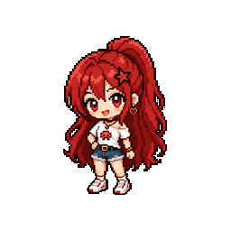
  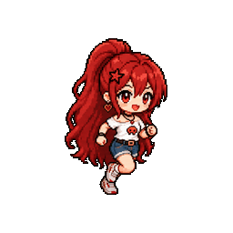
  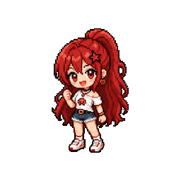
  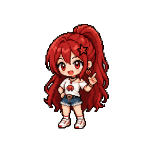
  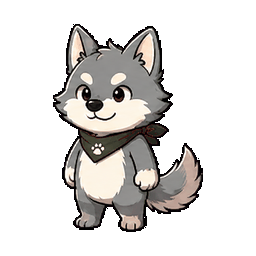
  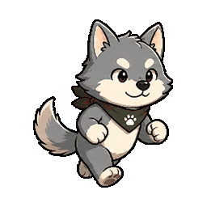
  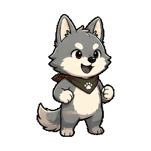
</p>

Demandez à un modèle d'image une « sprite sheet » et vous savez ce que vous allez obtenir : un personnage dont le visage change à chaque frame, un arrière-plan impossible à détourer, des poses qui se chevauchent et dérivent hors de la grille, ainsi qu'un PNG que votre moteur de jeu ne peut réellement pas utiliser. Une jolie démo, un asset inutile.

`sprite-gen` est une compétence Codex/Claude qui comble cet écart. Donnez-lui **une image de base** et une liste d'actions : elle pilote la génération ligne par ligne, verrouille l'identité du personnage, supprime l'arrière-plan chromatique pour obtenir un véritable canal alpha, extrait chaque pose sous forme de frame transparente propre, puis fabrique un atlas d'exécution **avec un `manifest.json.frame_layout` lisible par machine**.

Et pour les derniers 10 % que la génération ne réussit jamais à obtenir, il existe une **vue web de curation** : comparez les frames côte à côte, rejetez celles qui sont défectueuses, ajustez rotation/échelle/position de manière non destructive, observez la boucle en direct, puis fabriquez l'atlas. Le pipeline fait le travail ; vous gardez le goût.

```text
sprite-request.json → guides de mise en page + invites → sprite-gen gen lignes d'état
→ alpha chromatique → composants connexes → frames transparentes
→ sprite-sheet-alpha.png + manifest.json.frame_layout
```

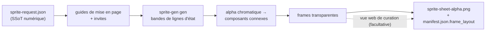
```mermaid
flowchart LR
    REQ["sprite-request.json<br/>(SSoT numérique)"] --> GUIDES["guides de mise en page<br/>+ invites"]
    GUIDES --> GEN["sprite-gen gen<br/>bandes de lignes d'état"]
    GEN --> EXTRACT["alpha chromatique →<br/>composants connexes"]
    EXTRACT --> FRAMES["frames transparentes"]
    FRAMES --> ATLAS["sprite-sheet-alpha.png<br/>+ manifest.json.frame_layout"]
    FRAMES -. "vue web de curation (facultative)" .-> ATLAS
```

> Architecture complète : [`docs/architecture.md`](docs/architecture.md)

## Ce que vous obtenez réellement

- **Un atlas de sprites transparent** (`sprite-sheet-alpha.png`) — véritable canal alpha, aucun halo chromatique résiduel, vérifié sur des arrière-plans blancs.
- **Un manifeste d'exécution** (`manifest.json.frame_layout`) — rectangles absolus des frames, fps et indicateurs de boucle par état. Votre moteur échantillonne les rectangles ; il ne devine jamais une grille.
- **Une QA que vous pouvez observer** — GIF par état et planches de contact, afin de juger le mouvement en tant que mouvement avant toute livraison.
- **Des libellés honnêtes** — les actions courtes et lisibles (idle, jump, attack, wave) sont la voie stable ; la locomotion cyclique (walk/run) est marquée comme expérimentale, sauf si la QA du mouvement est effectivement réussie. Aucune promesse excessive dissimulée.

## Qualité de l'alpha chromatique

L'extracteur conserve un nettoyage chromatique déterministe : le démélange à alpha doux préserve les mèches de cheveux et les contours fins anticrénelés, au lieu de les arracher avant de pouvoir résoudre la couverture.

<p align="center">
  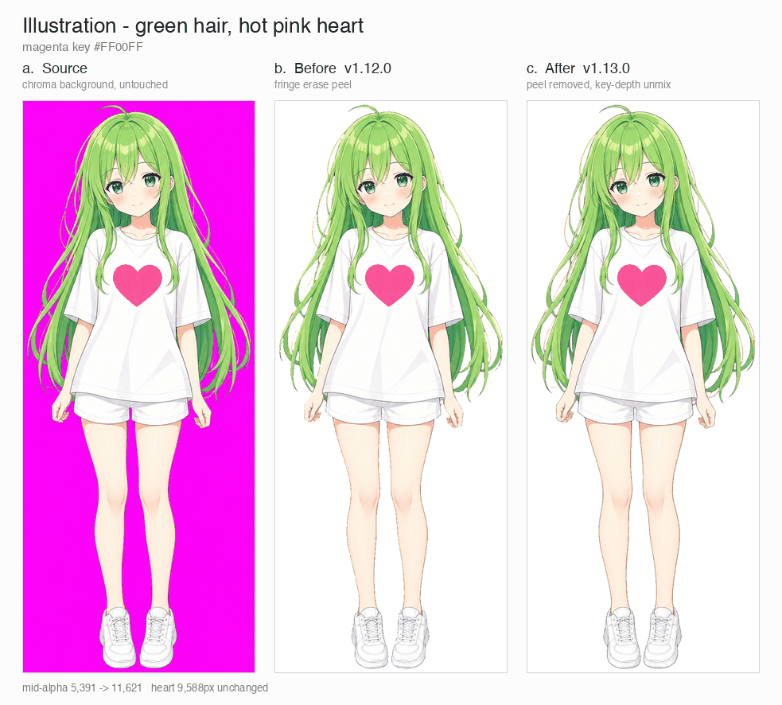<br />
  <em>Illustration, clé magenta : source, détourage peel v1.12.0, démélange à alpha doux v1.13.0.</em>
</p>

<p align="center">
  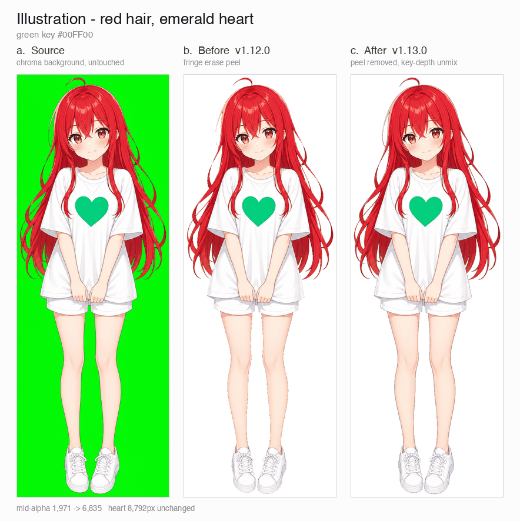<br />
  <em>Illustration, clé verte : source, détourage peel v1.12.0, démélange à alpha doux v1.13.0.</em>
</p>

<p align="center">
  <br />
  <em>Pixel art, clé magenta : source, détourage peel v1.12.0, sortie binarisée v1.13.0.</em>
</p>

<p align="center">
  <br />
  <em>Pixel art, clé verte : source, détourage peel v1.12.0, sortie binarisée v1.13.0.</em>
</p>

Les recadrages en gros plan ci-dessous montrent les détails des contours derrière les comparaisons en pied.

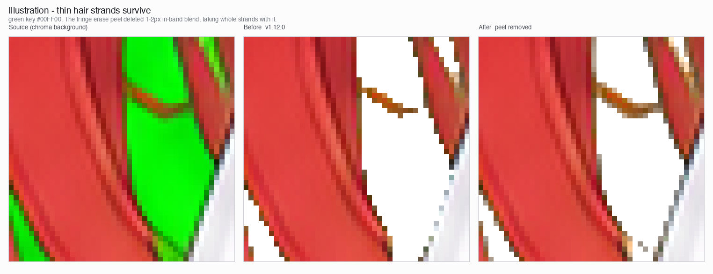

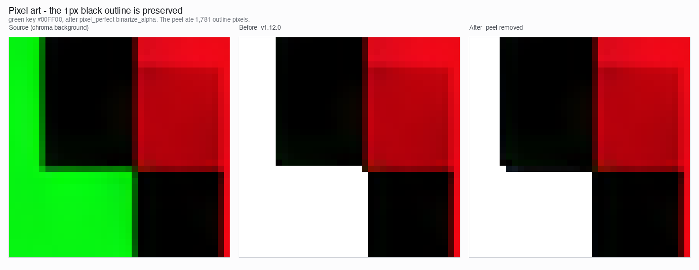

## Backbone Lattice

Le « pixel art » généré par IA n'est pas du pixel art. Les blocs vacillent, les contours portent de l'anticrénelage et la grille dérive au sein d'une même ligne, si bien qu'une découpe sur une grille régulière étale un bloc sur le suivant. La solution communautaire consiste à « dé-falsifier » l'image — deviner la taille des blocs à partir des longueurs de séquences, puis la re-quantifier — mais cela mesure chaque frame séparément, de sorte que la taille des cellules d'un cycle de marche respire d'une frame à l'autre.

**Backbone Lattice** mesure une grille unique pour tout le sujet et y maintient chaque découpe. La détection du pas par frame alimente un consensus transversal à toute la ligne et à toutes les frames, qui l'emporte sur les erreurs de détection harmoniques ; cette grille consensuelle est la *colonne vertébrale* sur laquelle chaque découpe s'aligne. Les découpes tombent sur les véritables frontières de couleur, et une largeur minimale de cellule proportionnelle au pas mesuré empêche deux découpes voisines de se retrouver sur la même bande. Une seule colonne vertébrale : le même bloc conserve donc la même taille sur toute l'animation au lieu de sauter d'une frame à l'autre.

Le résultat est vérifié par rapport à ce qui a été livré, et non évalué à l'œil sur une frame choisie : chaque séquence pixel-unfake est recalculée depuis sa propre bande source, puis comparée pixel par pixel. La forme que vous avez approuvée reste celle que vous obtenez ; seul l'emplacement des contours et des ombrages change, exactement comme le décide la colonne vertébrale.

## Vue web de curation

La génération vous mène à 90 %. La vue web est l'endroit où une personne l'amène jusqu'à la version *livrée* — autonome, sans dépendance à Studio ou à un framework, et exécutable partout où la compétence est installée (Claude Code Desktop, l'application Codex, un terminal classique).

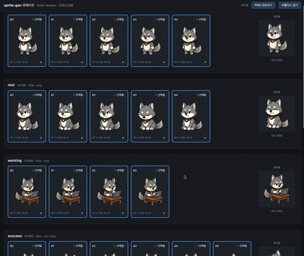

- **Deux lignes par état :** la **séquence de lecture** en haut et le **pool de candidats** en dessous (par exemple une deuxième ou troisième prise générée). Faites glisser la poignée ⠿ d'une frame pour réordonner la séquence, ou remontez une découpe depuis le pool — reconstruisez une boucle de course propre à partir des meilleures frames de toutes les prises. La disposition est enregistrée, de sorte que sa réouverture la restaure.
- **Transformation non destructive** par frame : glisser = déplacer, molette = redimensionner, poignée supérieure = faire pivoter, coin inférieur gauche = incliner, avec en plus un bouton d'inversion horizontale pour les sorties inversées gauche-droite. Les modifications résident dans un fichier annexe `curation.json` — les PNG sources ne sont jamais réécrits et l'étape de composition fabrique le résultat de manière déterministe. L'aperçu et la fabrication utilisent la même matrice affine : ce que vous alignez est donc ce que vous obtenez.
- **Aperçu en direct** : la séquence est animée à la fréquence d'images de l'état, avec lecture/pause, avance frame par frame et contrôle de vitesse de 0,25× à 4×.
- Ce n'est pas réservé aux sprites : pointez-la vers n'importe quel dossier de candidats image (icônes, logos, brouillons générés) avec `unpack_atlas_run.py --pngs-dir` et utilisez-la comme vue générale pour choisir le gagnant.

### Grille de sol isométrique

Pour les ensembles isométriques, la vue web superpose la grille du sol (à partir de `meta.json` tile/anchor), afin que vous puissiez aligner les meubles sur les axes du losange avec la poignée d'inclinaison.


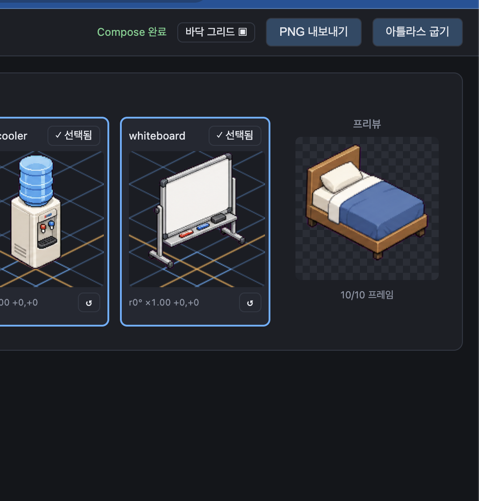

### Langues

La vue web est fournie en anglais et en coréen. Passez `--lang en|ko` au lancement, ou utilisez le bouton intégré :

```bash
python3 scripts/serve_curation.py --run-dir <run-dir> --lang en   # ou ko
```

## Prise en charge de Python

`sprite-gen` prend en charge CPython 3.10+. La CI exécute la version minimale prise en charge (3.10) ainsi que la dernière version couverte (3.14) sur des runners hébergés par GitHub.

Le démarrage rapide nécessite une installation de Python avec un fonctionnement correct de `venv`/`ensurepip`. Si `python3 -m venv` échoue avant l'installation des paquets dans une distribution locale, utilisez une version standard de CPython prise en charge, puis relancez les mêmes commandes.

## Démarrage rapide

```bash
# 0. installer les dépendances (Pillow, NumPy) dans un environnement virtuel vierge
python3 -m venv .venv && source .venv/bin/activate
pip install -e .

# 1. préparer une exécution à partir d'une image de base
python3 scripts/prepare_sprite_run.py --out-dir <run-dir> --character-id <id> --base-image base.png

# 2. générer une image de ligne par état avec la CLI du fournisseur géré par le moteur
python3 scripts/generate_sprite_image.py --provider codex \
  --prompt-file <run-dir>/prompts/<state>.txt \
  --out <run-dir>/raw/<state>.png \
  --ref <run-dir>/base-source.png \
  --ref <run-dir>/references/layout-guides/<state>.png
# 3. extraire les frames
python3 scripts/extract_sprite_row_frames.py --run-dir <run-dir>

# 4. (facultatif) curater les frames dans la vue web
python3 scripts/serve_curation.py --run-dir <run-dir>

# 5. fabriquer l'atlas d'exécution
python3 scripts/compose_sprite_atlas.py --run-dir <run-dir>
```

### Modifier une feuille terminée

Lorsqu'il ne reste que la feuille combinée, reconstruisez un répertoire d'exécution prêt pour le curateur, puis curater et exporter :

```bash
# reconstruire les frames : --grid explicite, rectangles du manifeste ou détection automatique de l'alpha (par défaut)
python3 scripts/unpack_atlas_run.py --atlas sheet.png            # détection automatique
python3 scripts/unpack_atlas_run.py --manifest manifest.json     # rectangles exacts
python3 scripts/unpack_atlas_run.py --pngs-dir furniture/        # importer un ensemble de PNG séparés

# après la curation, fabriquer les corrections dans des PNG nommés
python3 scripts/export_curated_pngs.py --run-dir <run-dir>
```

Par défaut, la sortie utilise un dossier `<source>-curator` facile à retrouver, placé à côté de l'entrée.

### Détourer l'arrière-plan d'une image importée

Les sprites générés sont détourés à partir de leur propre arrière-plan magenta/vert dans le pipeline et n'ont donc jamais besoin de cette opération. `cutout` est l'utilitaire d'importation/post-édition : une image arrivée *avec* un arrière-plan opaque et uniforme (une icône dessinée à la main, un sprite téléchargé, une capture d'écran) est transformée en PNG transparent propre.

<p align="center">
  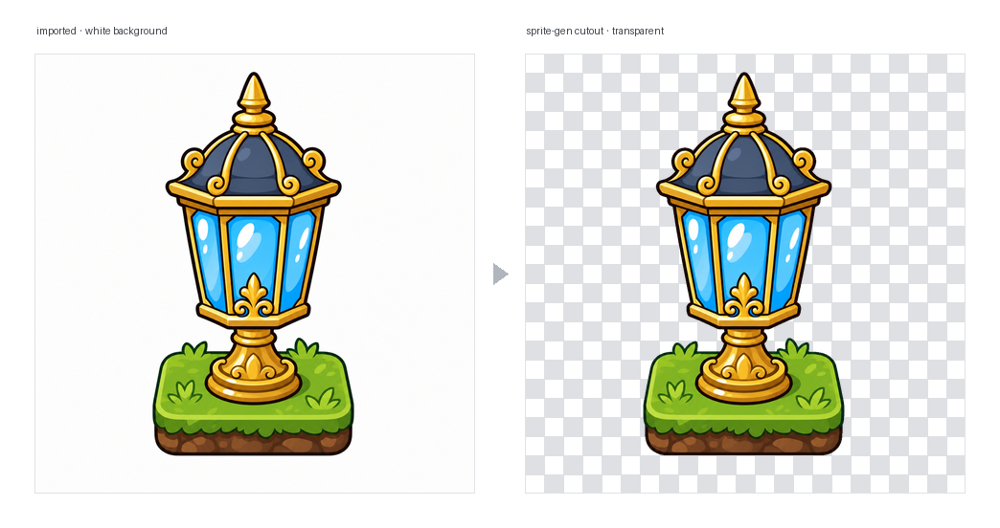
</p>

```bash
# achemine selon la couleur du coin : blanc/ivoire -> matte, magenta/vert -> moteur d'extraction
python3 -m sprite_gen.cli cutout icon.png --white-check
```

Il lit la couleur de l'arrière-plan dans le coin et achemine (`--key auto|white|magenta|green`) :

- **blanc / ivoire / uni** → matte positionnel. Un remplissage par propagation depuis le coin conserve uniquement l'arrière-plan connexe (les reflets lumineux *à l'intérieur* de l'objet sont préservés, sans créer de trous), puis un alpha doux décontaminé adoucit la bordure. Ajustez avec `--strength` (suppression du biseau), `--band` (profondeur du contour) et `--erode`.
- **clé magenta / verte** → le moteur chromatique `extract` vérifié du projet est réutilisé tel quel. Les couleurs clés n'apparaissent jamais dans les objets, de sorte que sa découpe basée uniquement sur la couleur est sûre dans ce cas — exactement là où la garde contre les zones blanches du flood-fill d'un matte blanc n'est pas nécessaire.

`--white-check` écrit des composites cyan/magenta/jaune afin que tout halo résiduel ressorte clairement. Pour les arrière-plans uniformes ; pas pour les arrière-plans complexes ou non uniformes.

Le workflow complet destiné aux agents et les contrats sont disponibles dans [`SKILL.md`](SKILL.md).

## Installation

Depuis les workflows de l'installateur de compétences Codex, installez ce dépôt comme compétence racine :

```bash
python3 ~/.codex/skills/.system/skill-installer/scripts/install-skill-from-github.py \
  --repo aldegad/sprite-gen --path .
```

### Propriété de la génération d'images

La génération soutenue par un fournisseur fait partie de ce moteur (`sprite_gen.gen`), avec `codex` et `grok` comme fournisseurs pris en charge. La compétence générale `image-gen` n'est qu'une passerelle légère vers la même commande et n'a donc pas besoin d'une seconde implémentation de fournisseur. Consultez [`docs/gen.md`](docs/gen.md) pour le contrat de CLI et de vérification.

## Attribution

Le workflow par lignes de composants est inspiré de la compétence `hatch-pet`, sous licence Apache-2.0, mais cible les atlas de sprites de jeu génériques et n'inclut aucun paquet pour animaux ni asset visuel d'animal.

## Licence

Apache-2.0