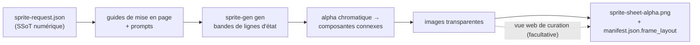
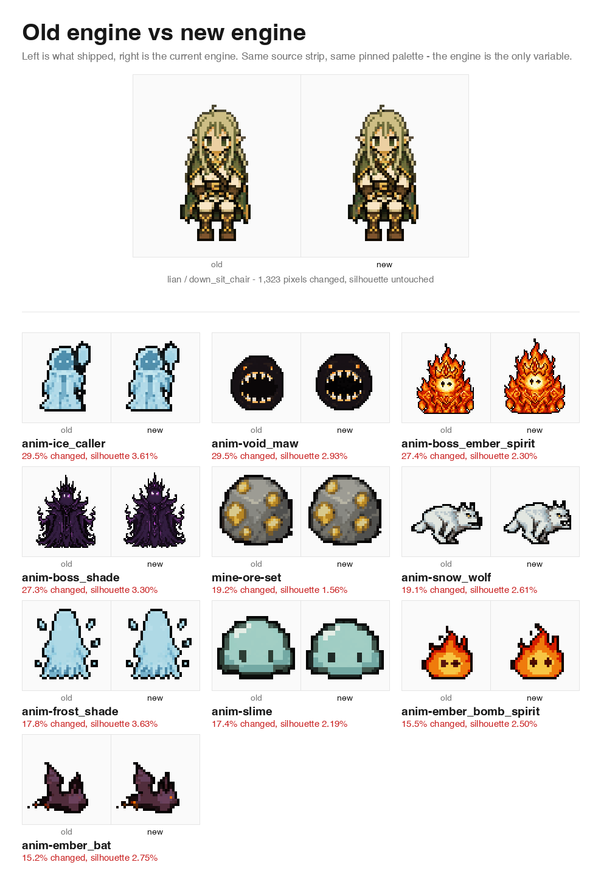

<h1 align="center">sprite-gen</h1>

<p align="center"><b>Un dessin en entrée. Un atlas de sprites prêt pour le jeu en sortie.</b></p>

<p align="center">

**Anglais** · [한국어](README.ko.md) · [日本語](README.ja.md) · [简体中文](README.zh-Hans.md) · [Espagnol](README.es.md) · [Français](README.fr.md)

</p>

---

Demandez à un modèle d’image une « sprite sheet » et vous savez ce que vous allez obtenir : un personnage dont le visage change à chaque image, un arrière-plan impossible à détourer, des poses qui se chevauchent et dérivent de la grille, ainsi qu’un PNG que votre moteur de jeu ne peut même pas utiliser. Une jolie démonstration, un asset inutile.

`sprite-gen` est un skill Codex/Claude qui comble cet écart. Donnez-lui **une image de base** et une liste d’actions — il pilote la génération ligne par ligne, verrouille l’identité du personnage, transforme l’arrière-plan chromatique en véritable alpha, extrait chaque pose sous forme d’image transparente propre, puis fabrique un atlas d’exécution **avec un `manifest.json.frame_layout` lisible par machine**.

Et pour les derniers 10 % que la génération ne réussit jamais à régler, il existe une **vue web de curation** : comparez les images côte à côte, rejetez celles qui sont ratées, ajustez rotation/échelle/position de manière non destructive, regardez la boucle en direct — puis fabriquez l’atlas. Le pipeline fait le travail ; vous gardez l’œil.

```text
sprite-request.json → guides de mise en page + prompts → sprite-gen gen state rows
→ alpha chromatique → composantes connexes → images transparentes
→ sprite-sheet-alpha.png + manifest.json.frame_layout
```


```mermaid
flowchart LR
    REQ["sprite-request.json<br/>(SSoT numérique)"] --> GUIDES["guides de mise en page<br/>+ prompts"]
    GUIDES --> GEN["sprite-gen gen<br/>bandes de lignes d'état"]
    GEN --> EXTRACT["alpha chromatique →<br/>composantes connexes"]
    EXTRACT --> FRAMES["images transparentes"]
    FRAMES --> ATLAS["sprite-sheet-alpha.png<br/>+ manifest.json.frame_layout"]
    FRAMES -. "vue web de curation (facultative)" .-> ATLAS
```

> Architecture complète : [`docs/architecture.md`](docs/architecture.md)

## Ce que vous obtenez réellement

- **Un atlas de sprites transparent** (`sprite-sheet-alpha.png`) — véritable alpha, sans frange chromatique résiduelle, vérifié sur des arrière-plans blancs.
- **Un manifeste d’exécution** (`manifest.json.frame_layout`) — rectangles absolus de chaque image, fps et indicateurs de boucle par état. Votre moteur échantillonne des rectangles ; il ne devine jamais une grille.
- **Une QA que vous pouvez regarder** — des GIF par état et des planches de contact, pour juger le mouvement comme un mouvement avant toute livraison.
- **Des libellés honnêtes** — les actions courtes et lisibles (idle, jump, attack, wave) sont la voie stable ; la locomotion cyclique (walk/run) reste marquée comme expérimentale tant que la QA du mouvement n’a pas réellement réussi. Aucune promesse excessive silencieuse.

## Qualité de l’alpha chromatique

L’extracteur conserve un nettoyage chromatique déterministe : le démélange soft-alpha préserve les mèches de cheveux antialiasées et les contours fins au lieu de les retirer avant de pouvoir résoudre la couverture.

<p align="center">
  <br />
  <em>Illustration, clé magenta : source, détourage v1.12.0, démélange soft-alpha v1.13.0.</em>
</p>

<p align="center">
  <br />
  <em>Illustration, clé verte : source, détourage v1.12.0, démélange soft-alpha v1.13.0.</em>
</p>

<p align="center">
  <br />
  <em>Pixel art, clé magenta : source, détourage v1.12.0, sortie binarisée v1.13.0.</em>
</p>

<p align="center">
  <br />
  <em>Pixel art, clé verte : source, détourage v1.12.0, sortie binarisée v1.13.0.</em>
</p>

Les gros plans ci-dessous montrent les détails des contours derrière les comparaisons en pied.


## Backbone Lattice

Le « pixel art » généré par l’IA n’est pas du pixel art. Les blocs tremblent, les contours portent de l’antialiasing et la trame dérive au sein d’une même ligne ; découper selon une grille régulière étale donc un bloc sur le suivant. La solution proposée par la communauté consiste à « dé-falsifier » l’image — deviner la taille des blocs à partir des longueurs de séquences et requantifier — mais chaque image est ainsi mesurée séparément, de sorte que la taille des cellules d’une boucle de marche respire d’une image à l’autre.

**Backbone Lattice** mesure une seule grille pour l’ensemble du sujet et y maintient chaque découpe. La détection du pas par image alimente un consensus sur toute la ligne et sur toutes les images, qui l’emporte sur les mauvaises détections harmoniques ; cette grille consensuelle est le *backbone* sur lequel chaque découpe s’aligne. Les découpes tombent sur les véritables frontières de couleur, et une largeur minimale de cellule proportionnelle au pas mesuré empêche deux découpes voisines de se rabattre sur la même bande. Un seul backbone : le même bloc conserve la même taille sur toute l’animation au lieu de changer d’une image à l’autre.

Même bande source, même palette verrouillée. Le moteur est la seule variable.

La vérification a été menée sur un projet entier plutôt que sur une image choisie : les 94 séquences pixel-perfect d’un jeu en production ont été recalculées à partir de leurs propres bandes sources, puis comparées pixel par pixel à la version livrée.

<p align="center">
  
</p>

Sur 26 690 432 pixels canoniques, la silhouette a changé de 1,41 %. La forme que vous avez approuvée reste celle que vous obtenez ; ce qui change, c’est l’emplacement des contours et de l’ombrage, exactement ce que le backbone détermine.

## Vue web de curation

La génération vous amène à 90 %. La vue web est l’endroit où un humain l’amène jusqu’à la *livraison* — autonome, sans dépendance à Studio ou à un framework, et exécutable partout où le skill est installé (Claude Code Desktop, l’application Codex, un simple terminal).


- **Deux lignes par état :** la **séquence de lecture** en haut et un **réservoir de candidates** en bas (par exemple une deuxième ou une troisième prise générée). Faites glisser la poignée ⠿ d’une image pour réordonner la séquence, ou remontez une découpe depuis le réservoir — reconstruisez une boucle de course propre à partir des meilleures images de plusieurs prises. La disposition est enregistrée ; la réouverture la restaure.
- **Transformation non destructive** par image : glisser = déplacer, molette = redimensionner, poignée supérieure = faire pivoter, coin inférieur gauche = incliner, avec en plus un bouton d’inversion horizontale pour les sorties inversées gauche-droite. Les modifications sont conservées dans un fichier annexe `curation.json` — les PNG sources ne sont jamais réécrits, et l’étape de composition fabrique le résultat de manière déterministe. L’aperçu et la fabrication utilisent une même matrice affine ; ce que vous alignez est donc ce que vous obtenez.
- **Aperçu en direct** : la séquence est animée à la valeur fps de l’état, avec lecture/pause, avancement image par image et contrôle de vitesse de 0,25× à 4×.
- Pas seulement pour les sprites : pointez-la vers n’importe quel dossier d’images candidates (icônes, logos, brouillons générés) avec `unpack_atlas_run.py --pngs-dir` et utilisez-la comme vue générale de sélection du meilleur résultat.

### Grille de sol isométrique

Pour les ensembles isométriques, la vue web superpose la grille du sol (depuis `meta.json` tile/anchor), afin que vous puissiez aligner les meubles sur les axes du losange avec la poignée d’inclinaison.


### Langues

La vue web est fournie en anglais et en coréen. Passez `--lang en|ko` au lancement, ou utilisez le bouton intégré :

```bash
python3 scripts/serve_curation.py --run-dir <run-dir> --lang en   # ou ko
```

## Prise en charge de Python

`sprite-gen` prend en charge CPython 3.10+. La CI exécute la version minimale prise en charge (3.10) ainsi que la dernière version couverte (3.14) sur des runners hébergés par GitHub.

Le démarrage rapide nécessite une installation de Python avec un `venv`/`ensurepip` fonctionnel. Si `python3 -m venv` échoue avant l’installation des paquets dans une distribution locale, utilisez une version standard de CPython dans n’importe quelle version prise en charge, puis relancez les mêmes commandes.

## Démarrage rapide

```bash
# 0. installer les dépendances (Pillow) dans un virtualenv neuf
python3 -m venv .venv && source .venv/bin/activate
pip install -e .

# 1. préparer une exécution à partir d’une image de base
python3 scripts/prepare_sprite_run.py --out-dir <run-dir> --character-id <id> --base-image base.png

# 2. générer une image de ligne par état avec la CLI du fournisseur gérée par le moteur
python3 scripts/generate_sprite_image.py --provider codex \
  --prompt-file <run-dir>/prompts/<state>.txt \
  --out <run-dir>/raw/<state>.png \
  --ref <run-dir>/base-source.png \
  --ref <run-dir>/references/layout-guides/<state>.png
# 3. extraire les images
python3 scripts/extract_sprite_row_frames.py --run-dir <run-dir>

# 4. (facultatif) curer les images dans la vue web
python3 scripts/serve_curation.py --run-dir <run-dir>

# 5. fabriquer l’atlas d’exécution
python3 scripts/compose_sprite_atlas.py --run-dir <run-dir>
```

### Modifier une planche terminée

Lorsqu’il ne reste que la planche combinée, reconstruisez un répertoire d’exécution prêt pour le curateur, puis curez et exportez :

```bash
# reconstruire les images : --grid explicite, rectangles du manifeste ou détection alpha automatique (par défaut)
python3 scripts/unpack_atlas_run.py --atlas sheet.png            # détection automatique
python3 scripts/unpack_atlas_run.py --manifest manifest.json     # rectangles exacts
python3 scripts/unpack_atlas_run.py --pngs-dir furniture/        # importer un ensemble de PNG indépendants

# après la curation, réintégrer les corrections dans des PNG nommés
python3 scripts/export_curated_pngs.py --run-dir <run-dir>
```

Par défaut, la sortie est placée dans un dossier `<source>-curator` facile à retrouver, à côté de l’entrée.

### Détourer l’arrière-plan d’une image importée

Les sprites générés utilisent leur propre arrière-plan magenta/vert comme clé dans le pipeline ; ils n’ont donc jamais besoin de cette opération. `cutout` est l’utilitaire d’import/post-édition : une image arrivée avec un arrière-plan opaque et uniforme (une icône dessinée à la main, un sprite téléchargé, une capture d’écran) est transformée en PNG transparent propre.

<p align="center">
  
</p>

```bash
# utilise la couleur du coin : blanc/ivoire -> matte, magenta/vert -> moteur d’extraction
python3 -m sprite_gen.cli cutout icon.png --white-check
```

L’utilitaire lit la couleur d’arrière-plan du coin et choisit la route (`--key auto|white|magenta|green`) :

- **blanc / ivoire / uni** → matte par position. Un remplissage depuis le coin ne conserve que l’arrière-plan connexe (les hautes lumières brillantes à l’intérieur de l’objet sont préservées, sans créer de trous), puis un alpha doux décontaminé adoucit le bord. Ajustez avec `--strength` (suppression du biseau), `--band` (profondeur du contour) et `--erode`.
- **clé magenta / verte** → le moteur chromatique `extract` vérifié par le projet est réutilisé tel quel. Les couleurs de clé n’apparaissent jamais dans les objets ; la découpe fondée uniquement sur la couleur y est donc sûre — précisément là où la protection par remplissage du matte blanc n’est pas nécessaire.

`--white-check` écrit des composites cyan/magenta/jaune afin que toute frange résiduelle apparaisse clairement. Pour les arrière-plans uniformes ; pas pour les arrière-plans complexes/non uniformes.

Le workflow complet destiné aux agents et les contrats sont disponibles dans [`SKILL.md`](SKILL.md).

## Installation

Depuis les workflows d’installation des skills Codex, installez ce dépôt comme skill racine :

```bash
python3 ~/.codex/skills/.system/skill-installer/scripts/install-skill-from-github.py \
  --repo aldegad/sprite-gen --path .
```

### Responsabilité de la génération d’images

La génération adossée à un fournisseur fait partie de ce moteur (`sprite_gen.gen`), avec `codex` et `grok` comme fournisseurs pris en charge. Le skill général `image-gen` n’est qu’une navette légère vers la même commande ; il n’a donc pas besoin d’une seconde implémentation de fournisseur. Consultez [`docs/gen.md`](docs/gen.md) pour le contrat de CLI et de vérification.

## Attribution

Le workflow de lignes par composantes s’inspire du skill `hatch-pet`, sous licence Apache-2.0, mais cible les atlas de sprites de jeu génériques et n’inclut aucun paquet ni asset visuel destiné aux animaux de compagnie.

## Licence

Apache-2.0