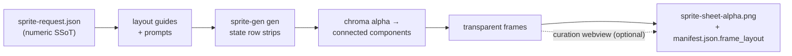

<h1 align="center">sprite-gen</h1>

<p align="center"><b>1枚の絵を入力。ゲーム対応のスプライトアトラスを出力。</b></p>

<p align="center">

**English** · [한국어](README.ko.md) · [日本語](README.ja.md) · [简体中文](README.zh-Hans.md) · [Español](README.es.md) · [Français](README.fr.md)

</p>

---

画像モデルに「スプライトシート」を頼むと、何が出てくるかはわかっています。フレームごとに顔が変わるキャラクター、キーアウトできない背景、重なり合ってグリッドからずれるポーズ、そしてゲームエンジンが実際には消費できないPNG。かわいいデモ、使えないアセット。

`sprite-gen` は、そのギャップを埋める Codex/Claude スキルです。**1枚のベース画像**とアクション一覧を渡すと、行ごとに生成を進め、キャラクターの同一性を固定し、クロマ背景を本物のアルファに剥がし、各ポーズをきれいな透過フレームとして抽出し、**機械可読な `manifest.json.frame_layout`** 付きのランタイムアトラスを焼き込みます。

そして生成がどうしても外す最後の10%には、**キュレーション webview** があります。フレームを横並びで比較し、壊れたものを却下し、回転/スケール/位置を非破壊で微調整し、ループをライブで確認してから焼き込みます。パイプラインが労力を引き受け、あなたはセンスを保ちます。

```text
sprite-request.json → layout guides + prompts → sprite-gen gen state rows
→ chroma alpha → connected components → transparent frames
→ sprite-sheet-alpha.png + manifest.json.frame_layout
```



> 全体アーキテクチャ: [`docs/architecture.md`](docs/architecture.md)

## 実際に得られるもの

- **透過スプライトアトラス** (`sprite-sheet-alpha.png`) — 本物のアルファ、残留クロマの縁なし、白背景で検証済み。
- **ランタイムマニフェスト** (`manifest.json.frame_layout`) — 絶対フレーム矩形、ステートごとのfpsとループフラグ。エンジンは矩形をサンプリングし、グリッドを推測しません。
- **目で確認できるQA** — ステートごとのGIFとコンタクトシートにより、出荷前にモーションをモーションとして判定できます。
- **正直なラベル** — 短く読みやすいアクション（idle, jump, attack, wave）が安定した経路です。周期的な移動（walk/run）は、モーションQAが実際に通らない限り experimental として扱われます。黙って過剰に約束しません。

## クロマアルファ品質

抽出器はクロマのクリーンアップを決定的に保ちます。soft-alpha unmix は、カバレッジを解く前に削ぎ落とすのではなく、アンチエイリアスされた髪の束や細いアウトラインを保持します。

<p align="center">
  <br />
  <em>イラスト、マゼンタキー: source, v1.12.0 peel, v1.13.0 soft-alpha unmix.</em>
</p>

<p align="center">
  <br />
  <em>イラスト、グリーンキー: source, v1.12.0 peel, v1.13.0 soft-alpha unmix.</em>
</p>

<p align="center">
  <br />
  <em>ピクセルアート、マゼンタキー: source, v1.12.0 peel, v1.13.0 binarized output.</em>
</p>

<p align="center">
  <br />
  <em>ピクセルアート、グリーンキー: source, v1.12.0 peel, v1.13.0 binarized output.</em>
</p>

下のクローズアップ切り抜きは、全身比較の背後にあるエッジのディテールを示しています。


## ピクセル格子の復元

AI が生成した「ピクセルアート」はピクセルアートではありません。ブロックは揺れ、輪郭にはアンチエイリアスが残り、格子は 1 行の中でもずれていきます。等間隔で切ると、あるブロックが隣のセルへにじみ出します。抽出器は格子を仮定せず測定します。フレームごとのピッチ検出、倍音の誤検出を押し切る行単位の合意、実際の色境界へスナップする切断線、そして測定されたピッチに比例する最小セル幅により、隣り合う切断線が同じ帯に重なって潰れることはありません。

同じソースストリップ、同じ固定パレット。変数はエンジンだけです。

選び抜いた 1 フレームではなく、プロジェクト 1 本まるごとで検証しました。実際のゲームの pixel_perfect ラン 94 本をそれぞれのソースストリップから再導出し、出荷中のフレームとピクセル単位で比較しています。

<p align="center">
  
</p>

正本フレーム 26,690,432px のうち、シルエットが動いたのは 1.41% です。承認した形はそのまま残り、変わるのは輪郭と陰影が落ちる位置、つまり格子が決めるまさにその部分です。

## キュレーション webview

生成で90%まで到達します。webview は、人間がそれを*出荷できる状態*まで持っていく場所です。スタンドアロンで、Studio やフレームワークへの依存はなく、スキルがインストールされている場所ならどこでも動きます（Claude Code Desktop、Codex app、普通のターミナル）。


- **ステートごとに2行:** 上が**再生シーケンス**、下が**候補プール**（例: 2回目や3回目に生成したテイク）。フレームの ⠿ グリップをドラッグしてシーケンスを並べ替えるか、プールからカットを引き上げます。複数テイクの最良フレームから、きれいなランループを1本組み直せます。配置は保存されるため、再度開くと復元されます。
- **フレームごとの非破壊トランスフォーム:** ドラッグ = 移動、ホイール = スケール、上ハンドル = 回転、左下 = シアー、さらに左右反転出力用の水平反転トグル。編集は `curation.json` サイドカーに保存されます。ソースPNGは決して書き換えられず、合成ステップが結果を決定的に焼き込みます。プレビューと焼き込みは同じアフィン行列を共有するため、揃えたものがそのまま得られます。
- **ライブプレビュー** はステートのfpsでシーケンスをアニメーションし、再生/一時停止、フレーム単位ステップ、0.25×–4×の速度制御に対応します。
- スプライト専用ではありません。`unpack_atlas_run.py --pngs-dir` で任意の画像候補フォルダ（アイコン、ロゴ、生成ドラフト）を指定すれば、汎用の勝者選びビューとして使えます。

### アイソメトリック地面グリッド

アイソメトリックセットでは、webview が（`meta.json` の tile/anchor から）床グリッドを重ね表示するため、シアーハンドルで家具をダイヤモンド軸にスナップできます。


### 言語

webview には英語と韓国語が同梱されています。起動時に `--lang en|ko` を渡すか、アプリ内トグルを使用します。

```bash
python3 scripts/serve_curation.py --run-dir <run-dir> --lang en   # or ko
```

## Python サポート

`sprite-gen` は CPython 3.10+ をサポートします。CI は GitHub-hosted runner 上で、サポートされる最小バージョン（3.10）と最新の対象バージョン（3.14）を実行します。

クイックスタートには、動作する `venv`/`ensurepip` を備えた Python インストールが必要です。ローカル配布版でパッケージインストール前に `python3 -m venv` が失敗する場合は、任意のサポート対象バージョンの標準 CPython ビルドを使用し、同じコマンドを再実行してください。

## クイックスタート

```bash
# 0. install dependencies (Pillow) into a fresh virtualenv
python3 -m venv .venv && source .venv/bin/activate
pip install -e .

# 1. prepare a run from a base image
python3 scripts/prepare_sprite_run.py --out-dir <run-dir> --character-id <id> --base-image base.png

# 2. generate one row image per state with the engine-owned provider CLI
python3 scripts/generate_sprite_image.py --provider codex \
  --prompt-file <run-dir>/prompts/<state>.txt \
  --out <run-dir>/raw/<state>.png \
  --ref <run-dir>/base-source.png \
  --ref <run-dir>/references/layout-guides/<state>.png
# 3. extract frames
python3 scripts/extract_sprite_row_frames.py --run-dir <run-dir>

# 4. (optional) curate frames in the webview
python3 scripts/serve_curation.py --run-dir <run-dir>

# 5. bake the runtime atlas
python3 scripts/compose_sprite_atlas.py --run-dir <run-dir>
```

### 完成済みシートを編集する

結合済みシートだけが残っている場合は、キュレーター対応の run dir を再構築してから、キュレーションとエクスポートを行います。

```bash
# rebuild frames: explicit --grid, --manifest rectangles, or alpha auto-detect (default)
python3 scripts/unpack_atlas_run.py --atlas sheet.png            # auto-detect
python3 scripts/unpack_atlas_run.py --manifest manifest.json     # exact rectangles
python3 scripts/unpack_atlas_run.py --pngs-dir furniture/        # import a loose PNG set

# after curating, bake corrections back to named PNGs
python3 scripts/export_curated_pngs.py --run-dir <run-dir>
```

出力はデフォルトで、入力の隣にある見つけやすい `<source>-curator` フォルダになります。

### インポート画像から背景を切り抜く

生成されたスプライトはパイプライン内で自身のマゼンタ/グリーン背景をキーとして処理されるため、これは不要です。`cutout` はインポート/後編集用ユーティリティです。均一な不透明背景*付きで*届いた画像（手描きアイコン、ダウンロードしたスプライト、スクリーンショット）を、きれいな透過PNGに変換します。

<p align="center">
  
</p>

```bash
# routes on the corner colour: white/ivory -> matte, magenta/green -> extract engine
python3 -m sprite_gen.cli cutout icon.png --white-check
```

隅の背景色を読み取り、ルーティングします（`--key auto|white|magenta|green`）。

- **white / ivory / solid** → 位置マット。隅からの flood-fill により、接続された背景だけを保持します（オブジェクト*内部*の明るいハイライトは残り、穴にはなりません）。その後、汚染除去されたソフトアルファで境界をフェザーします。`--strength`（ベベル除去）、`--band`（エッジ深度）、`--erode` で調整します。
- **magenta / green key** → プロジェクトで検証済みの `extract` クロマエンジンをそのまま再利用します。キー色はオブジェクト内に現れないため、その色のみのカットはそこで安全です。つまり、ホワイトマットの flood-fill ガードが*不要*なまさにその場所です。

`--white-check` はシアン/マゼンタ/イエローの合成画像を書き出すため、残った縁があればはっきり見えます。均一背景向けであり、複雑/非均一な背景向けではありません。

エージェント向けの完全なワークフローと契約は [`SKILL.md`](SKILL.md) にあります。

## インストール

Codex スキルインストーラーのワークフローから、このリポジトリをルートスキルとしてインストールします。

```bash
python3 ~/.codex/skills/.system/skill-installer/scripts/install-skill-from-github.py \
  --repo aldegad/sprite-gen --path .
```

### 画像生成の所有権

プロバイダーに支えられた生成は、このエンジン（`sprite_gen.gen`）の一部であり、`codex` と `grok` がサポート対象プロバイダーです。汎用の `image-gen` スキルは同じコマンドへの薄いシャトルにすぎないため、2つ目のプロバイダー実装は必要ありません。CLI と検証契約については [`docs/gen.md`](docs/gen.md) を参照してください。

## Attribution

component-row ワークフローは、Apache-2.0 ライセンスの `hatch-pet` スキルに着想を得ていますが、汎用的なゲーム用スプライトアトラスを対象としており、pet パッケージや pet ビジュアルアセットは含みません。

## License

Apache-2.0