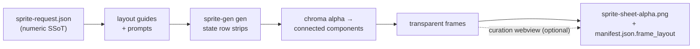

<p align="center">
  
  
  
  
  
  
  
</p>

<h1 align="center">sprite-gen</h1>

<p align="center"><b>1枚の絵を入力。ゲームですぐ使えるスプライトアトラスを出力。</b></p>

<p align="center">

**English** · [한국어](README.ko.md) · [日本語](README.ja.md) · [简体中文](README.zh-Hans.md) · [Español](README.es.md) · [Français](README.fr.md)

</p>

---

画像モデルに「スプライトシート」を頼むと、何が返ってくるかは分かっています。フレームごとに顔が変わるキャラクター、キー抜きできない背景、重なり合ってグリッドからずれていくポーズ、そしてゲームエンジンが実際には扱えないPNG。かわいいデモ、使えないアセットです。

`sprite-gen` は、その隙間を埋める Codex/Claude スキルです。**1枚のベース画像**とアクションのリストを渡すと、行ごとに生成を進め、キャラクターの同一性を固定し、クロマ背景を本物のアルファに除去し、各ポーズをきれいな透明フレームとして抽出し、**機械可読な `manifest.json.frame_layout`** 付きのランタイム用アトラスを焼き込みます。上のスプライトはすべてこの方法で作られました。

そして、生成ではどうしても正しくならない最後の10%のために、**キュレーション用webview**があります。フレームを横に並べて比較し、壊れたものを除外し、回転/拡大縮小/位置を非破壊で微調整し、ループをライブで確認してから焼き込みます。パイプラインが労力を担い、あなたは判断を保ちます。

```text
sprite-request.json → layout guides + prompts → sprite-gen gen state rows
→ chroma alpha → connected components → transparent frames
→ sprite-sheet-alpha.png + manifest.json.frame_layout
```



> 全体アーキテクチャ: [`docs/architecture.md`](docs/architecture.md)

## 実際に得られるもの

- **透明なスプライトアトラス** (`sprite-sheet-alpha.png`) — 本物のアルファ、残留クロマの縁なし、白背景で検証済み。
- **ランタイム用マニフェスト** (`manifest.json.frame_layout`) — 絶対座標のフレーム矩形、ステートごとのfpsとループフラグ。エンジンは矩形をサンプリングするだけで、グリッドを推測しません。
- **目で確認できるQA** — ステートごとのGIFとコンタクトシートにより、出荷前に動きを動きとして判断できます。
- **正直なラベル** — 短く読みやすいアクション (idle, jump, attack, wave) が安定した経路です。循環移動 (walk/run) は、モーションQAが実際に通らない限り実験的と表示されます。黙って過大に約束しません。

## クロマアルファ品質

抽出器はクロマのクリーンアップを決定的に保ちます。soft-alpha unmix は、カバレッジを解決する前に剥がしてしまうのではなく、アンチエイリアスされた髪の束や細いアウトラインを保持します。

<p align="center">
  <br />
  <em>イラスト、マゼンタキー: source, v1.12.0 peel, v1.13.0 soft-alpha unmix。</em>
</p>

<p align="center">
  <br />
  <em>イラスト、グリーンキー: source, v1.12.0 peel, v1.13.0 soft-alpha unmix。</em>
</p>

<p align="center">
  <br />
  <em>ピクセルアート、マゼンタキー: source, v1.12.0 peel, v1.13.0 binarized output。</em>
</p>

<p align="center">
  <br />
  <em>ピクセルアート、グリーンキー: source, v1.12.0 peel, v1.13.0 binarized output。</em>
</p>

下のクローズアップ切り抜きは、全身比較の背後にあるエッジの細部を示しています。


## キュレーションwebview

生成で90%まで到達します。webviewは、人間がそれを*出荷可能*にする場所です。スタンドアロンで、Studioやフレームワークへの依存はなく、スキルがインストールされている場所ならどこでも動きます (Claude Code Desktop、Codex app、通常のターミナル)。


- **ステートごとに2行:** 上に**再生シーケンス**、下に**候補プール** (例: 2回目または3回目の生成テイク)。フレームの⠿グリップをドラッグしてシーケンスを並べ替えるか、プールからカットを引き上げます。複数テイクの最良フレームから、きれいなランループを1つ組み直せます。配置は保存されるため、再度開くと復元されます。
- フレームごとの**非破壊トランスフォーム**: ドラッグ = 移動、ホイール = 拡大縮小、上ハンドル = 回転、左下 = シアー、さらに左右反転出力用の水平反転トグル。編集は `curation.json` サイドカーに保存されます。元のPNGは書き換えられず、合成ステップが結果を決定的に焼き込みます。プレビューと焼き込みは同じアフィン行列を共有するため、整列したものがそのまま出力されます。
- **ライブプレビュー**はステートのfpsでシーケンスをアニメーションし、再生/一時停止、フレーム単位のステップ、0.25×–4×の速度制御を備えています。
- スプライト専用ではありません。`unpack_atlas_run.py --pngs-dir` で任意の画像候補フォルダ (アイコン、ロゴ、生成ドラフト) を指定すれば、汎用の勝者選択ビューとして使えます。

### アイソメトリック地面グリッド

アイソメトリックセットでは、webviewが床グリッド (`meta.json` の tile/anchor 由来) を重ねて表示するため、シアーハンドルを使って家具をダイヤモンド軸にスナップできます。


### 言語

webviewには英語と韓国語が同梱されています。起動時に `--lang en|ko` を渡すか、アプリ内トグルを使用します。

```bash
python3 scripts/serve_curation.py --run-dir <run-dir> --lang en   # or ko
```

## Pythonサポート

`sprite-gen` は CPython 3.10+ をサポートします。CIはGitHubホストランナー上で、サポート最小バージョン (3.10) と最新の対象バージョン (3.14) を実行します。

クイックスタートには、動作する `venv`/`ensurepip` を備えたPythonインストールが必要です。ローカル配布版でパッケージインストール前に `python3 -m venv` が失敗する場合は、サポート対象の任意のバージョンの標準CPythonビルドを使用し、同じコマンドを再実行してください。

## クイックスタート

```bash
# 0. install dependencies (Pillow) into a fresh virtualenv
python3 -m venv .venv && source .venv/bin/activate
pip install -e .

# 1. prepare a run from a base image
python3 scripts/prepare_sprite_run.py --out-dir <run-dir> --character-id <id> --base-image base.png

# 2. generate one row image per state with the engine-owned provider CLI
python3 scripts/generate_sprite_image.py --provider codex \
  --prompt-file <run-dir>/prompts/<state>.txt \
  --out <run-dir>/raw/<state>.png \
  --ref <run-dir>/base-source.png \
  --ref <run-dir>/references/layout-guides/<state>.png
# 3. extract frames
python3 scripts/extract_sprite_row_frames.py --run-dir <run-dir>

# 4. (optional) curate frames in the webview
python3 scripts/serve_curation.py --run-dir <run-dir>

# 5. bake the runtime atlas
python3 scripts/compose_sprite_atlas.py --run-dir <run-dir>
```

### 完成済みシートの編集

結合済みシートだけが残っている場合は、キュレーター対応の run dir を再構築し、キュレーションしてエクスポートします。

```bash
# rebuild frames: explicit --grid, --manifest rectangles, or alpha auto-detect (default)
python3 scripts/unpack_atlas_run.py --atlas sheet.png            # auto-detect
python3 scripts/unpack_atlas_run.py --manifest manifest.json     # exact rectangles
python3 scripts/unpack_atlas_run.py --pngs-dir furniture/        # import a loose PNG set

# after curating, bake corrections back to named PNGs
python3 scripts/export_curated_pngs.py --run-dir <run-dir>
```

出力先はデフォルトで、入力の隣にある見つけやすい `<source>-curator` フォルダになります。

### インポート画像から背景を切り抜く

生成されたスプライトはパイプライン内で自身のマゼンタ/グリーン背景からキー抜きされるため、これを必要としません。`cutout` はインポート/後編集用ユーティリティです。*不透明で均一な背景付き*で届いた画像 (手描きアイコン、ダウンロードしたスプライト、スクリーンショット) を、きれいな透明PNGに変換します。

```bash
# uniform white / ivory / solid background -> transparent RGBA
python3 -m sprite_gen.cli cutout icon.png --white-check
```

隅から背景色を推定し、位置に基づいて連結した背景を flood-fill します (そのため、オブジェクト*内部*の明るいハイライトは保持され、穴として抜かれません)。その後、汚染除去されたソフトアルファで境界をフェザーします。`--white-check` はシアン/マゼンタ/イエローの合成を書き出し、残留フリンジがあればはっきり見えるようにします。`--strength` (ベベル除去)、`--band` (エッジ深度)、`--erode` で調整できます。複雑/不均一な背景向けではありません。

エージェント向けの完全なワークフローと契約は [`SKILL.md`](SKILL.md) にあります。

## インストール

Codex skill installer ワークフローから、このリポジトリをルートスキルとしてインストールします。

```bash
python3 ~/.codex/skills/.system/skill-installer/scripts/install-skill-from-github.py \
  --repo aldegad/sprite-gen --path .
```

### 画像生成の所有権

プロバイダーに支えられた生成はこのエンジン (`sprite_gen.gen`) の一部であり、サポートされるプロバイダーは `codex` と `grok` です。汎用の `image-gen` スキルは同じコマンドへの薄いシャトルにすぎないため、2つ目のプロバイダー実装は不要です。CLIと検証契約については [`docs/gen.md`](docs/gen.md) を参照してください。

## 帰属

component-row ワークフローは Apache-2.0 ライセンスの `hatch-pet` スキルに着想を得ていますが、汎用ゲームスプライトアトラスを対象としており、pet パッケージや pet ビジュアルアセットは含みません。

## ライセンス

Apache-2.0