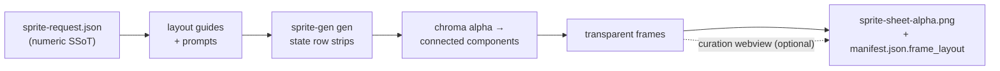

<p align="center">
  
  
  
  
  
  
  
</p>

<h1 align="center">sprite-gen</h1>

<p align="center"><b>1枚の絵を入れる。ゲームで使えるスプライトアトラスが出てくる。</b></p>

<p align="center">

**English** · [한국어](README.ko.md) · [日本語](README.ja.md) · [简体中文](README.zh-Hans.md) · [Español](README.es.md) · [Français](README.fr.md)

</p>

---

画像モデルに「sprite sheet」を頼むと、何が返ってくるかはわかっています。フレームごとに顔が変わるキャラクター、キー抜きできない背景、重なり合ってグリッドからずれるポーズ、そしてゲームエンジンが実際には消費できないPNG。かわいいデモ、使えないアセット。

`sprite-gen` は、その隙間を埋める Codex/Claude スキルです。**1枚のベース画像**とアクション一覧を渡すと、行ごとに生成を進め、キャラクターの同一性を固定し、クロマ背景を本物のアルファに剥がし、各ポーズをきれいな透過フレームとして抽出し、**機械可読な `manifest.json.frame_layout` 付き**のランタイムアトラスを焼き込みます。上のすべてのスプライトはこの方法で作られました。

そして、生成がどうしても正しくできない最後の10%のために、**キュレーション webview** があります。フレームを横並びで比較し、壊れたものを却下し、回転/スケール/位置を非破壊で微調整し、ループをライブで確認してから焼き込みます。パイプラインが労働を引き受け、あなたはセンスを保ちます。

```text
sprite-request.json → layout guides + prompts → sprite-gen gen state rows
→ chroma alpha → connected components → transparent frames
→ sprite-sheet-alpha.png + manifest.json.frame_layout
```



> 完全なアーキテクチャ: [`docs/architecture.md`](docs/architecture.md)

## 実際に得られるもの

- **透過スプライトアトラス** (`sprite-sheet-alpha.png`) — 本物のアルファ、残留クロマの縁なし、白背景に対して検証済み。
- **ランタイムマニフェスト** (`manifest.json.frame_layout`) — 絶対フレーム矩形、stateごとのfpsとループフラグ。エンジンは矩形をサンプリングし、グリッドを推測することはありません。
- **目で確認できるQA** — stateごとのGIFとコンタクトシートにより、出荷前にモーションをモーションとして判断できます。
- **正直なラベル** — 短く読みやすいアクション（idle, jump, attack, wave）が安定した道筋です。循環移動（walk/run）は、モーションQAに実際に合格しない限り experimental としてマークされます。黙って過剰に約束することはありません。

## クロマアルファ品質

抽出器はクロマクリーンアップを決定的に保ちます。soft-alpha unmix は、カバレッジを解決する前にアンチエイリアスされた髪の毛や細い輪郭を剥がしてしまうのではなく、それらを保持します。

<p align="center">
  <br />
  <em>イラスト、マゼンタキー: source, v1.12.0 peel, v1.13.0 soft-alpha unmix.</em>
</p>

<p align="center">
  <br />
  <em>イラスト、グリーンキー: source, v1.12.0 peel, v1.13.0 soft-alpha unmix.</em>
</p>

<p align="center">
  <br />
  <em>ピクセルアート、マゼンタキー: source, v1.12.0 peel, v1.13.0 binarized output.</em>
</p>

<p align="center">
  <br />
  <em>ピクセルアート、グリーンキー: source, v1.12.0 peel, v1.13.0 binarized output.</em>
</p>

下のクローズアップ切り抜きは、全身比較の背後にあるエッジのディテールを示しています。


## キュレーション webview

生成で90%まで到達します。webview は、人間がそれを*出荷可能*にする場所です。スタンドアロンで、Studio やフレームワークへの依存はなく、スキルがインストールされている場所ならどこでも動きます（Claude Code Desktop、Codex app、普通のターミナル）。


- **stateごとに2行:** 上に**再生シーケンス**、下に**候補プール**（例: 2回目または3回目に生成されたテイク）。フレームの ⠿ グリップをドラッグしてシーケンスを並べ替えるか、プールから切り抜きを引き上げます。複数テイクの最良フレームから、1本のきれいなランループを再構築できます。配置は保存されるため、再び開くと復元されます。
- フレームごとの**非破壊トランスフォーム**: ドラッグ = 移動、ホイール = スケール、上ハンドル = 回転、左下 = シアー、さらに左右反転出力のための水平反転トグル。編集は `curation.json` サイドカーに保存されます。元PNGは決して書き換えられず、composeステップが結果を決定的に焼き込みます。プレビューと焼き込みは同じアフィン行列を共有するため、揃えたものがそのまま得られます。
- **ライブプレビュー**は state のfpsでシーケンスをアニメーションし、再生/一時停止、フレーム単位のステップ、0.25×–4× の速度制御を備えています。
- スプライト専用ではありません。画像候補（アイコン、ロゴ、生成ドラフト）の任意のフォルダを `unpack_atlas_run.py --pngs-dir` で指定すれば、汎用的な勝者選択ビューとして使えます。

### アイソメトリック地面グリッド

アイソメトリックセットでは、webview が床グリッド（`meta.json` の tile/anchor から）を重ね表示するため、シアーハンドルで家具をダイヤモンド軸にスナップできます。


### 言語

webview には英語と韓国語が同梱されています。起動時に `--lang en|ko` を渡すか、アプリ内トグルを使用します。

```bash
python3 scripts/serve_curation.py --run-dir <run-dir> --lang en   # or ko
```

## Python サポート

`sprite-gen` は CPython 3.10+ をサポートします。CI は GitHub-hosted runners 上で、サポートされる最小バージョン（3.10）と最新の対象バージョン（3.14）を実行します。

クイックスタートには、動作する `venv`/`ensurepip` を備えた Python インストールが必要です。ローカル配布環境でパッケージインストール前に `python3 -m venv` が失敗する場合は、サポートされる任意のバージョンの標準 CPython ビルドを使用し、同じコマンドを再実行してください。

## クイックスタート

```bash
# 0. install dependencies (Pillow) into a fresh virtualenv
python3 -m venv .venv && source .venv/bin/activate
pip install -e .

# 1. prepare a run from a base image
python3 scripts/prepare_sprite_run.py --out-dir <run-dir> --character-id <id> --base-image base.png

# 2. generate one row image per state with the engine-owned provider CLI
python3 scripts/generate_sprite_image.py --provider codex \
  --prompt-file <run-dir>/prompts/<state>.txt \
  --out <run-dir>/raw/<state>.png \
  --ref <run-dir>/base-source.png \
  --ref <run-dir>/references/layout-guides/<state>.png
# 3. extract frames
python3 scripts/extract_sprite_row_frames.py --run-dir <run-dir>

# 4. (optional) curate frames in the webview
python3 scripts/serve_curation.py --run-dir <run-dir>

# 5. bake the runtime atlas
python3 scripts/compose_sprite_atlas.py --run-dir <run-dir>
```

### 完成済みシートを編集する

結合済みシートだけが残っている場合は、キュレーター対応の run dir を再構築し、その後キュレーションしてエクスポートします。

```bash
# rebuild frames: explicit --grid, --manifest rectangles, or alpha auto-detect (default)
python3 scripts/unpack_atlas_run.py --atlas sheet.png            # auto-detect
python3 scripts/unpack_atlas_run.py --manifest manifest.json     # exact rectangles
python3 scripts/unpack_atlas_run.py --pngs-dir furniture/        # import a loose PNG set

# after curating, bake corrections back to named PNGs
python3 scripts/export_curated_pngs.py --run-dir <run-dir>
```

出力はデフォルトで、入力の隣に見つけやすい `<source>-curator` フォルダとして作成されます。

### インポート画像から背景を切り抜く

生成されたスプライトは、パイプライン内で自身のマゼンタ/グリーン背景をキーとして処理されるため、
これを必要としません。`cutout` はインポート/後編集用ユーティリティです。
不透明な均一背景*付き*で届いた画像（手描きアイコン、
ダウンロードしたスプライト、スクリーンショット）を、きれいな透過PNGに変換します。

```bash
# routes on the corner colour: white/ivory -> matte, magenta/green -> extract engine
python3 -m sprite_gen.cli cutout icon.png --white-check
```

角の背景色を読み取り、ルーティングします（`--key auto|white|magenta|green`）。

- **white / ivory / solid** → position matte。角からの flood-fill は
  接続された背景のみを保持します（オブジェクト*内部*の明るいハイライトは残り、
  穴にはなりません）。その後、汚染除去された soft alpha が境界をフェザーします。
  `--strength`（ベベル除去）、`--band`（エッジ深度）、`--erode` で調整します。
- **magenta / green key** → プロジェクトで検証済みの `extract` クロマエンジンを
  そのまま再利用します。キー色はオブジェクト内に現れないため、その色だけによる切り抜きは
  そこで安全です。まさに、white matte の flood-fill ガードが*不要*な場所です。

`--white-check` はシアン/マゼンタ/イエローの合成画像を書き出すため、残った縁があれば
はっきり見えます。均一背景向けであり、複雑/非均一な背景向けではありません。

完全なエージェント向けワークフローと契約は [`SKILL.md`](SKILL.md) にあります。

## インストール

Codex スキルインストーラーのワークフローから、このリポジトリをルートスキルとしてインストールします。

```bash
python3 ~/.codex/skills/.system/skill-installer/scripts/install-skill-from-github.py \
  --repo aldegad/sprite-gen --path .
```

### 画像生成の所有権

プロバイダー連携の生成はこのエンジン（`sprite_gen.gen`）の一部であり、
サポートされるプロバイダーは `codex` と `grok` です。汎用 `image-gen` スキルは
同じコマンドへの薄いシャトルにすぎないため、2つ目のプロバイダー実装は不要です。
CLI と検証契約については [`docs/gen.md`](docs/gen.md) を参照してください。

## 帰属

component-row ワークフローは Apache-2.0 ライセンスの `hatch-pet` スキルに着想を得ていますが、汎用ゲームスプライトアトラスを対象としており、pet パッケージや pet ビジュアルアセットは含みません。

## License

Apache-2.0