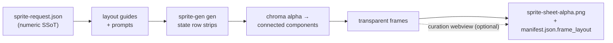

<p align="center">
  
  
  
  
  
  
  
</p>

<h1 align="center">sprite-gen</h1>

<p align="center"><b>1枚の絵を入力。ゲーム対応のスプライトアトラスを出力。</b></p>

<p align="center">

**English** · [한국어](README.ko.md) · [日本語](README.ja.md) · [简体中文](README.zh-Hans.md) · [Español](README.es.md) · [Français](README.fr.md)

</p>

---

画像モデルに「スプライトシート」を頼むと、何が出てくるかは分かっているはずです。フレームごとに顔が変わるキャラクター、キーアウトできない背景、重なってグリッドからずれるポーズ、そして実際にはゲームエンジンで使えないPNG。かわいいデモではあっても、アセットとしては使い物になりません。

`sprite-gen` は、そのギャップを埋める Codex/Claude スキルです。**1枚のベース画像**とアクション一覧を渡すと、行ごとに生成を進め、キャラクターの同一性を固定し、クロマ背景を本物のアルファに除去し、各ポーズをクリーンな透明フレームとして抽出し、**機械可読な `manifest.json.frame_layout`** 付きのランタイムアトラスを焼き込みます。上のすべてのスプライトはこの方法で作られました。

そして、生成が最後まで正しく仕上げられない残りの10%のために、**キュレーション webview** があります。フレームを横並びで比較し、壊れたものを除外し、回転/スケール/位置を非破壊で微調整し、ループをライブで確認してからベイクできます。パイプラインが労力を担い、あなたは審美眼を保ちます。

```text
sprite-request.json → layout guides + prompts → sprite-gen gen state rows
→ chroma alpha → connected components → transparent frames
→ sprite-sheet-alpha.png + manifest.json.frame_layout
```



> 全体アーキテクチャ: [`docs/architecture.md`](docs/architecture.md)

## 実際に得られるもの

- **透明スプライトアトラス** (`sprite-sheet-alpha.png`) — 本物のアルファ、残留クロマフリンジなし、白背景で検証済み。
- **ランタイムマニフェスト** (`manifest.json.frame_layout`) — 絶対フレーム矩形、ステートごとのfpsとループフラグ。エンジンは矩形をサンプリングするだけで、グリッドを推測することはありません。
- **見て確認できるQA** — ステートごとのGIFとコンタクトシートにより、出荷前にモーションをモーションとして判定できます。
- **誠実なラベル** — idle、jump、attack、wave のような短く読みやすいアクションが安定した道です。周期的な移動（walk/run）は、モーションQAに実際に合格しない限り experimental として扱われます。静かな過剰約束はしません。

## クロマアルファ品質

抽出器はクロマクリーンアップを決定論的に保ちます。soft-alpha unmix は、カバレッジを解ける前に剥がしてしまうのではなく、アンチエイリアスされた髪の毛や細い輪郭を保持します。

<p align="center">
  <br />
  <em>イラスト、マゼンタキー: source、v1.12.0 peel、v1.13.0 soft-alpha unmix。</em>
</p>

<p align="center">
  <br />
  <em>イラスト、グリーンキー: source、v1.12.0 peel、v1.13.0 soft-alpha unmix。</em>
</p>

<p align="center">
  <br />
  <em>ピクセルアート、マゼンタキー: source、v1.12.0 peel、v1.13.0 binarized output。</em>
</p>

<p align="center">
  <br />
  <em>ピクセルアート、グリーンキー: source、v1.12.0 peel、v1.13.0 binarized output。</em>
</p>

以下のクローズアップ切り抜きは、全身比較の背後にあるエッジディテールを示しています。


## キュレーション webview

生成で90%まで到達します。webview は、人間がそれを *出荷可能* に仕上げる場所です。スタンドアロンで、Studio やフレームワークへの依存はなく、スキルがインストールされている場所ならどこでも動きます（Claude Code Desktop、Codex app、通常のターミナル）。


- **ステートごとに2行:** 上段が **play sequence**、下段が **candidate pool**（例: 2回目または3回目に生成した候補）。フレームの ⠿ グリップをドラッグしてシーケンスを並べ替えたり、プールからカットを引き上げたりできます。複数テイクの最良フレームから、1つのきれいなランループを再構築できます。配置は保存されるため、再度開くと復元されます。
- フレームごとの **非破壊 transform**: ドラッグ = 移動、ホイール = スケール、上ハンドル = 回転、左下 = シアー、さらに左右反転出力用の水平反転トグル。編集内容は `curation.json` サイドカーに保存されます。ソースPNGは決して書き換えられず、compose ステップが結果を決定論的にベイクします。プレビューとベイクは同じアフィン行列を共有するため、整列したものがそのまま得られます。
- **ライブプレビュー** はステートのfpsでシーケンスをアニメーションし、再生/一時停止、フレーム単位ステップ、0.25×–4×の速度制御を備えています。
- スプライト専用ではありません。任意の画像候補フォルダ（アイコン、ロゴ、生成ドラフト）を `unpack_atlas_run.py --pngs-dir` で指定すれば、汎用的な勝者選びビューとして使えます。

### アイソメトリック床グリッド

アイソメトリックセットでは、webview が床グリッド（`meta.json` の tile/anchor 由来）を重ねて表示するため、シアーハンドルで家具をダイヤモンド軸にスナップできます。


### 言語

webview には英語と韓国語が同梱されています。起動時に `--lang en|ko` を渡すか、アプリ内トグルを使用してください。

```bash
python3 scripts/serve_curation.py --run-dir <run-dir> --lang en   # or ko
```

## Python サポート

`sprite-gen` は CPython 3.10+ をサポートします。CI は GitHub-hosted runner 上で、最小サポートバージョン（3.10）と最新カバーバージョン（3.14）を実行します。

クイックスタートには、動作する `venv`/`ensurepip` を備えた Python インストールが必要です。ローカルディストリビューションでパッケージインストール前に `python3 -m venv` が失敗する場合は、サポート対象の任意バージョンの標準 CPython ビルドを使用し、同じコマンドを再実行してください。

## クイックスタート

```bash
# 0. install dependencies (Pillow) into a fresh virtualenv
python3 -m venv .venv && source .venv/bin/activate
pip install -e .

# 1. prepare a run from a base image
python3 scripts/prepare_sprite_run.py --out-dir <run-dir> --character-id <id> --base-image base.png

# 2. generate one row image per state with the engine-owned provider CLI
python3 scripts/generate_sprite_image.py --provider codex \
  --prompt-file <run-dir>/prompts/<state>.txt \
  --out <run-dir>/raw/<state>.png \
  --ref <run-dir>/base-source.png \
  --ref <run-dir>/references/layout-guides/<state>.png
# 3. extract frames
python3 scripts/extract_sprite_row_frames.py --run-dir <run-dir>

# 4. (optional) curate frames in the webview
python3 scripts/serve_curation.py --run-dir <run-dir>

# 5. bake the runtime atlas
python3 scripts/compose_sprite_atlas.py --run-dir <run-dir>
```

### 完成済みシートの編集

結合済みシートだけが残っている場合は、キュレーター対応の run dir を再構築してから、キュレーションしてエクスポートします。

```bash
# rebuild frames: explicit --grid, --manifest rectangles, or alpha auto-detect (default)
python3 scripts/unpack_atlas_run.py --atlas sheet.png            # auto-detect
python3 scripts/unpack_atlas_run.py --manifest manifest.json     # exact rectangles
python3 scripts/unpack_atlas_run.py --pngs-dir furniture/        # import a loose PNG set

# after curating, bake corrections back to named PNGs
python3 scripts/export_curated_pngs.py --run-dir <run-dir>
```

出力はデフォルトで、入力の隣にある見つけやすい `<source>-curator` フォルダになります。

エージェント向けの完全なワークフローと契約は [`SKILL.md`](SKILL.md) にあります。

## インストール

Codex skill installer ワークフローから、このリポジトリをルートスキルとしてインストールします。

```bash
python3 ~/.codex/skills/.system/skill-installer/scripts/install-skill-from-github.py \
  --repo aldegad/sprite-gen --path .
```

### 画像生成の所有権

Provider-backed generation はこのエンジン（`sprite_gen.gen`）の一部であり、
サポートされるプロバイダーは `codex` と `grok` です。一般的な `image-gen` スキルは
同じコマンドへの薄いシャトルに過ぎないため、2つ目のプロバイダー実装は不要です。
CLI と検証契約については [`docs/gen.md`](docs/gen.md) を参照してください。

## 帰属

component-row ワークフローは Apache-2.0 ライセンスの `hatch-pet` スキルに着想を得ていますが、汎用ゲームスプライトアトラスを対象としており、pet パッケージや pet ビジュアルアセットは含みません。

## ライセンス

Apache-2.0