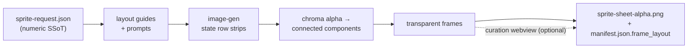

<p align="center">
  
  
  
  
  
  
  
</p>

<h1 align="center">sprite-gen</h1>

<p align="center"><b>1枚の絵を入力。ゲームですぐ使えるスプライトアトラスを出力。</b></p>

<p align="center">

**English** · [한국어](README.ko.md) · [日本語](README.ja.md) · [简体中文](README.zh-Hans.md) · [Español](README.es.md) · [Français](README.fr.md)

</p>

---

画像モデルに「スプライトシート」を頼むと、何が出てくるかはだいたいわかっています。フレームごとに顔が変わるキャラクター、キーアウトできない背景、重なり合ってグリッドからずれていくポーズ、そしてゲームエンジンが実際には扱えない PNG。かわいいデモではあるけれど、アセットとしては使い物になりません。

`sprite-gen` は、そのギャップを埋める Codex/Claude スキルです。**1枚のベース画像**とアクションのリストを渡すと、行ごとに生成を進め、キャラクターの同一性を固定し、クロマ背景を本物のアルファに取り除き、各ポーズをクリーンな透過フレームとして抽出し、**機械可読な `manifest.json.frame_layout`** 付きのランタイム用アトラスに焼き込みます。上にあるすべてのスプライトは、この方法で作られました。

そして、生成ではどうしても正しくならない最後の10%のために、**キュレーション webview** があります。フレームを横並びで比較し、壊れたものを却下し、回転・拡大縮小・位置を非破壊で微調整し、ループをライブで確認してから焼き込みます。パイプラインが作業を担い、あなたはセンスを保ちます。

```text
sprite-request.json → layout guides + prompts → image-gen state rows
→ chroma alpha → connected components → transparent frames
→ sprite-sheet-alpha.png + manifest.json.frame_layout
```



> 全体アーキテクチャ: [`docs/architecture.md`](docs/architecture.md)

## 実際に得られるもの

- **透過スプライトアトラス** (`sprite-sheet-alpha.png`) — 本物のアルファ、クロマの残り縁なし、白背景に対して検証済み。
- **ランタイム用マニフェスト** (`manifest.json.frame_layout`) — 絶対座標のフレーム矩形、ステートごとの fps とループフラグ。エンジンは矩形をサンプリングし、グリッドを推測する必要はありません。
- **目で確認できる QA** — ステートごとの GIF とコンタクトシートにより、出荷前にモーションをモーションとして判断できます。
- **誠実なラベル** — idle、jump、attack、wave のような短く読みやすいアクションが安定した経路です。walk/run のような周期的な移動は、モーション QA を実際に通過しない限り experimental として扱われます。黙って過剰な約束はしません。

## クロマアルファ品質

抽出器はクロマ処理を決定的に行います。ソフトアルファ unmix が髪の細い束や細いアウトラインのアンチエイリアスを保つため、カバレッジを解く前に境界が削られません。

<p align="center">
  <br />
  <em>イラスト、マゼンタキー: 元画像、v1.12.0 peel、v1.13.0 soft-alpha unmix。</em>
</p>

<p align="center">
  <br />
  <em>イラスト、グリーンキー: 元画像、v1.12.0 peel、v1.13.0 soft-alpha unmix。</em>
</p>

<p align="center">
  <br />
  <em>ピクセルアート、マゼンタキー: 元画像、v1.12.0 peel、v1.13.0 二値化出力。</em>
</p>

<p align="center">
  <br />
  <em>ピクセルアート、グリーンキー: 元画像、v1.12.0 peel、v1.13.0 二値化出力。</em>
</p>

下の拡大クロップは、全身比較の境界ディテールを示します。


## キュレーション webview

生成で90%まで到達します。webview は、人間がそれを*出荷可能*な状態に持っていく場所です。スタンドアロンで、Studio やフレームワークへの依存はなく、このスキルがインストールされている場所ならどこでも動きます（Claude Code Desktop、Codex アプリ、通常のターミナル）。


- **ステートごとに2行:** 上に**再生シーケンス**、下に**候補プール**（例: 2回目または3回目の生成テイク）。フレームの ⠿ グリップをドラッグしてシーケンスを並べ替えたり、プールからカットを引き上げたりできます。複数テイクの最良フレームから、1つのクリーンなランループを再構築できます。配置は保存されるため、再度開くと復元されます。
- フレームごとの**非破壊トランスフォーム**: ドラッグ = 移動、ホイール = 拡大縮小、上ハンドル = 回転、左下 = シアー、さらに左右反転出力用の水平反転トグル。編集内容は `curation.json` サイドカーに保存されます。ソース PNG は決して書き換えられず、合成ステップが結果を決定論的に焼き込みます。プレビューと焼き込みは同じアフィン行列を共有するため、整列したものがそのまま出力されます。
- **ライブプレビュー** はステートの fps でシーケンスをアニメーションし、再生/一時停止、フレーム単位のステップ、0.25×–4× の速度制御を備えています。
- スプライト専用ではありません。`unpack_atlas_run.py --pngs-dir` で任意の画像候補フォルダ（アイコン、ロゴ、生成ドラフト）を指定すれば、汎用の勝者選定ビューとして使えます。

### アイソメトリック地面グリッド

アイソメトリックセットでは、webview が床グリッド（`meta.json` の tile/anchor 由来）をオーバーレイするため、シアーハンドルで家具をダイヤモンド軸に合わせてスナップできます。


### 言語

webview には英語と韓国語が同梱されています。起動時に `--lang en|ko` を渡すか、アプリ内トグルを使用してください。

```bash
python3 scripts/serve_curation.py --run-dir <run-dir> --lang en   # or ko
```

## Python サポート

`sprite-gen` は CPython 3.10+ をサポートします。CI は GitHub-hosted runners 上で、サポートされる最小バージョン（3.10）と、対象範囲内の最新バージョン（3.14）を実行します。

クイックスタートには、動作する `venv`/`ensurepip` を備えた Python インストールが必要です。ローカル配布環境でパッケージインストール前に `python3 -m venv` が失敗する場合は、サポート対象の任意のバージョンの標準 CPython ビルドを使用し、同じコマンドを再実行してください。

## クイックスタート

```bash
# 0. install dependencies (Pillow) into a fresh virtualenv
python3 -m venv .venv && source .venv/bin/activate
pip install -e .

# 1. prepare a run from a base image
python3 scripts/prepare_sprite_run.py --out-dir <run-dir> --character-id <id> --base-image base.png

# 2. generate one row image per state with image-gen, save as raw/<state>.png
# 3. extract frames
python3 scripts/extract_sprite_row_frames.py --run-dir <run-dir>

# 4. (optional) curate frames in the webview
python3 scripts/serve_curation.py --run-dir <run-dir>

# 5. bake the runtime atlas
python3 scripts/compose_sprite_atlas.py --run-dir <run-dir>
```

### 完成済みシートの編集

結合済みシートだけが残っている場合は、キュレーター対応の run dir を再構築してから、キュレーションしてエクスポートします。

```bash
# rebuild frames: explicit --grid, --manifest rectangles, or alpha auto-detect (default)
python3 scripts/unpack_atlas_run.py --atlas sheet.png            # auto-detect
python3 scripts/unpack_atlas_run.py --manifest manifest.json     # exact rectangles
python3 scripts/unpack_atlas_run.py --pngs-dir furniture/        # import a loose PNG set

# after curating, bake corrections back to named PNGs
python3 scripts/export_curated_pngs.py --run-dir <run-dir>
```

出力先はデフォルトで、入力の隣に見つけやすい `<source>-curator` フォルダになります。

エージェント向けの完全なワークフローと契約は [`SKILL.md`](SKILL.md) にあります。

## インストール

Codex スキルインストーラーのワークフローから、このリポジトリをルートスキルとしてインストールします。

```bash
python3 ~/.codex/skills/.system/skill-installer/scripts/install-skill-from-github.py \
  --repo aldegad/sprite-gen --path .
```

### 必須スキル依存関係

生の行画像（クイックスタートのステップ2）は、別の [`image-gen`](https://github.com/aldegad/image-gen) スキルによって生成されます（`SKILL.md` の `depends_on` では `kuma:image-gen` として宣言）。同じ方法でインストールしてください。

```bash
python3 ~/.codex/skills/.system/skill-installer/scripts/install-skill-from-github.py \
  --repo aldegad/image-gen --path .
```

## 帰属

component-row ワークフローは Apache-2.0 ライセンスの `hatch-pet` スキルに着想を得ていますが、汎用的なゲーム用スプライトアトラスを対象としており、ペット用パッケージやペットのビジュアルアセットは含みません。

## ライセンス

Apache-2.0
