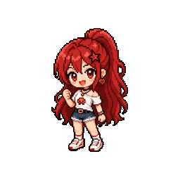
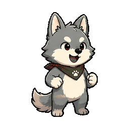
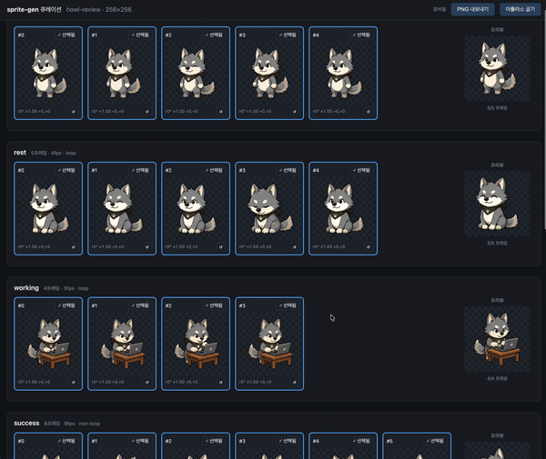
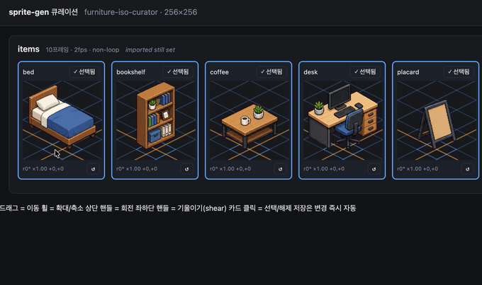

<p align="center">
  
  
  
  
  
  
  
</p>

<h1 align="center">sprite-gen</h1>

<p align="center"><b>1枚の絵を入力。ゲーム対応のスプライトアトラスを出力。</b></p>

<p align="center">

**English** · [한국어](README.ko.md) · [日本語](README.ja.md) · [简体中文](README.zh-Hans.md) · [Español](README.es.md) · [Français](README.fr.md)

</p>

---

画像モデルに「sprite sheet」を頼むと、何が返ってくるかは分かっています。フレームごとに顔が変わるキャラクター、キーアウトできない背景、重なってグリッドからずれていくポーズ、そしてゲームエンジンでは実際には使えないPNG。かわいいデモ、使えないアセット。

`sprite-gen` は、そのギャップを埋める Codex/Claude スキルです。**1枚のベース画像**とアクションのリストを渡すと、行ごとに生成を進め、キャラクターの同一性を固定し、クロマ背景を本物のアルファに除去し、各ポーズをクリーンな透明フレームとして抽出し、**機械可読な `manifest.json.frame_layout`** を持つランタイム用アトラスに焼き込みます。上のスプライトはすべてこの方法で作られました。

そして、生成がどうしても正しくできない最後の10%には、**curation webview** があります。フレームを横並びで比較し、壊れたものを却下し、回転/スケール/位置を非破壊で微調整し、ループをライブで確認してから焼き込みます。パイプラインが作業を担い、あなたはセンスを保ちます。

```text
sprite-request.json → layout guides + prompts → image-gen state rows
→ chroma alpha → connected components → transparent frames
→ sprite-sheet-alpha.png + manifest.json.frame_layout
```

<p align="center">
  
</p>

> 完全なアーキテクチャ: [`docs/architecture.md`](docs/architecture.md) · 図のソース: [`docs/architecture-diagram.html`](docs/architecture-diagram.html)

## 実際に得られるもの

- **透明なスプライトアトラス** (`sprite-sheet-alpha.png`) — 本物のアルファ、残留クロマの縁なし、白背景に対して検証済み。
- **ランタイムマニフェスト** (`manifest.json.frame_layout`) — 絶対フレーム矩形、状態ごとのfpsとループフラグ。エンジンは矩形をサンプリングし、グリッドを推測しません。
- **見て確認できるQA** — 状態ごとのGIFとコンタクトシートにより、出荷前にモーションをモーションとして判断できます。
- **正直なラベル** — 短く読みやすいアクション（idle, jump, attack, wave）が安定したパスです。循環ロコモーション（walk/run）は、モーションQAに実際に合格しない限り実験的として扱われます。黙って過剰に約束することはありません。

## Curation webview

生成で90%まで到達します。webview は、人間がそれを *出荷可能* に仕上げる場所です。スタンドアロンで、Studio やフレームワークへの依存はなく、スキルがインストールされている場所ならどこでも動きます（Claude Code Desktop、Codex app、普通のターミナル）。



- **状態ごとに2行:** 上に **play sequence**、下に **candidate pool**（例: 2回目または3回目に生成した別テイク）。フレームの ⠿ グリップをドラッグしてシーケンスを並べ替えるか、プールからカットを引き上げます。複数テイクの最良フレームから、1つのクリーンなランループを再構築できます。配置は保存されるため、再度開くと復元されます。
- フレームごとの **非破壊 transform**: ドラッグ = 移動、ホイール = スケール、上ハンドル = 回転、左下 = シアー、さらに左右反転出力用の水平反転トグル。編集は `curation.json` サイドカーに保存されます。ソースPNGは一切書き換えられず、compose ステップが結果を決定的に焼き込みます。プレビューと焼き込みは同じアフィン行列を共有するため、整列したものがそのまま得られます。
- **ライブプレビュー** は、状態のfpsでシーケンスをアニメーションし、再生/一時停止、フレーム単位のステップ、0.25×–4× の速度制御を備えます。
- スプライトだけではありません。`unpack_atlas_run.py --pngs-dir` で任意の画像候補フォルダ（アイコン、ロゴ、生成ドラフト）を指定すれば、汎用的な勝者選定ビューとして使えます。

### アイソメトリック地面グリッド

アイソメトリックセットでは、webview が床グリッド（`meta.json` の tile/anchor 由来）をオーバーレイするため、シアーハンドルを使って家具をダイヤモンド軸にスナップできます。




### 言語

webview には英語と韓国語が同梱されています。起動時に `--lang en|ko` を渡すか、アプリ内トグルを使用します。

```bash
python3 scripts/serve_curation.py --run-dir <run-dir> --lang en   # or ko
```

## Python サポート

`sprite-gen` は CPython 3.10+ をサポートします。CI は GitHub ホストランナー上で、最小サポートバージョン（3.10）と最新のカバー対象バージョン（3.14）を実行します。

クイックスタートには、動作する `venv`/`ensurepip` を備えた Python インストールが必要です。ローカル配布版でパッケージインストール前に `python3 -m venv` が失敗する場合は、サポート対象バージョンの標準 CPython ビルドを使用し、同じコマンドを再実行してください。

## Quickstart

```bash
# 0. install dependencies (Pillow) into a fresh virtualenv
python3 -m venv .venv && source .venv/bin/activate
pip install -e .

# 1. prepare a run from a base image
python3 scripts/prepare_sprite_run.py --out-dir <run-dir> --character-id <id> --base-image base.png

# 2. generate one row image per state with image-gen, save as raw/<state>.png
# 3. extract frames
python3 scripts/extract_sprite_row_frames.py --run-dir <run-dir>

# 4. (optional) curate frames in the webview
python3 scripts/serve_curation.py --run-dir <run-dir>

# 5. bake the runtime atlas
python3 scripts/compose_sprite_atlas.py --run-dir <run-dir>
```

### 完成済みシートを編集する

結合済みシートだけが残っている場合は、curator 対応の run dir を再構築してから、キュレーションしてエクスポートします。

```bash
# rebuild frames: explicit --grid, --manifest rectangles, or alpha auto-detect (default)
python3 scripts/unpack_atlas_run.py --atlas sheet.png            # auto-detect
python3 scripts/unpack_atlas_run.py --manifest manifest.json     # exact rectangles
python3 scripts/unpack_atlas_run.py --pngs-dir furniture/        # import a loose PNG set

# after curating, bake corrections back to named PNGs
python3 scripts/export_curated_pngs.py --run-dir <run-dir>
```

出力先のデフォルトは、入力の隣に作られる見つけやすい `<source>-curator` フォルダです。

完全なエージェント向けワークフローと契約は [`SKILL.md`](SKILL.md) にあります。

## Install

Codex スキルインストーラーワークフローから、このリポジトリをルートスキルとしてインストールします。

```bash
python3 ~/.codex/skills/.system/skill-installer/scripts/install-skill-from-github.py \
  --repo aldegad/sprite-gen --path .
```

### 必須スキル依存関係

生の行画像（クイックスタートのステップ2）は、別の [`image-gen`](https://github.com/aldegad/image-gen) スキル（`SKILL.md` の `depends_on` で `kuma:image-gen` として宣言）によって生成されます。同じ方法でインストールしてください。

```bash
python3 ~/.codex/skills/.system/skill-installer/scripts/install-skill-from-github.py \
  --repo aldegad/image-gen --path .
```

## Attribution

component-row ワークフローは、Apache-2.0 ライセンスの `hatch-pet` スキルに着想を得ていますが、汎用的なゲーム用スプライトアトラスを対象としており、ペット用パッケージやペットのビジュアルアセットは含みません。

## License

Apache-2.0