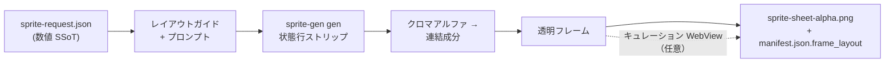

<h1 align="center">sprite-gen</h1>

<p align="center"><b>1枚の描画から、ゲームで使えるスプライトアトラスへ。</b></p>

<p align="center">

[English](README.md) · [한국어](README.ko.md) · **日本語** · [简体中文](README.zh-Hans.md) · [Español](README.es.md) · [Français](README.fr.md)

</p>

---

このスキルで生成・キュレーションしたスプライト（`claudecy`、`howl`）:

<p align="center">
  
  
  
  
  
  
  
</p>

画像モデルに「スプライトシート」を頼むと、何が出てくるかはご存じでしょう。フレームごとに顔が変わるキャラクター、キーアウトできない背景、重なったりグリッドからずれたりするポーズ、そしてゲームエンジンが実際には読み込めない PNG。かわいいデモですが、アセットとしては役に立ちません。

`sprite-gen` は、Codex/Claude のスキルとしてその隔たりを埋めます。**1枚のベース画像**とアクションのリストを渡すと、行ごとに生成を進め、キャラクターの同一性を固定し、クロマ背景を実アルファに変換し、各ポーズをクリーンな透明フレームとして抽出し、ランタイム用アトラスを **機械可読な `manifest.json.frame_layout` 付きで**作成します。

そして、生成が決して完璧にできない最後の 10% のために、**キュレーション用 WebView**があります。フレームを横並びで比較し、壊れたものを却下し、回転・スケール・位置を非破壊で微調整し、ループをリアルタイムで確認してからベイクできます。パイプラインが作業を担い、あなたは審美眼を保てます。

```text
sprite-request.json → レイアウトガイド + プロンプト → sprite-gen gen の状態行
→ クロマアルファ → 連結成分 → 透明フレーム
→ sprite-sheet-alpha.png + manifest.json.frame_layout
```


```mermaid
flowchart LR
    REQ["sprite-request.json<br/>(数値 SSoT)"] --> GUIDES["レイアウトガイド<br/>+ プロンプト"]
    GUIDES --> GEN["sprite-gen gen<br/>状態行ストリップ"]
    GEN --> EXTRACT["クロマアルファ →<br/>連結成分"]
    EXTRACT --> FRAMES["透明フレーム"]
    FRAMES --> ATLAS["sprite-sheet-alpha.png<br/>+ manifest.json.frame_layout"]
    FRAMES -. "キュレーション WebView（任意）" .-> ATLAS
```

> アーキテクチャ全体: [`docs/architecture.md`](docs/architecture.md)

## 実際に得られるもの

- **透明スプライトアトラス**（`sprite-sheet-alpha.png`）— 実アルファを使用し、クロマの残留フリンジがなく、白背景に対して検証済みです。
- **ランタイムマニフェスト**（`manifest.json.frame_layout`）— 絶対座標のフレーム矩形、状態ごとの fps、ループフラグを含みます。エンジンは矩形をサンプリングするため、グリッドを推測する必要がありません。
- **確認できる QA** — 状態ごとの GIF とコンタクトシートにより、出荷前に動きを動きとして評価できます。
- **正直なラベル** — 短く読みやすいアクション（idle、jump、attack、wave）が安定した経路です。周期的な移動（walk/run）は、モーション QA に実際に合格しない限り実験的として扱われます。暗黙の過剰な約束はしません。

## クロマアルファの品質

抽出処理はクロマのクリーンアップを決定論的に保ちます。ソフトアルファのアンミックスにより、アンチエイリアスのかかった髪の毛や細い輪郭線を、被覆率を解決する前に剥ぎ取ることなく保持します。

<p align="center">
  <br />
  <em>イラスト、マゼンタキー: ソース、v1.12.0 の peel、v1.13.0 の soft-alpha unmix。</em>
</p>

<p align="center">
  <br />
  <em>イラスト、グリーンキー: ソース、v1.12.0 の peel、v1.13.0 の soft-alpha unmix。</em>
</p>

<p align="center">
  <br />
  <em>ピクセルアート、マゼンタキー: ソース、v1.12.0 の peel、v1.13.0 の二値化出力。</em>
</p>

<p align="center">
  <br />
  <em>ピクセルアート、グリーンキー: ソース、v1.12.0 の peel、v1.13.0 の二値化出力。</em>
</p>

以下のクローズアップ画像では、全身比較の背後にあるエッジのディテールを確認できます。


## Backbone Lattice

AI 生成の「ピクセルアート」はピクセルアートではありません。ブロックは揺らぎ、エッジにはアンチエイリアスがかかり、1つの行の中でラティスがずれるため、均等なグリッドで切り出すと、1つのブロックが次のブロックににじみます。コミュニティでの対処法は、ランレングスからブロックサイズを推測して再量子化し、画像を「本物らしく戻す」ことです。しかしこれは各フレームを個別に測定するため、歩行サイクルではフレームごとにセルサイズが変動します。

**Backbone Lattice** は対象全体に対して1つのグリッドを測定し、すべての切り出しをそのグリッドに固定します。フレームごとのピッチ検出を行ごとに集約し、フレーム間のコンセンサスを形成します。高調波による誤検出よりも優先されるこのコンセンサスグリッドが、すべての切り出しが吸着する*バックボーン*になります。切り出し位置は実際の色境界に合わせられ、測定ピッチに比例した最小セル幅によって、隣接する2つの切り出しが同じ帯域に重なることを防ぎます。バックボーンを1つにすることで、アニメーション全体を通じて同じブロックが同じサイズに保たれ、フレーム間で飛び跳ねることがありません。

結果は、選び抜いたフレームを目視するのではなく、実際に出荷されたものに対して検証されます。すべてのピクセルパーフェクトな実行結果は、それぞれのソースストリップから再導出され、ピクセル単位で比較されます。承認した形状は得られる結果でも維持されます。変化するのは輪郭線と陰影が配置される場所だけであり、それこそがバックボーンによって決定される部分です。

## キュレーション WebView

生成で 90% まで到達できます。WebView は、人間がそれを*出荷可能な状態*まで仕上げる場所です。単体で動作し、Studio やフレームワークに依存せず、スキルがインストールされている場所ならどこでも実行できます（Claude Code Desktop、Codex アプリ、通常のターミナル）。


- **状態ごとに2行:** 上段は**再生シーケンス**、下段は**候補プール**です（例: 2回目、3回目に生成したテイク）。フレームの ⠿ グリップをドラッグしてシーケンスの順序を変更したり、候補プールからフレームを引き上げたりできます。複数のテイクから最良のフレームを集め、1つのクリーンな走行ループを再構成できます。配置は保存されるため、再度開いたときにも復元されます。
- **フレームごとの非破壊変形:** ドラッグ = 移動、ホイール = スケール、上部ハンドル = 回転、左下 = シア。左右反転して出力された場合のために、水平反転トグルもあります。編集内容は `curation.json` サイドカーに保存され、ソース PNG は書き換えられません。合成ステップで結果が決定論的にベイクされます。プレビューとベイクは同じアフィン行列を共有するため、配置したものがそのまま得られます。
- **ライブプレビュー:** 状態の fps でシーケンスをアニメーション表示し、再生/一時停止、フレーム単位のステップ実行、0.25×〜4×の速度調整に対応します。
- スプライト専用ではありません。`unpack_atlas_run.py --pngs-dir` で画像候補の任意のフォルダ（アイコン、ロゴ、生成ドラフトなど）を指定すれば、最良のものを選ぶための汎用ビューとして利用できます。

### アイソメトリック地面グリッド

アイソメトリック素材セットでは、WebView が床グリッド（`meta.json` の tile/anchor から取得）を重ねて表示します。シアハンドルを使って家具を菱形の軸にスナップできます。


### 言語

WebView には英語と韓国語が付属しています。起動時に `--lang en|ko` を渡すか、アプリ内の切り替えを使用してください。

```bash
python3 scripts/serve_curation.py --run-dir <run-dir> --lang en   # または ko
```

## Python サポート

`sprite-gen` は CPython 3.10 以降をサポートしています。CI では、GitHub ホストランナー上でサポート対象の最小バージョン（3.10）と、カバー対象の最新バージョン（3.14）を実行します。

クイックスタートには、動作する `venv`/`ensurepip` を備えた Python のインストールが必要です。ローカルディストリビューションでパッケージをインストールする前に `python3 -m venv` が失敗する場合は、サポート対象の標準 CPython ビルドを使用して、同じコマンドを再実行してください。

## クイックスタート

```bash
# 0. 新しい仮想環境に依存関係（Pillow、NumPy）をインストール
python3 -m venv .venv && source .venv/bin/activate
pip install -e .

# 1. ベース画像から実行用ディレクトリを準備
python3 scripts/prepare_sprite_run.py --out-dir <run-dir> --character-id <id> --base-image base.png

# 2. エンジン所有のプロバイダー CLI で状態ごとに1枚の行画像を生成
python3 scripts/generate_sprite_image.py --provider codex \
  --prompt-file <run-dir>/prompts/<state>.txt \
  --out <run-dir>/raw/<state>.png \
  --ref <run-dir>/base-source.png \
  --ref <run-dir>/references/layout-guides/<state>.png
# 3. フレームを抽出
python3 scripts/extract_sprite_row_frames.py --run-dir <run-dir>

# 4. （任意）WebView でフレームをキュレーション
python3 scripts/serve_curation.py --run-dir <run-dir>

# 5. ランタイムアトラスをベイク
python3 scripts/compose_sprite_atlas.py --run-dir <run-dir>
```

### 完成済みシートの編集

結合済みのシートだけが残っている場合は、キュレーター対応の実行用ディレクトリを再構築し、キュレーションしてエクスポートします。

```bash
# フレームを再構築: 明示的な --grid、--manifest の矩形、またはアルファ自動検出（デフォルト）
python3 scripts/unpack_atlas_run.py --atlas sheet.png            # 自動検出
python3 scripts/unpack_atlas_run.py --manifest manifest.json     # 正確な矩形
python3 scripts/unpack_atlas_run.py --pngs-dir furniture/        # 個別 PNG セットをインポート

# キュレーション後、補正を名前付き PNG にベイク
python3 scripts/export_curated_pngs.py --run-dir <run-dir>
```

出力先はデフォルトで、入力ファイルの隣にある見つけやすい `<source>-curator` フォルダです。

### インポート画像から背景を切り取る

生成されたスプライトはパイプライン内部でマゼンタ/グリーン背景をキーにして処理されるため、通常この処理は必要ありません。`cutout` はインポート後の編集用ユーティリティです。つまり、単色で不透明な背景付きで届いた画像（手描きアイコン、ダウンロードしたスプライト、スクリーンショット）を、クリーンな透明 PNG に変換します。

<p align="center">
  
</p>

```bash
# 角の色に応じて振り分け: 白/アイボリー -> matte、マゼンタ/グリーン -> extract エンジン
python3 -m sprite_gen.cli cutout icon.png --white-check
```

角の背景色を読み取り、`--key auto|white|magenta|green` に振り分けます。

- **白 / アイボリー / 単色** → position matte。角からのフラッドフィルで連結した背景だけを保持します（オブジェクト内部の明るいハイライトは、穴として扱われずに残ります）。その後、除染済みのソフトアルファで境界を滑らかにします。`--strength`（ベベル除去）、`--band`（エッジの深さ）、`--erode` で調整できます。
- **マゼンタ / グリーンキー** → プロジェクトで検証済みの `extract` クロマエンジンをそのまま再利用します。キーの色がオブジェクト内に現れないため、色だけに基づく切り抜きが安全です。これは白マットのフラッドフィルガードが必要ないケースです。

`--white-check` を指定すると、シアン/マゼンタ/イエローの合成画像を書き出すため、残留フリンジを明確に確認できます。単色背景向けであり、複雑な背景や不均一な背景には使用しないでください。

エージェント向けの完全なワークフローと契約は [`SKILL.md`](SKILL.md) にあります。

## インストール

Codex スキルインストーラーのワークフローから、このリポジトリをルートスキルとしてインストールします。

```bash
python3 ~/.codex/skills/.system/skill-installer/scripts/install-skill-from-github.py \
  --repo aldegad/sprite-gen --path .
```

### 画像生成の所有権

プロバイダー対応の生成はこのエンジン（`sprite_gen.gen`）の一部であり、サポートされているプロバイダーは `codex` と `grok` です。一般的な `image-gen` スキルは同じコマンドへの薄いシャトルにすぎないため、別のプロバイダー実装は必要ありません。CLI と検証契約については [`docs/gen.md`](docs/gen.md) を参照してください。

## 帰属表示

コンポーネント行ワークフローは Apache-2.0 ライセンスの `hatch-pet` スキルに着想を得ていますが、汎用ゲームスプライトアトラスを対象としており、ペット用パッケージやペットのビジュアルアセットは含みません。

## ライセンス

Apache-2.0