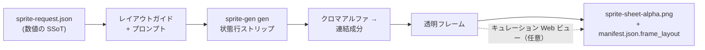

<h1 align="center">sprite-gen</h1>

<p align="center"><b>1枚の画像から、ゲーム対応のスプライトアトラスを。</b></p>

<p align="center">

[English](README.md) · [한국어](README.ko.md) · **日本語** · [简体中文](README.zh-Hans.md) · [Español](README.es.md) · [Français](README.fr.md)

</p>

---

画像モデルに「スプライトシート」を頼むと、何が得られるかはご存じでしょう。フレームごとに顔が変わるキャラクター、キーアウトできない背景、重なったりグリッドからずれたりするポーズ、そしてゲームエンジンが実際には読み込めない PNG。かわいいデモですが、使えないアセットです。

`sprite-gen` は、その隔たりを埋める Codex/Claude スキルです。**1枚のベース画像**とアクションのリストを渡すと、生成を行単位で進め、キャラクターの同一性を固定し、クロマ背景を本物のアルファに変換し、各ポーズをクリーンな透明フレームとして抽出し、ランタイム用アトラスを **機械可読な `manifest.json.frame_layout` 付きで**生成します。

そして、生成がどうしても正しく仕上げられない最後の 10% のために、**キュレーション用 Web ビュー**があります。フレームを並べて比較し、壊れたものを却下し、回転・スケール・位置を非破壊で微調整し、ループをリアルタイムで確認してからベイクできます。パイプラインが作業を担い、あなたは審美眼を保てます。

```text
sprite-request.json → レイアウトガイド + プロンプト → sprite-gen gen の状態行
→ クロマアルファ → 連結成分 → 透明フレーム
→ sprite-sheet-alpha.png + manifest.json.frame_layout
```


```mermaid
flowchart LR
    REQ["sprite-request.json<br/>(数値の SSoT)"] --> GUIDES["レイアウトガイド<br/>+ プロンプト"]
    GUIDES --> GEN["sprite-gen gen<br/>状態行ストリップ"]
    GEN --> EXTRACT["クロマアルファ →<br/>連結成分"]
    EXTRACT --> FRAMES["透明フレーム"]
    FRAMES --> ATLAS["sprite-sheet-alpha.png<br/>+ manifest.json.frame_layout"]
    FRAMES -. "キュレーション Web ビュー（任意）" .-> ATLAS
```

> アーキテクチャの全体像: [`docs/architecture.md`](docs/architecture.md)

## 実際に得られるもの

- **透明なスプライトアトラス**（`sprite-sheet-alpha.png`） — 本物のアルファで、クロマの残留フリンジがなく、白背景に対して検証済みです。
- **ランタイムマニフェスト**（`manifest.json.frame_layout`） — フレームの絶対矩形、状態ごとの fps、ループフラグを含みます。エンジンは矩形をサンプリングし、グリッドを推測することはありません。
- **確認できる QA** — 状態ごとの GIF とコンタクトシートにより、出荷前に動きを動きとして評価できます。
- **正直なラベル** — idle、jump、attack、wave のような短く読みやすいアクションが安定した経路です。周期的な移動（walk/run）は、モーション QA に実際に合格しない限り実験的扱いになります。黙って過大な約束をすることはありません。

## クロマアルファの品質

抽出処理はクロマのクリーンアップを決定論的に保ちます。ソフトアルファのアンミックスにより、アンチエイリアスされた髪の毛や細い輪郭線を、カバレッジを解決する前に剥がしてしまうことなく保持します。

<p align="center">
  <br />
  <em>イラスト、マゼンタキー：ソース、v1.12.0 peel、v1.13.0 soft-alpha unmix。</em>
</p>

<p align="center">
  <br />
  <em>イラスト、グリーンキー：ソース、v1.12.0 peel、v1.13.0 soft-alpha unmix。</em>
</p>

<p align="center">
  <br />
  <em>ピクセルアート、マゼンタキー：ソース、v1.12.0 peel、v1.13.0 binarized output。</em>
</p>

<p align="center">
  <br />
  <em>ピクセルアート、グリーンキー：ソース、v1.12.0 peel、v1.13.0 binarized output。</em>
</p>

以下の拡大クロップでは、全身比較の背後にあるエッジのディテールを示します。


## Backbone Lattice

AI 生成の「ピクセルアート」はピクセルアートではありません。ブロックは揺らぎ、エッジにはアンチエイリアスが残り、1つの行の中でもラティスがずれるため、均等なグリッドで切り出すと、あるブロックが次のブロックへにじみます。コミュニティでの対処法は、画像を「本物らしく戻す」ことです。ランレングスからブロックサイズを推測して再量子化します。しかしこれは各フレームを個別に測定するため、歩行サイクルではフレームごとにセルサイズが呼吸するように変化します。

**Backbone Lattice** は対象全体に対して1つのグリッドを測定し、すべての切り出しをそのグリッドに固定します。フレームごとのピッチ検出を行全体・フレーム横断のコンセンサスに入力し、高調波による誤検出を上回る判断を行います。そのコンセンサスグリッドが、すべての切り出しがスナップする *backbone* です。切り出し位置は実際の色の境界に置かれ、測定されたピッチに比例した最小セル幅によって、隣接する2つの切り出しが同じ帯域に重なることを防ぎます。1つの backbone により、アニメーション全体で同じブロックが同じサイズに保たれ、フレーム間で突然変化することがありません。

同じソースストリップ、同じ固定パレット。変数はエンジンだけです。

これは厳選した1フレームではなく、プロジェクト全体で検証されました。実際に稼働しているゲームのピクセルパーフェクトな94個すべてのランを、それぞれのソースストリップから再導出し、出荷されたものとピクセル単位で比較しました。

<p align="center">
  
</p>

26,690,432個の正規ピクセル全体で、シルエットの変化は1.41%でした。承認した形状は、そのまま得られる形状です。変わるのは輪郭線と陰影が配置される場所であり、それこそが backbone の決定する部分です。

## キュレーション Web ビュー

生成で90%まで進められます。Web ビューは、人間がそれを*出荷可能な状態*まで仕上げる場所です。単体で動作し、Studio やフレームワークへの依存はなく、スキルがインストールされている場所ならどこでも実行できます（Claude Code Desktop、Codex アプリ、通常のターミナル）。


- **状態ごとに2行:** 上段は**再生シーケンス**、下段は**候補プール**（例：2回目、3回目に生成したテイク）です。フレームの ⠿ グリップをドラッグしてシーケンスの順序を変えたり、プールから切り出しを引き上げたりできます。複数のテイクから最良のフレームを集め、1つのきれいな走行ループを再構築できます。配置は保存されるため、再度開くと復元されます。
- **フレームごとの非破壊変形:** ドラッグ = 移動、ホイール = スケール、上部ハンドル = 回転、左下 = シア。左右が反転した出力には水平反転トグルもあります。編集内容は `curation.json` サイドカーに保存され、ソース PNG は書き換えられません。合成ステップで結果が決定論的にベイクされます。プレビューとベイクは同じアフィン行列を共有するため、位置合わせしたものがそのまま得られます。
- **ライブプレビュー:** 状態の fps でシーケンスをアニメーション表示し、再生・一時停止、フレーム単位のステップ実行、0.25×〜4×の速度調整に対応します。
- スプライト専用ではありません。`unpack_atlas_run.py --pngs-dir` で画像候補（アイコン、ロゴ、生成ドラフトなど）のフォルダを指定すれば、一般的な採用候補選別ビューとして使えます。

### アイソメトリック地面グリッド

アイソメトリックセットでは、Web ビューに床グリッド（`meta.json` の tile/anchor から取得）が重ねて表示されるため、シアハンドルを使って家具をダイヤモンド軸にスナップできます。


### 言語

Web ビューには英語と韓国語が付属しています。起動時に `--lang en|ko` を渡すか、アプリ内の切り替えを使用してください。

```bash
python3 scripts/serve_curation.py --run-dir <run-dir> --lang en   # または ko
```

## Python のサポート

`sprite-gen` は CPython 3.10 以降をサポートしています。CI は GitHub ホストランナー上で、サポート対象の最小バージョン（3.10）と、対象範囲の最新バージョン（3.14）を実行します。

クイックスタートには、正常に動作する `venv`/`ensurepip` を備えた Python のインストールが必要です。ローカルディストリビューションでパッケージをインストールする前に `python3 -m venv` が失敗する場合は、サポート対象の標準 CPython ビルドを使用し、同じコマンドを再実行してください。

## クイックスタート

```bash
# 0. 依存関係（Pillow）を新しい仮想環境にインストール
python3 -m venv .venv && source .venv/bin/activate
pip install -e .

# 1. ベース画像からランを準備
python3 scripts/prepare_sprite_run.py --out-dir <run-dir> --character-id <id> --base-image base.png

# 2. エンジン管理のプロバイダー CLI で状態ごとに1枚の行画像を生成
python3 scripts/generate_sprite_image.py --provider codex \
  --prompt-file <run-dir>/prompts/<state>.txt \
  --out <run-dir>/raw/<state>.png \
  --ref <run-dir>/base-source.png \
  --ref <run-dir>/references/layout-guides/<state>.png
# 3. フレームを抽出
python3 scripts/extract_sprite_row_frames.py --run-dir <run-dir>

# 4. （任意）Web ビューでフレームをキュレーション
python3 scripts/serve_curation.py --run-dir <run-dir>

# 5. ランタイムアトラスをベイク
python3 scripts/compose_sprite_atlas.py --run-dir <run-dir>
```

### 完成済みシートの編集

結合済みシートだけが残っている場合は、キュレーター対応のランディレクトリを再構築してから、キュレーションと書き出しを行います。

```bash
# フレームを再構築：明示的な --grid、--manifest の矩形、またはアルファ自動検出（デフォルト）
python3 scripts/unpack_atlas_run.py --atlas sheet.png            # 自動検出
python3 scripts/unpack_atlas_run.py --manifest manifest.json     # 正確な矩形
python3 scripts/unpack_atlas_run.py --pngs-dir furniture/        # 個別 PNG セットをインポート

# キュレーション後、補正を名前付き PNG にベイクし直す
python3 scripts/export_curated_pngs.py --run-dir <run-dir>
```

出力先はデフォルトで、入力ファイルの隣にある見つけやすい `<source>-curator` フォルダになります。

### インポート画像から背景を切り抜く

生成されたスプライトはパイプライン内で、それぞれのマゼンタ/グリーン背景をキーに処理されるため、この作業は必要ありません。`cutout` はインポート後の編集用ユーティリティです。不透明な単色背景付きで届いた画像（手描きアイコン、ダウンロードしたスプライト、スクリーンショットなど）を、きれいな透明 PNG に変換します。

<p align="center">
  
</p>

```bash
# 角の色に応じて処理：白/アイボリー -> matte、マゼンタ/グリーン -> extract エンジン
python3 -m sprite_gen.cli cutout icon.png --white-check
```

角の背景色を読み取り、`--key auto|white|magenta|green` に振り分けます。

- **白 / アイボリー / 単色** → position matte。角からのフラッドフィルで連結した背景だけを保持します（オブジェクト内部の明るいハイライトは穴として扱われず残ります）。その後、除染済みのソフトアルファで境界をなじませます。`--strength`（ベベル除去）、`--band`（エッジの深さ）、`--erode` で調整できます。
- **マゼンタ / グリーンキー** → プロジェクトで検証済みの `extract` クロマエンジンをそのまま再利用します。キー色はオブジェクト内に現れないため、ここでは色だけによる切り抜きが安全です。白マットのフラッドフィルガードが必要ない、まさにその場所です。

`--white-check` はシアン/マゼンタ/イエローの合成画像を書き出すため、残ったフリンジがはっきり確認できます。単色背景用であり、複雑な背景や不均一な背景には使用しないでください。

エージェント向けの完全なワークフローとコントラクトは [`SKILL.md`](SKILL.md) にあります。

## インストール

Codex スキルインストーラーのワークフローから、このリポジトリをルートスキルとしてインストールします。

```bash
python3 ~/.codex/skills/.system/skill-installer/scripts/install-skill-from-github.py \
  --repo aldegad/sprite-gen --path .
```

### 画像生成の責任範囲

プロバイダー対応の生成はこのエンジン（`sprite_gen.gen`）の一部であり、サポートされるプロバイダーは `codex` と `grok` です。一般的な `image-gen` スキルは同じコマンドへの薄いシャトルにすぎないため、別のプロバイダー実装は必要ありません。CLI と検証コントラクトについては [`docs/gen.md`](docs/gen.md) を参照してください。

## 帰属

コンポーネント行ワークフローは Apache-2.0 ライセンスの `hatch-pet` スキルに着想を得ていますが、汎用ゲームスプライトアトラスを対象としており、ペット関連のパッケージやペットのビジュアルアセットは含まれていません。

## ライセンス

Apache-2.0