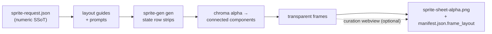

<p align="center">
  
  
  
  
  
  
  
</p>

<h1 align="center">sprite-gen</h1>

<p align="center"><b>그림 하나를 넣으면. 게임에 바로 쓸 수 있는 스프라이트 아틀라스가 나옵니다.</b></p>

<p align="center">

**English** · [한국어](README.ko.md) · [日本語](README.ja.md) · [简体中文](README.zh-Hans.md) · [Español](README.es.md) · [Français](README.fr.md)

</p>

---

이미지 모델에 "sprite sheet"를 요청해 본 사람이라면 결과가 어떤지 압니다. 프레임마다 얼굴이 바뀌는 캐릭터, 키 아웃되지 않는 배경, 서로 겹치고 그리드 밖으로 밀려나는 포즈, 그리고 게임 엔진이 실제로는 소비할 수 없는 PNG. 귀여운 데모지만, 쓸모없는 에셋입니다.

`sprite-gen`은 그 간극을 닫는 Codex/Claude skill입니다. **기본 이미지 하나**와 액션 목록을 주면, 행 단위로 생성을 구동하고, 캐릭터 정체성을 고정하며, 크로마 배경을 실제 알파로 제거하고, 각 포즈를 깨끗한 투명 프레임으로 추출한 뒤, **기계가 읽을 수 있는 `manifest.json.frame_layout`**이 포함된 런타임 아틀라스를 굽습니다. 위의 모든 스프라이트는 이 방식으로 만들었습니다.

그리고 생성이 끝내 맞히지 못하는 마지막 10%를 위해 **curation webview**가 있습니다. 프레임을 나란히 비교하고, 망가진 것은 거부하고, 회전/스케일/위치를 비파괴적으로 살짝 조정하고, 루프를 실시간으로 본 다음 굽습니다. 파이프라인이 노동을 맡고, 당신은 감각을 지킵니다.

```text
sprite-request.json → layout guides + prompts → sprite-gen gen state rows
→ chroma alpha → connected components → transparent frames
→ sprite-sheet-alpha.png + manifest.json.frame_layout
```



> 전체 아키텍처: [`docs/architecture.md`](docs/architecture.md)

## 실제로 얻는 것

- **투명 스프라이트 아틀라스** (`sprite-sheet-alpha.png`) — 실제 알파, 남은 크로마 테두리 없음, 흰 배경에 대해 검증됨.
- **런타임 manifest** (`manifest.json.frame_layout`) — 절대 프레임 사각형, 상태별 fps와 루프 플래그. 엔진은 사각형을 샘플링하며, 그리드를 추측하지 않습니다.
- **눈으로 확인하는 QA** — 상태별 GIF와 contact sheet로, 어떤 것이든 배포되기 전에 모션을 모션으로 판단합니다.
- **정직한 라벨** — 짧고 읽기 쉬운 액션(idle, jump, attack, wave)이 안정적인 경로입니다. 순환 이동(walk/run)은 motion QA가 실제로 통과하지 않는 한 experimental로 표시됩니다. 조용히 과장하지 않습니다.

## Chroma alpha 품질

추출기는 크로마 정리를 결정론적으로 유지합니다. soft-alpha unmix는 커버리지가 해결되기 전에 머리카락의 안티앨리어싱된 가닥과 얇은 윤곽선을 벗겨내는 대신 보존합니다.

<p align="center">
  <br />
  <em>일러스트레이션, 마젠타 키: 원본, v1.12.0 peel, v1.13.0 soft-alpha unmix.</em>
</p>

<p align="center">
  <br />
  <em>일러스트레이션, 그린 키: 원본, v1.12.0 peel, v1.13.0 soft-alpha unmix.</em>
</p>

<p align="center">
  <br />
  <em>픽셀 아트, 마젠타 키: 원본, v1.12.0 peel, v1.13.0 binarized output.</em>
</p>

<p align="center">
  <br />
  <em>픽셀 아트, 그린 키: 원본, v1.12.0 peel, v1.13.0 binarized output.</em>
</p>

아래 클로즈업 크롭은 전신 비교 뒤의 가장자리 디테일을 보여줍니다.


## Curation webview

생성은 90%까지 데려갑니다. webview는 사람이 그것을 *출시 가능한 상태*로 가져가는 곳입니다. Studio나 프레임워크 의존성이 없는 standalone이며, skill이 설치된 곳이라면 어디서든 실행됩니다(Claude Code Desktop, Codex 앱, 일반 터미널).


- **상태별 두 행:** 위에는 **play sequence**, 아래에는 **candidate pool**(예: 두 번째 또는 세 번째 생성 테이크)이 있습니다. 프레임의 ⠿ 그립을 끌어 시퀀스를 재정렬하거나, 풀에서 컷을 위로 끌어올리세요. 여러 테이크의 가장 좋은 프레임으로 하나의 깨끗한 run loop를 다시 만들 수 있습니다. 배치는 저장되므로 다시 열어도 복원됩니다.
- 프레임별 **비파괴 transform**: 드래그 = 이동, 휠 = 스케일, 상단 핸들 = 회전, 좌하단 = shear, 여기에 좌우 반전 출력용 horizontal-flip 토글이 있습니다. 편집은 `curation.json` sidecar에 저장됩니다. 원본 PNG는 절대 다시 쓰지 않으며, compose 단계가 결과를 결정론적으로 굽습니다. Preview와 bake는 하나의 affine matrix를 공유하므로, 정렬한 그대로 결과가 나옵니다.
- **Live preview**는 해당 상태의 fps로 시퀀스를 애니메이션하며, 재생/일시정지, 프레임 단위 이동, 0.25×–4× 속도 제어를 제공합니다.
- 스프라이트에만 쓰는 것이 아닙니다. `unpack_atlas_run.py --pngs-dir`로 이미지 후보 폴더(아이콘, 로고, 생성 초안)를 가리키면, 일반적인 승자 선택 뷰로 사용할 수 있습니다.

### Isometric ground grid

아이소메트릭 세트에서는 webview가 (`meta.json` tile/anchor에서 온) 바닥 그리드를 오버레이하므로, shear 핸들로 가구를 다이아몬드 축에 맞춰 스냅할 수 있습니다.


### 언어

webview는 영어와 한국어를 함께 제공합니다. 실행할 때 `--lang en|ko`를 전달하거나, 앱 안의 토글을 사용하세요.

```bash
python3 scripts/serve_curation.py --run-dir <run-dir> --lang en   # or ko
```

## Python 지원

`sprite-gen`은 CPython 3.10+를 지원합니다. CI는 GitHub-hosted runners에서 최소 지원 버전(3.10)과 최신 커버 버전(3.14)을 실행합니다.

quickstart에는 동작하는 `venv`/`ensurepip`가 있는 Python 설치가 필요합니다. 로컬 배포판에서 패키지 설치 전에 `python3 -m venv`가 실패한다면, 지원되는 임의 버전의 표준 CPython 빌드를 사용한 뒤 같은 명령을 다시 실행하세요.

## Quickstart

```bash
# 0. install dependencies (Pillow) into a fresh virtualenv
python3 -m venv .venv && source .venv/bin/activate
pip install -e .

# 1. prepare a run from a base image
python3 scripts/prepare_sprite_run.py --out-dir <run-dir> --character-id <id> --base-image base.png

# 2. generate one row image per state with the engine-owned provider CLI
python3 scripts/generate_sprite_image.py --provider codex \
  --prompt-file <run-dir>/prompts/<state>.txt \
  --out <run-dir>/raw/<state>.png \
  --ref <run-dir>/base-source.png \
  --ref <run-dir>/references/layout-guides/<state>.png
# 3. extract frames
python3 scripts/extract_sprite_row_frames.py --run-dir <run-dir>

# 4. (optional) curate frames in the webview
python3 scripts/serve_curation.py --run-dir <run-dir>

# 5. bake the runtime atlas
python3 scripts/compose_sprite_atlas.py --run-dir <run-dir>
```

### 완성된 sheet 편집하기

합쳐진 sheet만 남아 있다면, curator-ready run dir을 다시 만든 뒤 curate하고 export하세요.

```bash
# rebuild frames: explicit --grid, --manifest rectangles, or alpha auto-detect (default)
python3 scripts/unpack_atlas_run.py --atlas sheet.png            # auto-detect
python3 scripts/unpack_atlas_run.py --manifest manifest.json     # exact rectangles
python3 scripts/unpack_atlas_run.py --pngs-dir furniture/        # import a loose PNG set

# after curating, bake corrections back to named PNGs
python3 scripts/export_curated_pngs.py --run-dir <run-dir>
```

출력은 기본적으로 입력 옆에 찾기 쉬운 `<source>-curator` 폴더로 생성됩니다.

### 가져온 이미지에서 배경 잘라내기

생성된 스프라이트는 파이프라인 내부에서 자체 마젠타/그린 배경을 기준으로 키 처리되므로, 이 기능이 필요 없습니다. `cutout`은 import/post-edit 유틸리티입니다. 불투명하고 균일한 배경을 *가진 채* 들어온 이미지(손으로 그린 아이콘, 다운로드한 스프라이트, 스크린샷)를 깨끗한 투명 PNG로 바꿉니다.

```bash
# routes on the corner colour: white/ivory -> matte, magenta/green -> extract engine
python3 -m sprite_gen.cli cutout icon.png --white-check
```

모서리 배경색을 읽고 라우팅합니다(`--key auto|white|magenta|green`).

- **white / ivory / solid** → position matte. 모서리 flood-fill이 연결된 배경만 유지합니다(오브젝트 *안쪽*의 밝은 하이라이트는 살아남고, 구멍이 뚫리지 않습니다). 그런 다음 decontaminated soft alpha가 경계를 부드럽게 처리합니다. `--strength`(bevel 제거), `--band`(edge depth), `--erode`로 조정하세요.
- **magenta / green key** → 프로젝트에서 검증된 `extract` chroma engine을 그대로 재사용합니다. 키 색상은 오브젝트에 절대 나타나지 않으므로 색상만으로 자르는 방식이 그곳에서는 안전합니다. 바로 white matte의 flood-fill guard가 *필요하지 않은* 위치입니다.

`--white-check`는 남은 fringe가 확실히 드러나도록 cyan/magenta/yellow 합성 이미지를 씁니다. 균일한 배경용이며, 복잡하거나 불균일한 배경용이 아닙니다.

전체 에이전트 대상 워크플로와 계약은 [`SKILL.md`](SKILL.md)에 있습니다.

## 설치

Codex skill installer 워크플로에서 이 저장소를 root skill로 설치하세요.

```bash
python3 ~/.codex/skills/.system/skill-installer/scripts/install-skill-from-github.py \
  --repo aldegad/sprite-gen --path .
```

### 이미지 생성 소유권

Provider-backed generation은 이 엔진(`sprite_gen.gen`)의 일부이며, `codex`와 `grok`가 지원 provider입니다. 일반 `image-gen` skill은 같은 명령으로 보내는 얇은 셔틀일 뿐이므로, 두 번째 provider 구현이 필요하지 않습니다. CLI와 검증 계약은 [`docs/gen.md`](docs/gen.md)를 참고하세요.

## Attribution

component-row 워크플로는 Apache-2.0 라이선스의 `hatch-pet` skill에서 영감을 받았지만, 범용 게임 스프라이트 아틀라스를 대상으로 하며 pet 패키지나 pet visual asset은 포함하지 않습니다.

## License

Apache-2.0