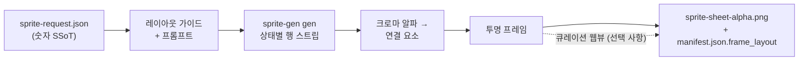

<h1 align="center">sprite-gen</h1>

<p align="center"><b>그림 하나를 넣으면 게임용 스프라이트 아틀라스가 나옵니다.</b></p>

<p align="center">

**English** · [한국어](README.ko.md) · [日本語](README.ja.md) · [简体中文](README.zh-Hans.md) · [Español](README.es.md) · [Français](README.fr.md)

</p>

---

이 스킬로 생성하고 큐레이션한 스프라이트(`claudecy`, `howl`):

<p align="center">
  
  
  
  
  
  
  
</p>

이미지 모델에게 “스프라이트 시트”를 요청하면 어떤 결과가 나오는지 알 것이다. 프레임마다 얼굴이 바뀌는 캐릭터, 키가 빠지지 않는 배경, 서로 겹치고 격자에서 벗어나는 포즈, 그리고 게임 엔진이 실제로 읽을 수 없는 PNG. 귀여운 데모일 뿐, 쓸모 있는 에셋은 아니다.

`sprite-gen`은 그 간극을 메우는 Codex/Claude 스킬이다. **기본 이미지 하나**와 액션 목록을 주면 행 단위로 생성을 수행하고, 캐릭터의 정체성을 고정하며, 크로마 배경을 실제 알파로 제거하고, 각 포즈를 깔끔한 투명 프레임으로 추출한 뒤, **기계가 읽을 수 있는 `manifest.json.frame_layout`**을 포함한 런타임 아틀라스를 구워낸다.

생성 모델이 끝내 제대로 처리하지 못하는 마지막 10%를 위해 **큐레이션 웹뷰**도 제공한다. 프레임을 나란히 비교하고, 망가진 프레임을 거부하고, 회전·크기·위치를 비파괴적으로 조정하고, 루프를 실시간으로 확인한 다음 굽는다. 파이프라인이 노동을 담당하고, 최종 감각은 당신이 유지한다.

```text
sprite-request.json → layout guides + prompts → sprite-gen gen state rows
→ chroma alpha → connected components → transparent frames
→ sprite-sheet-alpha.png + manifest.json.frame_layout
```


```mermaid
flowchart LR
    REQ["sprite-request.json<br/>(숫자 SSoT)"] --> GUIDES["레이아웃 가이드<br/>+ 프롬프트"]
    GUIDES --> GEN["sprite-gen gen<br/>상태별 행 스트립"]
    GEN --> EXTRACT["크로마 알파 →<br/>연결 요소"]
    EXTRACT --> FRAMES["투명 프레임"]
    FRAMES --> ATLAS["sprite-sheet-alpha.png<br/>+ manifest.json.frame_layout"]
    FRAMES -. "큐레이션 웹뷰 (선택 사항)" .-> ATLAS
```

> 전체 아키텍처: [`docs/architecture.md`](docs/architecture.md)

## 실제로 얻는 것

- **투명 스프라이트 아틀라스**(`sprite-sheet-alpha.png`) — 실제 알파를 사용하며, 남은 크로마 테두리가 없고 흰색 배경에서 검증된다.
- **런타임 매니페스트**(`manifest.json.frame_layout`) — 절대 좌표 기준 프레임 사각형, 상태별 fps와 루프 플래그를 포함한다. 엔진은 사각형을 샘플링하며 격자를 추측하지 않는다.
- **확인 가능한 QA** — 상태별 GIF와 콘택트 시트를 제공하므로, 출시 전에 움직임을 움직임으로 판단할 수 있다.
- **정직한 라벨** — 짧고 읽기 쉬운 액션(idle, jump, attack, wave)이 안정적인 경로다. 반복 이동(walk/run)은 실제 모션 QA를 통과한 경우가 아니면 실험 단계로 표시된다. 조용히 과장하지 않는다.

## 크로마 알파 품질

추출기는 크로마 정리를 결정론적으로 유지한다. 소프트 알파 언믹싱은 커버리지를 계산하기 전에 안티앨리어싱된 머리카락 가닥과 가느다란 외곽선을 벗겨내는 대신 보존한다.

<p align="center">
  <br />
  <em>일러스트, 마젠타 키: 원본, v1.12.0 peel, v1.13.0 소프트 알파 언믹스.</em>
</p>

<p align="center">
  <br />
  <em>일러스트, 녹색 키: 원본, v1.12.0 peel, v1.13.0 소프트 알파 언믹스.</em>
</p>

<p align="center">
  <br />
  <em>픽셀 아트, 마젠타 키: 원본, v1.12.0 peel, v1.13.0 이진화 출력.</em>
</p>

<p align="center">
  <br />
  <em>픽셀 아트, 녹색 키: 원본, v1.12.0 peel, v1.13.0 이진화 출력.</em>
</p>

아래의 확대 크롭은 전신 비교 이미지 뒤에 있는 가장자리 세부 정보를 보여준다.


## Backbone Lattice

AI가 생성한 “픽셀 아트”는 픽셀 아트가 아니다. 블록이 흔들리고, 가장자리에 안티앨리어싱이 남으며, 한 행 안에서도 격자가 이동한다. 따라서 균일한 격자로 자르면 한 블록이 다음 블록으로 번진다. 커뮤니티에서 사용하는 해결책은 이미지를 “가짜가 아니게” 만드는 것이다. 런 길이에서 블록 크기를 추정하고 다시 양자화한다. 하지만 이 방식은 각 프레임을 개별적으로 측정하므로, 걷기 사이클의 셀 크기가 프레임마다 숨 쉬듯 변한다.

**Backbone Lattice**는 전체 피사체에 하나의 격자를 측정하고 모든 절단을 그 격자에 맞춘다. 프레임별 피치 감지는 행 전체와 프레임 간 합의로 이어지며, 고조파 오검출을 압도한다. 이 합의 격자가 모든 절단이 맞물리는 *백본*이다. 절단은 실제 색상 경계에 놓이고, 측정된 피치에 비례하는 최소 셀 너비가 인접한 두 절단이 같은 띠로 합쳐지는 것을 방지한다. 하나의 백본을 사용하므로 애니메이션 전체에서 같은 블록이 같은 크기를 유지하며 프레임마다 튀지 않는다.

결과는 임의로 고른 프레임을 눈대중으로 확인하는 것이 아니라, 실제로 출시된 결과를 기준으로 검증된다. 모든 픽셀 단위 실행은 자체 원본 스트립에서 다시 도출되고 픽셀별로 비교된다. 승인한 형태는 얻는 결과에서도 그대로 유지된다. 달라지는 것은 외곽선과 음영이 배치되는 위치뿐이며, 바로 그 위치를 백본이 결정한다.

## 큐레이션 웹뷰

생성은 90%를 해결한다. 웹뷰는 사람이 결과를 *출시 가능한 상태*로 만드는 곳이다. Studio나 프레임워크에 종속되지 않고, 스킬이 설치된 어디서나 실행된다(Claude Code Desktop, Codex 앱, 일반 터미널).


- **상태별 두 행:** 위에는 **재생 시퀀스**, 아래에는 **후보 풀**이 표시된다(예: 두 번째 또는 세 번째 생성 결과). 프레임의 ⠿ 손잡이를 드래그해 시퀀스 순서를 바꾸거나, 후보 풀에서 프레임을 끌어올 수 있다. 여러 생성 결과에서 가장 좋은 프레임을 골라 하나의 깔끔한 실행 루프를 다시 구성한다. 배열은 저장되므로 다시 열면 복원된다.
- **프레임별 비파괴 변환:** 드래그 = 이동, 휠 = 크기 조절, 상단 핸들 = 회전, 왼쪽 하단 = 기울이기. 좌우가 뒤집힌 결과를 위한 수평 뒤집기 토글도 제공된다. 편집 내용은 `curation.json` 사이드카 파일에 저장되며, 원본 PNG는 절대 다시 쓰지 않는다. 합성 단계에서 결과를 결정론적으로 굽는다. 미리보기와 굽기는 하나의 아핀 행렬을 공유하므로, 정렬한 결과가 그대로 출력된다.
- **실시간 미리보기:** 상태의 fps로 시퀀스를 애니메이션하며, 재생/일시 정지, 프레임 단위 이동, 0.25×–4× 속도 조절을 지원한다.
- 스프라이트 전용이 아니다. `unpack_atlas_run.py --pngs-dir`로 이미지 후보가 있는 폴더(아이콘, 로고, 생성 초안 등)를 지정하면 일반적인 최종안 선택 뷰로 사용할 수 있다.

### 등각 투영 바닥 격자

등각 투영 세트에서는 웹뷰가 `meta.json`의 타일/앵커 정보를 기반으로 바닥 격자를 오버레이한다. 따라서 기울이기 핸들로 가구를 마름모 축에 맞출 수 있다.


### 언어

웹뷰는 영어와 한국어를 제공한다. 실행할 때 `--lang en|ko`를 전달하거나 앱 내 토글을 사용한다.

```bash
python3 scripts/serve_curation.py --run-dir <run-dir> --lang en   # 또는 ko
```

## Python 지원

`sprite-gen`은 CPython 3.10 이상을 지원한다. CI는 GitHub 호스팅 러너에서 지원 최소 버전(3.10)과 최신 지원 버전(3.14)을 실행한다.

빠른 시작에는 정상적으로 작동하는 `venv`/`ensurepip`가 포함된 Python 설치가 필요하다. 로컬 배포판에서 패키지를 설치하기 전에 `python3 -m venv`가 실패한다면, 지원되는 버전의 표준 CPython 빌드를 사용해 동일한 명령을 다시 실행한다.

## 빠른 시작

```bash
# 0. 새 가상환경에 의존성(Pillow) 설치
python3 -m venv .venv && source .venv/bin/activate
pip install -e .

# 1. 기본 이미지에서 실행 준비
python3 scripts/prepare_sprite_run.py --out-dir <run-dir> --character-id <id> --base-image base.png

# 2. 엔진이 소유한 provider CLI로 상태별 행 이미지 하나씩 생성
python3 scripts/generate_sprite_image.py --provider codex \
  --prompt-file <run-dir>/prompts/<state>.txt \
  --out <run-dir>/raw/<state>.png \
  --ref <run-dir>/base-source.png \
  --ref <run-dir>/references/layout-guides/<state>.png
# 3. 프레임 추출
python3 scripts/extract_sprite_row_frames.py --run-dir <run-dir>

# 4. (선택 사항) 웹뷰에서 프레임 큐레이션
python3 scripts/serve_curation.py --run-dir <run-dir>

# 5. 런타임 아틀라스 굽기
python3 scripts/compose_sprite_atlas.py --run-dir <run-dir>
```

### 완성된 시트 편집

결합된 시트만 남아 있는 경우, 큐레이터용 실행 디렉터리를 다시 만든 다음 큐레이션하고 내보낸다.

```bash
# 프레임 재구성: 명시적 --grid, --manifest 사각형 또는 알파 자동 감지(기본값)
python3 scripts/unpack_atlas_run.py --atlas sheet.png            # 자동 감지
python3 scripts/unpack_atlas_run.py --manifest manifest.json     # 정확한 사각형
python3 scripts/unpack_atlas_run.py --pngs-dir furniture/        # 개별 PNG 세트 가져오기

# 큐레이션 후 보정 내용을 이름이 지정된 PNG에 다시 굽기
python3 scripts/export_curated_pngs.py --run-dir <run-dir>
```

출력은 기본적으로 입력 파일 옆에서 찾을 수 있는 `<source>-curator` 폴더에 저장된다.

### 가져온 이미지에서 배경 잘라내기

생성된 스프라이트는 파이프라인 내부에서 자체 마젠타/녹색 배경을 키로 사용하므로 이 작업이 필요하지 않다. `cutout`은 가져오기/후편집 유틸리티다. 불투명하고 균일한 배경이 포함된 이미지(손으로 그린 아이콘, 다운로드한 스프라이트, 스크린샷)를 깔끔한 투명 PNG로 변환한다.

<p align="center">
  
</p>

```bash
# 모서리 색상에 따라 라우팅: 흰색/아이보리 -> matte, 마젠타/녹색 -> extract 엔진
python3 -m sprite_gen.cli cutout icon.png --white-check
```

모서리 배경 색상을 읽고 다음 경로로 라우팅한다(`--key auto|white|magenta|green`).

- **흰색 / 아이보리 / 단색** → position matte. 모서리 플러드 필은 연결된 배경만 유지한다(객체 *내부*의 밝은 하이라이트는 구멍이 나지 않고 보존됨). 그런 다음 오염이 제거된 소프트 알파가 테두리를 부드럽게 처리한다. `--strength`(베벨 제거), `--band`(가장자리 깊이), `--erode`로 조정한다.
- **마젠타 / 녹색 키** → 프로젝트에서 검증된 `extract` 크로마 엔진을 그대로 재사용한다. 키 색상이 객체에 나타나지 않으므로 색상만을 기준으로 잘라내도 안전하다. 흰색 matte의 플러드 필 보호가 필요하지 않은 바로 그 경우다.

`--white-check`는 시안/마젠타/노란색 합성 이미지를 작성하므로, 남은 테두리가 있으면 뚜렷하게 드러난다. 균일한 배경용이며 복잡하거나 균일하지 않은 배경에는 사용하지 않는다.

에이전트용 전체 워크플로와 계약은 [`SKILL.md`](SKILL.md)에 있다.

## 설치

Codex 스킬 설치 워크플로에서 이 저장소를 루트 스킬로 설치한다.

```bash
python3 ~/.codex/skills/.system/skill-installer/scripts/install-skill-from-github.py \
  --repo aldegad/sprite-gen --path .
```

### 이미지 생성 소유권

프로바이더 기반 생성은 이 엔진(`sprite_gen.gen`)의 일부이며, 지원되는 프로바이더는 `codex`와 `grok`이다. 일반 `image-gen` 스킬은 동일한 명령으로 연결하는 얇은 셔틀일 뿐이므로 별도의 프로바이더 구현이 필요하지 않다. CLI 및 검증 계약은 [`docs/gen.md`](docs/gen.md)를 참조한다.

## 저작자 표시

컴포넌트 행 워크플로는 Apache-2.0 라이선스가 적용된 `hatch-pet` 스킬에서 영감을 받았지만, 일반적인 게임 스프라이트 아틀라스를 대상으로 하며 펫 패키지나 펫 시각 에셋은 포함하지 않는다.

## 라이선스

Apache-2.0