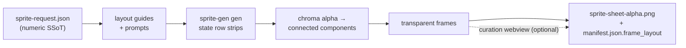

<h1 align="center">sprite-gen</h1>

<p align="center"><b>그림 하나를 넣으면 게임용 스프라이트 아틀라스가 나옵니다.</b></p>

<p align="center">

**English** · [한국어](README.ko.md) · [日本語](README.ja.md) · [简体中文](README.zh-Hans.md) · [Español](README.es.md) · [Français](README.fr.md)

</p>

---

이미지 모델에 “스프라이트 시트”를 요청해 보면 어떤 결과가 나오는지 알 수 있습니다. 프레임마다 얼굴이 바뀌는 캐릭터, 투명하게 제거되지 않는 배경, 서로 겹치거나 그리드에서 벗어나는 포즈, 그리고 게임 엔진이 실제로 사용할 수 없는 PNG입니다. 귀여운 데모일 뿐, 쓸모 있는 에셋은 아닙니다.

`sprite-gen`은 Codex/Claude 스킬로 이 간극을 메웁니다. **기본 이미지 하나**와 동작 목록을 주면, 행 단위로 생성을 진행하고 캐릭터의 정체성을 고정하며, 크로마 배경을 실제 알파로 제거하고, 각 포즈를 깔끔한 투명 프레임으로 추출한 뒤, **기계가 읽을 수 있는 `manifest.json.frame_layout`**이 포함된 런타임 아틀라스를 만듭니다.

생성 모델이 끝내 제대로 처리하지 못하는 마지막 10%를 위해 **큐레이션 웹뷰**도 제공합니다. 프레임을 나란히 비교하고, 망가진 프레임을 거부하고, 회전/크기/위치를 비파괴적으로 미세 조정하고, 루프를 실시간으로 확인한 다음 베이크할 수 있습니다. 파이프라인이 노동을 맡고, 최종 감각은 당신이 유지합니다.

```text
sprite-request.json → layout guides + prompts → sprite-gen gen state rows
→ chroma alpha → connected components → transparent frames
→ sprite-sheet-alpha.png + manifest.json.frame_layout
```


```mermaid
flowchart LR
    REQ["sprite-request.json<br/>(numeric SSoT)"] --> GUIDES["layout guides<br/>+ prompts"]
    GUIDES --> GEN["sprite-gen gen<br/>state row strips"]
    GEN --> EXTRACT["chroma alpha →<br/>connected components"]
    EXTRACT --> FRAMES["transparent frames"]
    FRAMES --> ATLAS["sprite-sheet-alpha.png<br/>+ manifest.json.frame_layout"]
    FRAMES -. "curation webview (optional)" .-> ATLAS
```

> 전체 아키텍처: [`docs/architecture.md`](docs/architecture.md)

## 실제로 얻는 것

- **투명 스프라이트 아틀라스** (`sprite-sheet-alpha.png`) — 실제 알파가 적용되며, 남은 크로마 가장자리 번짐이 없고 흰색 배경으로 검증됩니다.
- **런타임 매니페스트** (`manifest.json.frame_layout`) — 절대 프레임 사각형, 상태별 fps와 루프 플래그를 제공합니다. 엔진은 사각형을 샘플링하며, 그리드를 추측하지 않습니다.
- **직접 확인할 수 있는 QA** — 상태별 GIF와 콘택트 시트를 제공하므로, 배포 전에 동작을 동작으로 판단할 수 있습니다.
- **정직한 라벨** — 짧고 읽기 쉬운 동작(idle, jump, attack, wave)이 안정적인 경로입니다. 순환형 이동(walk/run)은 실제 모션 QA를 통과한 경우가 아니면 실험적 기능으로 표시됩니다. 조용히 과장하지 않습니다.

## 크로마 알파 품질

추출기는 크로마 정리를 결정론적으로 유지합니다. 소프트 알파 언믹싱은 커버리지를 계산하기 전에 안티앨리어싱된 머리카락 가닥과 가느다란 윤곽선을 벗겨내지 않고 보존합니다.

<p align="center">
  <br />
  <em>일러스트레이션, 마젠타 키: 소스, v1.12.0 peel, v1.13.0 soft-alpha unmix.</em>
</p>

<p align="center">
  <br />
  <em>일러스트레이션, 그린 키: 소스, v1.12.0 peel, v1.13.0 soft-alpha unmix.</em>
</p>

<p align="center">
  <br />
  <em>픽셀 아트, 마젠타 키: 소스, v1.12.0 peel, v1.13.0 binarized output.</em>
</p>

<p align="center">
  <br />
  <em>픽셀 아트, 그린 키: 소스, v1.12.0 peel, v1.13.0 binarized output.</em>
</p>

아래의 확대 크롭은 전신 비교 이미지 뒤에 있는 가장자리 디테일을 보여줍니다.


## Backbone Lattice

AI가 생성한 “픽셀 아트”는 픽셀 아트가 아닙니다. 블록이 흔들리고, 가장자리에 안티앨리어싱이 남으며, 한 행 안에서도 격자가 어긋나므로 균일한 그리드로 자르면 한 블록이 다음 블록에 번집니다. 커뮤니티에서 사용하는 해결책은 이미지에서 블록 크기를 런 길이로 추측해 재양자화하는 “가짜 픽셀 아트 제거” 방식입니다. 하지만 이 방식은 각 프레임을 개별적으로 측정하므로, 걷기 사이클의 셀 크기가 프레임마다 숨 쉬듯 변합니다.

**Backbone Lattice**는 전체 주제에 대해 하나의 그리드를 측정하고 모든 절단을 그리드에 맞춥니다. 프레임별 피치 감지는 행 전체 및 프레임 간 합의값을 계산하며, 이 합의값은 조화 오검출보다 우선합니다. 이 합의 그리드가 모든 절단이 맞물리는 *백본*입니다. 절단선은 실제 색상 경계에 놓이고, 측정된 피치에 비례한 최소 셀 너비가 적용되어 이웃한 두 절단선이 같은 밴드에 겹치는 일이 방지됩니다. 하나의 백본을 사용하므로 애니메이션 전체에서 같은 블록이 프레임마다 튀지 않고 동일한 크기를 유지합니다.

같은 소스 스트립과 고정된 팔레트를 사용했습니다. 유일한 변수는 엔진입니다.

손으로 고른 프레임이 아니라 전체 프로젝트에서 검증했습니다. 실제 게임의 픽셀 퍼펙트 실행 94개를 각자의 소스 스트립에서 다시 도출한 뒤, 배포된 결과와 픽셀 단위로 비교했습니다.

<p align="center">
  
</p>

총 26,690,432개의 정규 픽셀에서 실루엣 변화율은 1.41%였습니다. 승인한 형태는 그대로 유지됩니다. 달라지는 것은 윤곽선과 음영이 놓이는 위치이며, 이것이 바로 백본이 결정하는 부분입니다.

## 큐레이션 웹뷰

생성은 90%를 해결합니다. 웹뷰는 사람이 결과물을 *출시 가능한 상태*로 만드는 곳입니다. 독립 실행형이며 Studio나 프레임워크에 의존하지 않고, 스킬이 설치된 어디서나 실행됩니다(Claude Code Desktop, Codex 앱, 일반 터미널).


- **상태별 두 행:** 위에는 **재생 시퀀스**, 아래에는 **후보 풀**이 표시됩니다(예: 두 번째 또는 세 번째 생성 결과). 프레임의 ⠿ 그립을 드래그해 시퀀스를 재정렬하거나, 후보 풀에서 잘라낸 프레임을 위로 가져올 수 있습니다. 여러 생성 결과에서 가장 좋은 프레임을 골라 하나의 깔끔한 실행 루프를 다시 구성할 수 있습니다. 배열은 저장되므로 다시 열면 복원됩니다.
- **프레임별 비파괴 변환:** 드래그 = 이동, 휠 = 크기 조절, 위쪽 핸들 = 회전, 왼쪽 아래 핸들 = 전단이며, 좌우가 뒤집힌 결과를 위한 수평 뒤집기 토글도 있습니다. 편집 내용은 `curation.json` 사이드카에 저장됩니다. 원본 PNG는 다시 쓰지 않으며, compose 단계에서 결과를 결정론적으로 베이크합니다. 미리보기와 베이크는 하나의 아핀 행렬을 공유하므로, 정렬한 모습 그대로 결과가 나옵니다.
- **실시간 미리보기:** 상태의 fps에 맞춰 시퀀스를 애니메이션으로 재생하며, 재생/일시정지, 프레임 단위 이동, 0.25×–4× 속도 조절을 제공합니다.
- 스프라이트 전용이 아닙니다. `unpack_atlas_run.py --pngs-dir`로 이미지 후보가 있는 폴더(아이콘, 로고, 생성 초안 등)를 지정하면 일반적인 최종 후보 선택 뷰로 사용할 수 있습니다.

### 아이소메트릭 바닥 그리드

아이소메트릭 세트의 경우 웹뷰가 바닥 그리드를 오버레이합니다(`meta.json`의 tile/anchor에서 가져옴). 따라서 전단 핸들을 사용해 가구를 다이아몬드 축에 맞출 수 있습니다.


### 언어

웹뷰는 영어와 한국어를 제공합니다. 실행할 때 `--lang en|ko`를 전달하거나 앱 내 토글을 사용하세요.

```bash
python3 scripts/serve_curation.py --run-dir <run-dir> --lang en   # 또는 ko
```

## Python 지원

`sprite-gen`은 CPython 3.10 이상을 지원합니다. CI는 GitHub 호스팅 러너에서 최소 지원 버전(3.10)과 최신 검증 버전(3.14)을 실행합니다.

빠른 시작에는 정상적으로 작동하는 `venv`/`ensurepip`가 포함된 Python 설치가 필요합니다. 로컬 배포판에서 패키지 설치 전에 `python3 -m venv`가 실패한다면, 지원되는 버전의 표준 CPython 빌드를 사용해 동일한 명령을 다시 실행하세요.

## 빠른 시작

```bash
# 0. 새 가상환경에 의존성(Pillow) 설치
python3 -m venv .venv && source .venv/bin/activate
pip install -e .

# 1. 기본 이미지에서 실행 준비
python3 scripts/prepare_sprite_run.py --out-dir <run-dir> --character-id <id> --base-image base.png

# 2. 엔진이 소유한 provider CLI로 상태별 행 이미지 하나씩 생성
python3 scripts/generate_sprite_image.py --provider codex \
  --prompt-file <run-dir>/prompts/<state>.txt \
  --out <run-dir>/raw/<state>.png \
  --ref <run-dir>/base-source.png \
  --ref <run-dir>/references/layout-guides/<state>.png
# 3. 프레임 추출
python3 scripts/extract_sprite_row_frames.py --run-dir <run-dir>

# 4. (선택 사항) 웹뷰에서 프레임 큐레이션
python3 scripts/serve_curation.py --run-dir <run-dir>

# 5. 런타임 아틀라스 베이크
python3 scripts/compose_sprite_atlas.py --run-dir <run-dir>
```

### 완성된 시트 편집

결합된 시트만 남아 있는 경우, 큐레이터용 실행 디렉터리를 다시 만든 다음 큐레이션하고 내보내세요.

```bash
# 프레임 재구성: 명시적 --grid, --manifest 사각형 또는 알파 자동 감지(기본값)
python3 scripts/unpack_atlas_run.py --atlas sheet.png            # 자동 감지
python3 scripts/unpack_atlas_run.py --manifest manifest.json     # 정확한 사각형
python3 scripts/unpack_atlas_run.py --pngs-dir furniture/        # 개별 PNG 세트 가져오기

# 큐레이션 후 보정 내용을 이름이 지정된 PNG로 다시 베이크
python3 scripts/export_curated_pngs.py --run-dir <run-dir>
```

출력은 기본적으로 입력 파일 옆에서 찾기 쉬운 `<source>-curator` 폴더에 생성됩니다.

### 가져온 이미지에서 배경 제거

생성된 스프라이트는 파이프라인 안에서 자체 마젠타/그린 배경을 기준으로 처리되므로 이 기능이 필요하지 않습니다. `cutout`은 가져오기/후편집 유틸리티입니다. 불투명하고 균일한 배경이 포함된 이미지(손으로 그린 아이콘, 다운로드한 스프라이트, 스크린샷)를 깔끔한 투명 PNG로 변환합니다.

<p align="center">
  
</p>

```bash
# 모서리 색상에 따라 라우팅: 흰색/아이보리 -> matte, 마젠타/그린 -> extract 엔진
python3 -m sprite_gen.cli cutout icon.png --white-check
```

모서리의 배경색을 읽고 다음 경로로 라우팅합니다(`--key auto|white|magenta|green`).

- **흰색 / 아이보리 / 단색** → position matte. 모서리 플러드 필은 연결된 배경만 유지합니다. 물체 *내부*의 밝은 하이라이트는 구멍이 뚫리지 않고 보존됩니다. 이후 오염이 제거된 소프트 알파가 테두리를 부드럽게 처리합니다. `--strength`(베벨 제거), `--band`(가장자리 깊이), `--erode`로 조정할 수 있습니다.
- **마젠타 / 그린 키** → 프로젝트에서 검증된 `extract` 크로마 엔진을 그대로 재사용합니다. 키 색상이 물체 안에 나타나지 않으므로 이 경우 색상만으로 자르는 방식이 안전합니다. 흰색 매트의 플러드 필 가드가 필요하지 않은 정확한 상황입니다.

`--white-check`는 시안/마젠타/노랑 합성 이미지를 작성하므로 남은 가장자리 번짐을 쉽게 확인할 수 있습니다. 균일한 배경용이며, 복잡하거나 균일하지 않은 배경에는 적합하지 않습니다.

에이전트용 전체 워크플로와 계약은 [`SKILL.md`](SKILL.md)에 있습니다.

## 설치

Codex 스킬 설치 워크플로에서 이 저장소를 루트 스킬로 설치하세요.

```bash
python3 ~/.codex/skills/.system/skill-installer/scripts/install-skill-from-github.py \
  --repo aldegad/sprite-gen --path .
```

### 이미지 생성 소유권

provider 기반 생성은 이 엔진(`sprite_gen.gen`)의 일부이며, 지원되는 provider는 `codex`와 `grok`입니다. 일반 `image-gen` 스킬은 동일한 명령으로 전달하는 얇은 셔틀일 뿐이므로, 별도의 provider 구현은 필요하지 않습니다. CLI와 검증 계약은 [`docs/gen.md`](docs/gen.md)를 참고하세요.

## 저작자 표시

컴포넌트 행 워크플로는 Apache-2.0 라이선스로 제공되는 `hatch-pet` 스킬에서 영감을 받았지만, 범용 게임 스프라이트 아틀라스를 대상으로 하며 펫 패키지나 펫 시각 에셋은 포함하지 않습니다.

## 라이선스

Apache-2.0