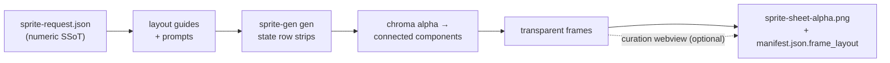

<p align="center">
  
  
  
  
  
  
  
</p>

<h1 align="center">sprite-gen</h1>

<p align="center"><b>输入一张图。输出可直接用于游戏的精灵图集。</b></p>

<p align="center">

**English** · [한국어](README.ko.md) · [日本語](README.ja.md) · [简体中文](README.zh-Hans.md) · [Español](README.es.md) · [Français](README.fr.md)

</p>

---

让图像模型生成一张“sprite sheet”，你很清楚会得到什么：每一帧脸都在变的角色、无法抠掉的背景、相互重叠且偏离网格的姿势，以及游戏引擎实际上无法消费的 PNG。演示很可爱，素材却没法用。

`sprite-gen` 是一个 Codex/Claude skill，用来补上这个缺口。给它**一张基础图片**和一组动作列表 — 它会逐行驱动生成，锁定角色身份，把色键背景剥离成真正的 alpha，提取每个姿势为干净透明帧，并烘焙出运行时图集，附带机器可读的 `manifest.json.frame_layout`。上面的每个精灵都是这样制作的。

而对于生成永远搞不准的最后 10%，这里还有一个**精选 webview**：并排比较帧、拒绝坏帧、以非破坏方式微调旋转/缩放/位置、实时观看循环 — 然后烘焙。流水线负责苦活；你保留审美判断。

```text
sprite-request.json → layout guides + prompts → sprite-gen gen state rows
→ chroma alpha → connected components → transparent frames
→ sprite-sheet-alpha.png + manifest.json.frame_layout
```



> 完整架构：[`docs/architecture.md`](docs/architecture.md)

## 你实际会得到什么

- **透明精灵图集**（`sprite-sheet-alpha.png`）— 真正的 alpha，没有残留色键边缘，并已针对白色背景验证。
- **运行时 manifest**（`manifest.json.frame_layout`）— 绝对帧矩形、每个状态的 fps 和循环标记。你的引擎采样矩形；它永远不需要猜网格。
- **可观看的 QA** — 每个状态的 GIF 和接触表，因此在发货前就以运动本身来判断运动。
- **诚实的标签** — 简短可读的动作（idle、jump、attack、wave）是稳定路径；循环移动（walk/run）会标记为实验性，除非运动 QA 确实通过。不会悄悄过度承诺。

## Chroma alpha 质量

提取器保持色键清理的确定性：soft-alpha unmix 会保留抗锯齿的发丝和细轮廓，而不是在覆盖率求解之前就把它们剥掉。

<p align="center">
  <br />
  <em>插画，洋红色键：source、v1.12.0 peel、v1.13.0 soft-alpha unmix。</em>
</p>

<p align="center">
  <br />
  <em>插画，绿色键：source、v1.12.0 peel、v1.13.0 soft-alpha unmix。</em>
</p>

<p align="center">
  <br />
  <em>像素画，洋红色键：source、v1.12.0 peel、v1.13.0 binarized output。</em>
</p>

<p align="center">
  <br />
  <em>像素画，绿色键：source、v1.12.0 peel、v1.13.0 binarized output。</em>
</p>

下面的近景裁剪展示了全身对比背后的边缘细节。


## 精选 webview

生成可以帮你完成 90%。webview 是人类把它推进到*可发货*的地方 — 独立运行，不依赖 Studio 或框架，在安装了该 skill 的任何地方都能运行（Claude Code Desktop、Codex app、普通终端）。


- **每个状态两行：** 上方是**播放序列**，下方是**候选池**（例如第二次或第三次生成结果）。拖动某帧的 ⠿ 手柄来重排序列，或从候选池中拉取一个切图 — 从多次生成的最佳帧里重建一个干净的跑步循环。排列会被保存，因此重新打开时会恢复。
- **每帧非破坏性变换**：拖动 = 移动，滚轮 = 缩放，顶部手柄 = 旋转，左下 = 剪切，另有水平翻转开关用于左右反转输出。编辑保存在 `curation.json` sidecar 中 — 源 PNG 永远不会被重写，compose 步骤会以确定性方式烘焙结果。预览和烘焙共享同一个仿射矩阵，所以你对齐的结果就是最终得到的结果。
- **实时预览** 会以该状态的 fps 播放序列，支持播放/暂停、逐帧步进，以及 0.25×–4× 速度控制。
- 不只适用于精灵：用 `unpack_atlas_run.py --pngs-dir` 指向任意图像候选文件夹（图标、logo、生成草稿），即可把它当作通用的“挑赢家”视图。

### 等距地面网格

对于等距素材集，webview 会叠加地面网格（来自 `meta.json` tile/anchor），这样你就可以通过剪切手柄把家具吸附到菱形轴线上。


### 语言

webview 内置英语和韩语。启动时传入 `--lang en|ko`，或使用应用内切换：

```bash
python3 scripts/serve_curation.py --run-dir <run-dir> --lang en   # or ko
```

## Python 支持

`sprite-gen` 支持 CPython 3.10+。CI 在 GitHub-hosted runners 上运行最低支持版本（3.10）和最新覆盖版本（3.14）。

快速开始需要一个可正常使用 `venv`/`ensurepip` 的 Python 安装。如果本地发行版在安装包之前运行 `python3 -m venv` 就失败，请使用任意受支持版本的标准 CPython 构建，并重新运行相同命令。

## 快速开始

```bash
# 0. install dependencies (Pillow) into a fresh virtualenv
python3 -m venv .venv && source .venv/bin/activate
pip install -e .

# 1. prepare a run from a base image
python3 scripts/prepare_sprite_run.py --out-dir <run-dir> --character-id <id> --base-image base.png

# 2. generate one row image per state with the engine-owned provider CLI
python3 scripts/generate_sprite_image.py --provider codex \
  --prompt-file <run-dir>/prompts/<state>.txt \
  --out <run-dir>/raw/<state>.png \
  --ref <run-dir>/base-source.png \
  --ref <run-dir>/references/layout-guides/<state>.png
# 3. extract frames
python3 scripts/extract_sprite_row_frames.py --run-dir <run-dir>

# 4. (optional) curate frames in the webview
python3 scripts/serve_curation.py --run-dir <run-dir>

# 5. bake the runtime atlas
python3 scripts/compose_sprite_atlas.py --run-dir <run-dir>
```

### 编辑已完成的图集

当只剩下合成后的图集时，重建一个 curator-ready run dir，然后精选并导出：

```bash
# rebuild frames: explicit --grid, --manifest rectangles, or alpha auto-detect (default)
python3 scripts/unpack_atlas_run.py --atlas sheet.png            # auto-detect
python3 scripts/unpack_atlas_run.py --manifest manifest.json     # exact rectangles
python3 scripts/unpack_atlas_run.py --pngs-dir furniture/        # import a loose PNG set

# after curating, bake corrections back to named PNGs
python3 scripts/export_curated_pngs.py --run-dir <run-dir>
```

输出默认会写到输入旁边一个容易找到的 `<source>-curator` 文件夹。

### 从导入图片中切掉背景

生成的精灵会在流水线内部从自身的洋红/绿色背景中抠出，
因此它们永远不需要这个。`cutout` 是导入/后期编辑工具：一张
带有不透明均匀背景的图片（手绘图标、
下载的精灵、截图）会被转换成干净的透明 PNG。

```bash
# routes on the corner colour: white/ivory -> matte, magenta/green -> extract engine
python3 -m sprite_gen.cli cutout icon.png --white-check
```

它会读取角落背景颜色并路由（`--key auto|white|magenta|green`）：

- **white / ivory / solid** → position matte。角落 flood-fill 只保留
  连通背景（物体*内部*的明亮高光会保留，不会被挖洞），然后去污染的 soft alpha
  羽化边缘。可用 `--strength`（斜边移除）、`--band`（边缘深度）、`--erode` 调整。
- **magenta / green key** → 复用项目已验证的 `extract` chroma engine。
  key colours 永远不会出现在物体中，所以它的纯颜色切除在那里是
  安全的 — 正好也是 white matte 的 flood-fill guard *不*需要的地方。

`--white-check` 会写出青色/洋红/黄色合成图，让任何残留边缘都明显暴露。
适用于均匀背景；不适用于复杂/非均匀背景。

完整的面向 agent 的工作流和契约位于 [`SKILL.md`](SKILL.md)。

## 安装

从 Codex skill installer 工作流中，将此仓库安装为 root skill：

```bash
python3 ~/.codex/skills/.system/skill-installer/scripts/install-skill-from-github.py \
  --repo aldegad/sprite-gen --path .
```

### 图像生成归属

Provider-backed generation 是该引擎（`sprite_gen.gen`）的一部分，
支持的 providers 为 `codex` 和 `grok`。通用 `image-gen` skill
只是到同一命令的一层薄 shuttle，因此不需要第二套 provider
实现。CLI 和验证契约见 [`docs/gen.md`](docs/gen.md)。

## 归属说明

component-row 工作流受 Apache-2.0 许可的 `hatch-pet` skill 启发，但目标是通用游戏精灵图集，不包含任何 pet packages 或 pet visual assets。

## License

Apache-2.0