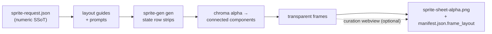

<h1 align="center">sprite-gen</h1>

<p align="center"><b>输入一张图。输出可直接用于游戏的精灵图集。</b></p>

<p align="center">

**English** · [한국어](README.ko.md) · [日本語](README.ja.md) · [简体中文](README.zh-Hans.md) · [Español](README.es.md) · [Français](README.fr.md)

</p>

---

向图像模型请求一张“sprite sheet”，你知道会得到什么：每一帧脸都在变的角色，抠不掉的背景，互相重叠并偏离网格的姿势，以及游戏引擎实际上无法消费的 PNG。可爱的演示，没用的素材。

`sprite-gen` 是一个 Codex/Claude skill，用来补上这道鸿沟。给它**一张基础图像**和一组动作列表，它会逐行驱动生成，锁定角色身份，把色键背景剥离为真实 alpha，将每个姿势提取为干净的透明帧，并烘焙出运行时图集，附带机器可读的 `manifest.json.frame_layout`。

而对于生成永远差一点的最后 10%，这里有一个**策展 webview**：并排比较帧，拒绝坏掉的帧，以非破坏方式微调旋转/缩放/位置，实时观看循环，然后烘焙。流水线负责苦活；你保留判断品味。

```text
sprite-request.json → layout guides + prompts → sprite-gen gen state rows
→ chroma alpha → connected components → transparent frames
→ sprite-sheet-alpha.png + manifest.json.frame_layout
```



> 完整架构：[`docs/architecture.md`](docs/architecture.md)

## 你实际会得到什么

- **透明精灵图集**（`sprite-sheet-alpha.png`）——真实 alpha，没有残留的色键毛边，并已用白色背景验证。
- **运行时 manifest**（`manifest.json.frame_layout`）——绝对帧矩形、每个状态的 fps 和循环标记。你的引擎采样矩形；它永远不需要猜网格。
- **可观看的 QA**——每个状态的 GIF 和 contact sheet，因此在任何内容发布前，动作会作为动作来评判。
- **诚实的标签**——短且可读的动作（idle、jump、attack、wave）是稳定路径；循环位移动作（walk/run）除非动作 QA 实际通过，否则会标记为实验性。不会默默过度承诺。

## Chroma alpha 质量

提取器让色键清理保持确定性：soft-alpha unmix 会保留抗锯齿的发丝和细轮廓，而不是在覆盖率尚未求解前就把它们剥掉。

<p align="center">
  <br />
  <em>插画，洋红色键：源图、v1.12.0 peel、v1.13.0 soft-alpha unmix。</em>
</p>

<p align="center">
  <br />
  <em>插画，绿色键：源图、v1.12.0 peel、v1.13.0 soft-alpha unmix。</em>
</p>

<p align="center">
  <br />
  <em>像素画，洋红色键：源图、v1.12.0 peel、v1.13.0 binarized output。</em>
</p>

<p align="center">
  <br />
  <em>像素画，绿色键：源图、v1.12.0 peel、v1.13.0 binarized output。</em>
</p>

下面的近景裁剪展示了全身对比背后的边缘细节。


## 像素格点还原

AI 生成的“像素画”并不是像素画。方块会抖动，边缘残留抗锯齿，格点甚至在同一行内也会漂移，因此按等距切割会把一个方块糊到相邻格里。提取器不假设格点，而是测量它：逐帧节距检测、压过倍频误检的整行共识、吸附到真实颜色边界的切割线，以及与实测节距成比例的最小格宽，使相邻两条切割线绝不会塌缩到同一条带上。

同一份源图条，同一份固定调色板。唯一的变量是引擎。

验证对象是整个项目，而不是精挑细选的一帧：一款在跑的游戏中全部 94 个 pixel_perfect run 都从各自的源图条重新导出，并与已出货的帧逐像素比对。

<p align="center">
  
</p>

在 26,690,432 个正本像素中，轮廓的变动为 1.41%。你确认过的形状仍然是你拿到的形状；改变的是描边与明暗落在哪里，而那正是格点决定的部分。

## 策展 webview

生成能完成 90%。webview 是人类把它推进到*可发布*的地方——独立运行，不依赖 Studio 或框架，在安装了该 skill 的任何地方都能运行（Claude Code Desktop、Codex app、普通终端）。


- **每个状态两行：**顶部是**播放序列**，下方是**候选池**（例如第二次或第三次生成结果）。拖动帧的 ⠿ 抓手来重排序列，或从候选池把一个片段拉上来——用多次生成里最好的帧重建一个干净的奔跑循环。排列会被保存，因此重新打开时会恢复。
- **每帧非破坏变换**：拖动 = 移动，滚轮 = 缩放，顶部手柄 = 旋转，左下角 = 剪切，另有水平翻转开关用于左右反转输出。编辑存放在 `curation.json` sidecar 中——源 PNG 永远不会被重写，compose 步骤会以确定性方式烘焙结果。预览和烘焙共享同一个仿射矩阵，所以你对齐的就是最终得到的。
- **实时预览**会按该状态的 fps 播放序列，带播放/暂停、逐帧步进，以及 0.25×–4× 速度控制。
- 不只适用于精灵：用 `unpack_atlas_run.py --pngs-dir` 指向任意图像候选文件夹（图标、logo、生成草稿），即可把它用作通用的“选出赢家”视图。

### 等距地面网格

对于等距素材集，webview 会叠加地面网格（来自 `meta.json` tile/anchor），这样你可以用剪切手柄将家具吸附到菱形轴线上。


### 语言

webview 内置英语和韩语。启动时传入 `--lang en|ko`，或使用应用内切换：

```bash
python3 scripts/serve_curation.py --run-dir <run-dir> --lang en   # or ko
```

## Python 支持

`sprite-gen` 支持 CPython 3.10+。CI 会在 GitHub 托管 runner 上运行最低支持版本（3.10）和最新覆盖版本（3.14）。

快速开始需要安装带有可用 `venv`/`ensurepip` 的 Python。如果本地发行版在安装包之前执行 `python3 -m venv` 失败，请使用任意受支持版本的标准 CPython 构建，然后重新运行相同命令。

## 快速开始

```bash
# 0. install dependencies (Pillow) into a fresh virtualenv
python3 -m venv .venv && source .venv/bin/activate
pip install -e .

# 1. prepare a run from a base image
python3 scripts/prepare_sprite_run.py --out-dir <run-dir> --character-id <id> --base-image base.png

# 2. generate one row image per state with the engine-owned provider CLI
python3 scripts/generate_sprite_image.py --provider codex \
  --prompt-file <run-dir>/prompts/<state>.txt \
  --out <run-dir>/raw/<state>.png \
  --ref <run-dir>/base-source.png \
  --ref <run-dir>/references/layout-guides/<state>.png
# 3. extract frames
python3 scripts/extract_sprite_row_frames.py --run-dir <run-dir>

# 4. (optional) curate frames in the webview
python3 scripts/serve_curation.py --run-dir <run-dir>

# 5. bake the runtime atlas
python3 scripts/compose_sprite_atlas.py --run-dir <run-dir>
```

### 编辑已完成的 sheet

当只剩下合并后的 sheet 时，重建一个可供策展器使用的 run dir，然后策展并导出：

```bash
# rebuild frames: explicit --grid, --manifest rectangles, or alpha auto-detect (default)
python3 scripts/unpack_atlas_run.py --atlas sheet.png            # auto-detect
python3 scripts/unpack_atlas_run.py --manifest manifest.json     # exact rectangles
python3 scripts/unpack_atlas_run.py --pngs-dir furniture/        # import a loose PNG set

# after curating, bake corrections back to named PNGs
python3 scripts/export_curated_pngs.py --run-dir <run-dir>
```

输出默认会放在输入旁边一个容易找到的 `<source>-curator` 文件夹中。

### 从导入图像中切掉背景

生成的精灵会在流水线内部从自己的洋红/绿色背景中抠出，
因此它们不需要这个。`cutout` 是导入/后期编辑工具：一张
*带有*不透明统一背景的图像（手绘图标、下载的精灵、截图）
会被转换成干净的透明 PNG。

<p align="center">
  
</p>

```bash
# routes on the corner colour: white/ivory -> matte, magenta/green -> extract engine
python3 -m sprite_gen.cli cutout icon.png --white-check
```

它会读取角落背景颜色并路由（`--key auto|white|magenta|green`）：

- **white / ivory / solid** → position matte。角落 flood-fill 只保留
  连通背景（物体*内部*的明亮高光会保留，不会被打洞），随后用去污染的 soft alpha 羽化边缘。可用
  `--strength`（去除 bevel）、`--band`（边缘深度）、`--erode` 调整。
- **magenta / green key** → 项目已验证的 `extract` 色键引擎会被
  原样复用。键色永远不会出现在物体中，因此它的纯颜色切割在那里是
  安全的——也正是在白色 matte 的 flood-fill 保护*不*需要的地方。

`--white-check` 会写出青色/洋红色/黄色合成图，让任何残留毛边都醒目可见。适用于统一背景；不适用于复杂/非统一背景。

完整的面向 agent 的工作流和契约位于 [`SKILL.md`](SKILL.md)。

## 安装

从 Codex skill installer 工作流中，将此仓库安装为 root skill：

```bash
python3 ~/.codex/skills/.system/skill-installer/scripts/install-skill-from-github.py \
  --repo aldegad/sprite-gen --path .
```

### 图像生成所有权

由 provider 支持的生成是此引擎（`sprite_gen.gen`）的一部分，
支持的 provider 为 `codex` 和 `grok`。通用 `image-gen` skill
只是通往同一命令的轻量穿梭层，因此不需要第二套 provider
实现。有关 CLI 和验证契约，请参见 [`docs/gen.md`](docs/gen.md)。

## 致谢

component-row 工作流受到 Apache-2.0 许可的 `hatch-pet` skill 启发，但目标是通用游戏精灵图集，并且不包含任何宠物包或宠物视觉素材。

## License

Apache-2.0