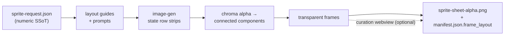

<p align="center">
  
  
  
  
  
  
  
</p>

<h1 align="center">sprite-gen</h1>

<p align="center"><b>输入一张图。输出可直接用于游戏的精灵图集。</b></p>

<p align="center">

**English** · [한국어](README.ko.md) · [日本語](README.ja.md) · [简体中文](README.zh-Hans.md) · [Español](README.es.md) · [Français](README.fr.md)

</p>

---

让图像模型生成一张“sprite sheet”，你大概知道会得到什么：每一帧脸都在变的角色、无法抠掉的背景、互相重叠并偏离网格的姿势，以及游戏引擎其实无法消费的 PNG。演示很可爱，资源却没法用。

`sprite-gen` 是一个 Codex/Claude skill，用来补上这段差距。给它**一张基础图像**和一组动作列表，它会逐行驱动生成，锁定角色身份，把色键背景剥离成真正的 alpha，提取每个姿势为干净的透明帧，并烘焙出运行时图集，且带有机器可读的 `manifest.json.frame_layout`。上面的每一个精灵都是这样制作的。

至于生成始终差一点的最后 10%，这里有一个**策展 webview**：并排比较帧，拒绝坏帧，以非破坏方式微调旋转/缩放/位置，实时观看循环动画，然后烘焙。流水线负责苦活；你保留审美判断。

```text
sprite-request.json → layout guides + prompts → image-gen state rows
→ chroma alpha → connected components → transparent frames
→ sprite-sheet-alpha.png + manifest.json.frame_layout
```



> 完整架构：[`docs/architecture.md`](docs/architecture.md)

## 你实际会得到什么

- **透明精灵图集**（`sprite-sheet-alpha.png`）——真正的 alpha，没有残留色键边缘，并已在白色背景上验证。
- **运行时 manifest**（`manifest.json.frame_layout`）——绝对帧矩形、每个状态的 fps 和循环标志。你的引擎采样矩形；它永远不用猜网格。
- **可观看的 QA**——每个状态的 GIF 和接触表，所以在交付前，动作会作为动作来判断。
- **诚实的标签**——简短可读的动作（idle、jump、attack、wave）是稳定路径；循环位移运动（walk/run）除非动作 QA 真正通过，否则会标记为实验性。不默默过度承诺。

## 策展 webview

生成能带你走完 90%。webview 是人类把它推进到*可发布*的地方：独立运行，不依赖 Studio 或框架，安装了该 skill 的地方都能运行（Claude Code Desktop、Codex app、普通终端）。


- **每个状态两行：**上方是**播放序列**，下方是**候选池**（例如第二次或第三次生成结果）。拖动帧的 ⠿ 把手来重排序列，或从候选池里拉一个片段上来——从多次生成的最佳帧中重建一段干净的奔跑循环。排列会被保存，所以重新打开时会恢复。
- 每帧的**非破坏性变换**：拖动 = 移动，滚轮 = 缩放，顶部把手 = 旋转，左下 = 剪切，外加一个水平翻转开关，用于左右反转输出。编辑存放在 `curation.json` sidecar 中——源 PNG 永远不会被重写，compose 步骤会确定性地烘焙结果。预览和烘焙共用同一个仿射矩阵，所以你对齐的就是最终得到的。
- **实时预览**会按状态 fps 播放序列，带有播放/暂停、逐帧步进，以及 0.25×–4× 速度控制。
- 不只适用于精灵：用 `unpack_atlas_run.py --pngs-dir` 指向任意图像候选文件夹（图标、logo、生成草稿），即可把它当作通用的胜出图挑选视图。

### 等距地面网格

对于等距视角资源集，webview 会叠加地面网格（来自 `meta.json` 的 tile/anchor），这样你就可以用剪切把手把家具贴合到菱形轴线上。


### 语言

webview 随附英语和韩语。启动时传入 `--lang en|ko`，或使用应用内切换：

```bash
python3 scripts/serve_curation.py --run-dir <run-dir> --lang en   # or ko
```

## Python 支持

`sprite-gen` 支持 CPython 3.10+。CI 在 GitHub 托管 runner 上运行最低支持版本（3.10）和最新覆盖版本（3.14）。

快速开始需要安装带有可用 `venv`/`ensurepip` 的 Python。如果本地发行版中 `python3 -m venv` 在安装包之前失败，请使用任意受支持版本的标准 CPython 构建，并重新运行相同命令。

## 快速开始

```bash
# 0. install dependencies (Pillow) into a fresh virtualenv
python3 -m venv .venv && source .venv/bin/activate
pip install -e .

# 1. prepare a run from a base image
python3 scripts/prepare_sprite_run.py --out-dir <run-dir> --character-id <id> --base-image base.png

# 2. generate one row image per state with image-gen, save as raw/<state>.png
# 3. extract frames
python3 scripts/extract_sprite_row_frames.py --run-dir <run-dir>

# 4. (optional) curate frames in the webview
python3 scripts/serve_curation.py --run-dir <run-dir>

# 5. bake the runtime atlas
python3 scripts/compose_sprite_atlas.py --run-dir <run-dir>
```

### 编辑已完成的图集

当只剩合成后的整张图时，重建一个可用于策展器的 run dir，然后策展并导出：

```bash
# rebuild frames: explicit --grid, --manifest rectangles, or alpha auto-detect (default)
python3 scripts/unpack_atlas_run.py --atlas sheet.png            # auto-detect
python3 scripts/unpack_atlas_run.py --manifest manifest.json     # exact rectangles
python3 scripts/unpack_atlas_run.py --pngs-dir furniture/        # import a loose PNG set

# after curating, bake corrections back to named PNGs
python3 scripts/export_curated_pngs.py --run-dir <run-dir>
```

输出默认会放到输入旁边一个容易找到的 `<source>-curator` 文件夹中。

完整的面向 agent 的工作流和契约位于 [`SKILL.md`](SKILL.md)。

## 安装

在 Codex skill installer 工作流中，将此仓库安装为根 skill：

```bash
python3 ~/.codex/skills/.system/skill-installer/scripts/install-skill-from-github.py \
  --repo aldegad/sprite-gen --path .
```

### 必需的 skill 依赖

原始行图像（快速开始第 2 步）由单独的 [`image-gen`](https://github.com/aldegad/image-gen) skill 生成（在 `SKILL.md` 的 `depends_on` 中声明为 `kuma:image-gen`）。用同样方式安装它：

```bash
python3 ~/.codex/skills/.system/skill-installer/scripts/install-skill-from-github.py \
  --repo aldegad/image-gen --path .
```

## 署名

component-row 工作流受到 Apache-2.0 授权的 `hatch-pet` skill 启发，但目标是通用游戏精灵图集，并且不包含任何 pet 包或 pet 视觉资源。

## 许可证

Apache-2.0