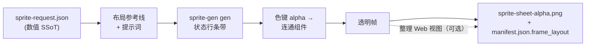

<h1 align="center">sprite-gen</h1>

<p align="center"><b>输入一张图，输出可直接用于游戏的精灵图集。</b></p>

<p align="center">

**English** · [한국어](README.ko.md) · [日本語](README.ja.md) · [简体中文](README.zh-Hans.md) · [Español](README.es.md) · [Français](README.fr.md)

</p>

---

向图像模型索要一张“sprite sheet”，你通常会得到什么：每一帧都变脸的角色、无法抠出的背景、彼此重叠并逐渐偏离网格的姿势，以及游戏引擎根本无法使用的 PNG。演示很可爱，资源毫无用处。

`sprite-gen` 是一个 Codex/Claude 技能，用来填补这个空缺。给它**一张基础图像**和一份动作列表——它会逐行驱动生成，锁定角色身份，将色键背景抠除为真正的 alpha，提取每个姿势作为干净的透明帧，并生成运行时图集，同时提供**机器可读的 `manifest.json.frame_layout`**。

而对于生成永远做不好的最后 10%，还有一个**整理 Web 视图**：并排比较帧，拒绝损坏的帧，以非破坏方式微调旋转/缩放/位置，实时观看循环——然后生成图集。流水线负责繁重工作；你保留最终审美判断。

```text
sprite-request.json → 布局参考线 + 提示词 → sprite-gen gen 状态行
→ 色键 alpha → 连通组件 → 透明帧
→ sprite-sheet-alpha.png + manifest.json.frame_layout
```


```mermaid
flowchart LR
    REQ["sprite-request.json<br/>(数值 SSoT)"] --> GUIDES["布局参考线<br/>+ 提示词"]
    GUIDES --> GEN["sprite-gen gen<br/>状态行条带"]
    GEN --> EXTRACT["色键 alpha →<br/>连通组件"]
    EXTRACT --> FRAMES["透明帧"]
    FRAMES --> ATLAS["sprite-sheet-alpha.png<br/>+ manifest.json.frame_layout"]
    FRAMES -. "整理 Web 视图（可选）" .-> ATLAS
```

> 完整架构：[`docs/architecture.md`](docs/architecture.md)

## 你实际会得到什么

- **透明精灵图集**（`sprite-sheet-alpha.png`）——真正的 alpha，没有残留的色键边缘，并且经过白色背景验证。
- **运行时清单**（`manifest.json.frame_layout`）——绝对帧矩形、每个状态的 fps 和循环标志。你的引擎采样矩形，永远不需要猜测网格。
- **可观看的 QA**——每个状态的 GIF 和联系表，因此在资源发布前，可以先以运动的方式判断运动效果。
- **诚实的标签**——简短易读的动作（idle、jump、attack、wave）是稳定路径；循环移动（walk/run）除非运动 QA 实际通过，否则会标记为实验性。不会默默过度承诺。

## 色键 alpha 质量

提取器保持色键清理的确定性：软 alpha 混合分离会保留抗锯齿的发丝和细轮廓，而不是在覆盖率计算完成前就将它们剥离。

<p align="center">
  <br />
  <em>插画，洋红色键：源图、v1.12.0 peel、v1.13.0 软 alpha 混合分离。</em>
</p>

<p align="center">
  <br />
  <em>插画，绿色键：源图、v1.12.0 peel、v1.13.0 软 alpha 混合分离。</em>
</p>

<p align="center">
  <br />
  <em>像素画，洋红色键：源图、v1.12.0 peel、v1.13.0 二值化输出。</em>
</p>

<p align="center">
  <br />
  <em>像素画，绿色键：源图、v1.12.0 peel、v1.13.0 二值化输出。</em>
</p>

下面的局部放大裁剪展示了全身对比图背后的边缘细节。


## Backbone Lattice

AI 生成的“像素画”并不是像素画。方块会摇摆，边缘带有抗锯齿，而且同一行内部的格栅会漂移，因此按照均匀网格裁切时，一个方块会被涂抹到下一个方块中。社区的修复方法是“反伪像”——根据连续长度猜测方块大小并重新量化——但这样会分别测量每一帧，因此行走循环中的单元格大小会逐帧呼吸变化。

**Backbone Lattice** 会为整个主体测量一套网格，并让每一次裁切都遵循它。逐帧间距检测会汇入一个跨帧的整行共识，从而压过谐波误检；这套共识网格就是每次裁切都会吸附到的*主干*。裁切落在实际的颜色边界上，而与测得间距成比例的最小单元格宽度，则确保相邻裁切不会塌缩到同一条带上。一条主干，就能让同一个方块在整个动画中保持相同大小，而不是在帧与帧之间跳动。

相同的源条带，相同的固定调色板。唯一的变量是引擎。

它是在整个项目上完成验证的，而不是挑选某一帧：一个实际运行中的游戏共有 94 次像素级精确运行，所有运行都从各自的源条带重新推导，并与最终发布版本逐像素进行比较。

<p align="center">
  
</p>

在 26,690,432 个规范像素中，轮廓变化了 1.41%。你批准的形状仍然是最终得到的形状；变化的是轮廓和阴影落在哪里，而这正是主干所决定的内容。

## 整理 Web 视图

生成可以完成 90%。Web 视图负责让人把结果带到*可发布状态*——它独立运行，不依赖 Studio 或框架，只要安装了该技能即可在任何地方运行（Claude Code Desktop、Codex 应用或普通终端）。


- **每个状态两行：**上方是**播放序列**，下方是**候选池**（例如第二次或第三次生成的结果）。拖动帧的 ⠿ 把手可以重新排列序列，或从候选池中提取裁切结果——从多次生成中挑选最佳帧，重新构建一个干净的运行循环。排列会被保存，因此重新打开时会恢复。
- **每帧的非破坏性变换：**拖动 = 移动，滚轮 = 缩放，顶部把手 = 旋转，左下角 = 错切，另有水平翻转开关，用于修正左右反向的输出。编辑内容保存在 `curation.json` sidecar 中——源 PNG 永远不会被重写，合成步骤会确定性地生成结果。预览和生成共用同一个仿射矩阵，因此你对齐的就是最终得到的效果。
- **实时预览**会按照状态的 fps 播放序列，支持播放/暂停、逐帧步进，以及 0.25×–4× 速度控制。
- 不仅适用于精灵：使用 `unpack_atlas_run.py --pngs-dir` 指向任意包含图像候选的文件夹（图标、徽标、生成草稿），即可将其作为通用的优胜者选择视图。

### 等距地面网格

对于等距素材集，Web 视图会叠加地面网格（来自 `meta.json` 的 tile/anchor），这样你可以使用错切把家具吸附到菱形轴线上。


### 语言

Web 视图随附英语和韩语。启动时传入 `--lang en|ko`，或使用应用内切换开关：

```bash
python3 scripts/serve_curation.py --run-dir <run-dir> --lang en   # 或 ko
```

## Python 支持

`sprite-gen` 支持 CPython 3.10+。CI 会在 GitHub 托管的运行器上运行最低支持版本（3.10）和最新覆盖版本（3.14）。

快速入门要求 Python 安装能够正常使用 `venv`/`ensurepip`。如果本地发行版在安装软件包之前执行 `python3 -m venv` 失败，请使用任意受支持版本的标准 CPython 构建，然后重新运行相同的命令。

## 快速入门

```bash
# 0. 将依赖（Pillow）安装到全新的虚拟环境中
python3 -m venv .venv && source .venv/bin/activate
pip install -e .

# 1. 从基础图像准备一次运行
python3 scripts/prepare_sprite_run.py --out-dir <run-dir> --character-id <id> --base-image base.png

# 2. 使用引擎负责的 provider CLI 为每个状态生成一张行图像
python3 scripts/generate_sprite_image.py --provider codex \
  --prompt-file <run-dir>/prompts/<state>.txt \
  --out <run-dir>/raw/<state>.png \
  --ref <run-dir>/base-source.png \
  --ref <run-dir>/references/layout-guides/<state>.png
# 3. 提取帧
python3 scripts/extract_sprite_row_frames.py --run-dir <run-dir>

# 4. （可选）在 Web 视图中整理帧
python3 scripts/serve_curation.py --run-dir <run-dir>

# 5. 生成运行时图集
python3 scripts/compose_sprite_atlas.py --run-dir <run-dir>
```

### 编辑已完成的图集

当只剩下合并后的图集时，先重建一个可供整理器使用的运行目录，然后进行整理并导出：

```bash
# 重建帧：显式指定 --grid、--manifest 矩形，或自动检测 alpha（默认）
python3 scripts/unpack_atlas_run.py --atlas sheet.png            # 自动检测
python3 scripts/unpack_atlas_run.py --manifest manifest.json     # 精确矩形
python3 scripts/unpack_atlas_run.py --pngs-dir furniture/        # 导入一组松散 PNG

# 整理后，将修正结果生成回命名 PNG
python3 scripts/export_curated_pngs.py --run-dir <run-dir>
```

输出默认会放在输入文件旁边、易于查找的 `<source>-curator` 文件夹中。

### 从导入图像中裁去背景

生成的精灵会在流水线内部使用自身的洋红色/绿色背景进行色键处理，因此不需要这一步。`cutout` 是导入/后期编辑工具：它会将一张带有不透明统一背景的图像（手绘图标、下载的精灵或截图）转换为干净的透明 PNG。

<p align="center">
  
</p>

```bash
# 根据角落颜色路由：白色/象牙色 -> matte，洋红色/绿色 -> 使用 extract 引擎
python3 -m sprite_gen.cli cutout icon.png --white-check
```

它会读取角落背景颜色并进行路由（`--key auto|white|magenta|green`）：

- **白色 / 象牙色 / solid** → position matte。角落泛洪填充只保留连通的背景（对象*内部*的明亮高光会保留，不会被孔洞化），然后由去污染的软 alpha 柔化边缘。使用 `--strength`（斜面去除）、`--band`（边缘深度）和 `--erode` 调节。
- **洋红色 / 绿色色键** → 原样复用项目已验证的 `extract` 色键引擎。色键颜色不会出现在对象中，因此这里使用仅按颜色裁切是安全的——这正是白色 matte 不需要泛洪填充保护的地方。

`--white-check` 会写入青色/洋红色/黄色合成图，因此任何残留边缘都会非常明显。适用于统一背景；不适用于复杂/非统一背景。

完整的面向智能体工作流和契约位于[`SKILL.md`](SKILL.md)。

## 安装

在 Codex 技能安装器工作流中，将此仓库作为根技能安装：

```bash
python3 ~/.codex/skills/.system/skill-installer/scripts/install-skill-from-github.py \
  --repo aldegad/sprite-gen --path .
```

### 图像生成归属

基于 provider 的生成属于该引擎（`sprite_gen.gen`）的一部分，支持的 provider 为 `codex` 和 `grok`。通用的 `image-gen` 技能只是通往同一命令的轻量转发器，因此不需要第二套 provider 实现。CLI 和验证契约请参阅[`docs/gen.md`](docs/gen.md)。

## 署名

行组件工作流受到 Apache-2.0 许可的 `hatch-pet` 技能启发，但目标是通用游戏精灵图集，并且不包含任何宠物软件包或宠物视觉资源。

## 许可证

Apache-2.0