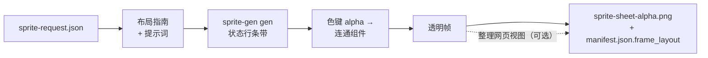

<h1 align="center">sprite-gen</h1>

<p align="center"><b>输入一张图，输出可直接用于游戏的精灵图集。</b></p>

<p align="center">

**英文** · [韩语](README.ko.md) · [日语](README.ja.md) · [简体中文](README.zh-Hans.md) · [西班牙语](README.es.md) · [法语](README.fr.md)

</p>

---

向图像模型请求一张“sprite sheet（精灵表）”，你大概知道会得到什么：角色的脸每帧都在变化，背景无法抠掉，姿势相互重叠并且偏离网格，还有一张游戏引擎根本无法实际使用的 PNG。演示很可爱，资源却毫无用处。

`sprite-gen` 是一个 Codex/Claude 技能，用来填补这一空白。给它**一张基础图像**和一组动作——它会逐行驱动生成，锁定角色身份，将色键背景去除为真正的 alpha，提取每个姿势作为干净的透明帧，并构建运行时图集，同时生成**机器可读的 `manifest.json.frame_layout`**。

而对于生成模型永远做不好的最后 10%，还有一个**整理网页视图**：并排比较帧，拒绝损坏的帧，以非破坏方式微调旋转/缩放/位置，实时观看循环——然后进行构建。流水线负责繁重劳动；审美由你掌握。

```text
sprite-request.json → 布局指南 + 提示词 → sprite-gen gen 状态行
→ 色键 alpha → 连通组件 → 透明帧
→ sprite-sheet-alpha.png + manifest.json.frame_layout
```


```mermaid
flowchart LR
    REQ["sprite-request.json<br/（数值 SSoT）"] --> GUIDES["布局指南<br/>+ 提示词"]
    GUIDES --> GEN["sprite-gen gen<br/>状态行条带"]
    GEN --> EXTRACT["色键 alpha →<br/>连通组件"]
    EXTRACT --> FRAMES["透明帧"]
    FRAMES --> ATLAS["sprite-sheet-alpha.png<br/>+ manifest.json.frame_layout"]
    FRAMES -. "整理网页视图（可选）" .-> ATLAS
```

> 完整架构：[`docs/architecture.md`](docs/architecture.md)

## 示例输出

使用此技能生成并整理的精灵（`claudecy`、`howl`）：

<p>
  
  
  
  
  
  
  
</p>

## 你实际得到的内容

- **透明精灵图集**（`sprite-sheet-alpha.png`）——真正的 alpha，没有残留的色键边缘，并且已通过白色背景验证。
- **运行时清单**（`manifest.json.frame_layout`）——绝对帧矩形、每个状态的 fps 和循环标志。你的引擎采样矩形，而不是猜测网格。
- **可观看的 QA**——每个状态的 GIF 和联系表，因此在发布前可以将动作作为动作来评判。
- **诚实的标签**——简短易读的动作（idle、jump、attack、wave）是稳定路径；循环移动（walk/run）只有在动作 QA 实际通过后才会被标记为稳定，否则标记为实验性。不会默默过度承诺。

## 色键 alpha 质量

提取器保持色键清理的确定性：软 alpha 解混会保留抗锯齿的发丝和细线条，而不是在覆盖率得到解决之前就将它们剥离。

<p align="center">
  <br />
  <em>插画，洋红色键：源图、v1.12.0 剥离、v1.13.0 软 alpha 解混。</em>
</p>

<p align="center">
  <br />
  <em>插画，绿色键：源图、v1.12.0 剥离、v1.13.0 软 alpha 解混。</em>
</p>

<p align="center">
  <br />
  <em>像素画，洋红色键：源图、v1.12.0 剥离、v1.13.0 二值化输出。</em>
</p>

<p align="center">
  <br />
  <em>像素画，绿色键：源图、v1.12.0 剥离、v1.13.0 二值化输出。</em>
</p>

下面的局部放大图展示了全身对比图背后的边缘细节。


## Backbone Lattice

AI 生成的“像素画”并不是像素画。方块会抖动，边缘带有抗锯齿，同一行内的网格也会漂移，因此按照均匀网格切割时，一个方块会被涂抹到下一个方块中。社区的修复方法是“取消伪像素化”——根据连续长度猜测方块大小并重新量化——但它会分别测量每一帧，因此行走循环的单元格大小会在帧与帧之间呼吸变化。

**Backbone Lattice** 为整个主体测量一套网格，并让每次切割都遵循它。每帧的间距检测会输入一个覆盖整行、跨帧的共识结果，从而压过谐波误检；这套共识网格就是每次切割都会对齐的*骨架*。切口落在真实的颜色边界上，与测得间距成比例的最小单元格宽度，则确保相邻切口不会塌缩到同一条带上。一套骨架让同一个方块在整个动画中保持相同大小，而不是在不同帧之间跳变。

结果会根据实际发布的内容进行验证，而不是凭人工挑选的一帧目测：每个像素级精确运行都会从其自身的源条带重新推导，并逐像素进行比较。你批准的形状仍然是最终得到的形状；变化的只有轮廓和阴影落在哪里，而这正是骨架所决定的部分。

## 整理网页视图

生成能完成 90%。网页视图则是人类将其带到*可发布状态*的地方——它是独立的，不依赖 Studio 或框架，只要安装了该技能就能运行（Claude Code Desktop、Codex 应用或普通终端均可）。


- **每个状态两行：**顶部是**播放序列**，底部是**候选池**（例如第二次或第三次生成结果）。拖动帧的 ⠿ 控件可重新排列序列，或将一个切好的帧从候选池拖上来——从多次生成结果中选出最佳帧，重建一个干净的运行循环。排列会被保存，因此重新打开后会恢复。
- **每帧非破坏性变换：**拖动 = 移动，滚轮 = 缩放，顶部控件 = 旋转，左下角 = 错切，另有水平翻转开关，用于处理左右反转的输出。编辑内容保存在 `curation.json` sidecar 文件中——源 PNG 永远不会被重写，组合步骤会确定性地构建结果。预览与构建共享同一个仿射矩阵，因此你对齐的内容就是最终得到的内容。
- **实时预览**会按照状态的 fps 播放序列，并提供播放/暂停、逐帧步进和 0.25×–4× 速度控制。
- 不仅适用于精灵：使用 `unpack_atlas_run.py --pngs-dir` 指向任意包含图像候选的文件夹（图标、徽标、生成草稿），即可将其作为通用的优胜者选择视图。

### 等距地面网格

对于等距图集，网页视图会叠加地面网格（来自 `meta.json` 的 tile/anchor），这样你可以使用错切控件，将家具吸附到菱形轴线上。


### 语言

网页视图内置英文和韩文。启动时传入 `--lang en|ko`，或使用应用内切换开关：

```bash
python3 scripts/serve_curation.py --run-dir <run-dir> --lang en   # 或 ko
```

## Python 支持

`sprite-gen` 支持 CPython 3.10+。CI 会在 GitHub 托管的运行器上运行最低支持版本（3.10）和最新覆盖版本（3.14）。

快速开始需要一个可正常使用 `venv`/`ensurepip` 的 Python 安装。如果本地发行版在安装包之前执行 `python3 -m venv` 失败，请使用任意受支持版本的标准 CPython 构建，并重新运行相同的命令。

## 快速开始

```bash
# 0. 将依赖项（Pillow）安装到新的虚拟环境中
python3 -m venv .venv && source .venv/bin/activate
pip install -e .

# 1. 从基础图像准备一次运行
python3 scripts/prepare_sprite_run.py --out-dir <run-dir> --character-id <id> --base-image base.png

# 2. 使用引擎拥有的 provider CLI，为每个状态生成一张行图像
python3 scripts/generate_sprite_image.py --provider codex \
  --prompt-file <run-dir>/prompts/<state>.txt \
  --out <run-dir>/raw/<state>.png \
  --ref <run-dir>/base-source.png \
  --ref <run-dir>/references/layout-guides/<state>.png
# 3. 提取帧
python3 scripts/extract_sprite_row_frames.py --run-dir <run-dir>

# 4. （可选）在网页视图中整理帧
python3 scripts/serve_curation.py --run-dir <run-dir>

# 5. 构建运行时图集
python3 scripts/compose_sprite_atlas.py --run-dir <run-dir>
```

### 编辑已完成的图集

当只剩下合并后的图集时，重新构建一个适合整理的运行目录，然后进行整理并导出：

```bash
# 重建帧：显式使用 --grid、--manifest 矩形，或自动检测 alpha（默认）
python3 scripts/unpack_atlas_run.py --atlas sheet.png            # 自动检测
python3 scripts/unpack_atlas_run.py --manifest manifest.json     # 精确矩形
python3 scripts/unpack_atlas_run.py --pngs-dir furniture/        # 导入一组散装 PNG

# 整理后，将修正内容构建回带名称的 PNG
python3 scripts/export_curated_pngs.py --run-dir <run-dir>
```

输出默认位于输入文件旁边、易于查找的 `<source>-curator` 文件夹中。

### 从导入图像中去除背景

生成的精灵在流水线内部会使用自身的洋红色/绿色背景进行色键处理，因此不需要执行此操作。`cutout` 是导入/后期编辑工具：对于一张带有不透明纯色背景的图像（手绘图标、下载的精灵、截图），它会将其转换为干净的透明 PNG。

<p align="center">
  
</p>

```bash
# 根据角落颜色选择路径：白色/象牙色 -> matte，洋红色/绿色 -> 使用提取引擎
python3 -m sprite_gen.cli cutout icon.png --white-check
```

它会读取角落背景颜色并选择路径（`--key auto|white|magenta|green`）：

- **白色 / 象牙色 / 纯色** → position matte。角落泛洪填充只保留连通的背景（对象*内部*明亮的高光仍会保留，不会形成孔洞），然后由去污染的软 alpha 为边缘添加羽化效果。使用 `--strength`（斜面去除）、`--band`（边缘深度）、`--erode` 进行调整。
- **洋红色 / 绿色键** → 原样复用项目经过验证的 `extract` 色键引擎。键色不会出现在对象中，因此此处使用仅基于颜色的切割是安全的——而这正是白色 matte 不需要泛洪填充保护的地方。

`--white-check` 会写入青色/洋红色/黄色合成图，因此任何残留边缘都会明显暴露。适用于纯色背景；不适用于复杂/非均匀背景。

完整的面向智能体的工作流与契约位于 [`SKILL.md`](SKILL.md)。

## 安装

通过 Codex 技能安装器工作流，将此仓库安装为根技能：

```bash
python3 ~/.codex/skills/.system/skill-installer/scripts/install-skill-from-github.py \
  --repo aldegad/sprite-gen --path .
```

### 图像生成归属

基于 provider 的生成属于此引擎（`sprite_gen.gen`）的一部分，支持的 provider 为 `codex` 和 `grok`。通用的 `image-gen` 技能只是同一命令的薄封装，因此不需要第二套 provider 实现。有关 CLI 和验证契约，请参阅 [`docs/gen.md`](docs/gen.md)。

## 署名

组件行工作流的灵感来自采用 Apache-2.0 许可证的 `hatch-pet` 技能，但本项目面向通用游戏精灵图集，不包含任何宠物包或宠物视觉资源。

## 许可证

Apache-2.0