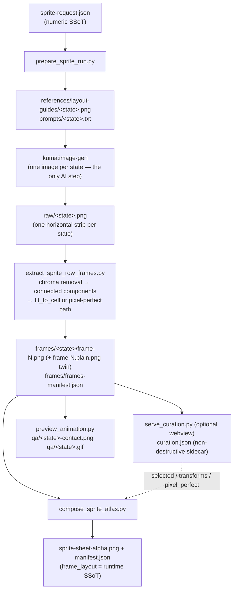
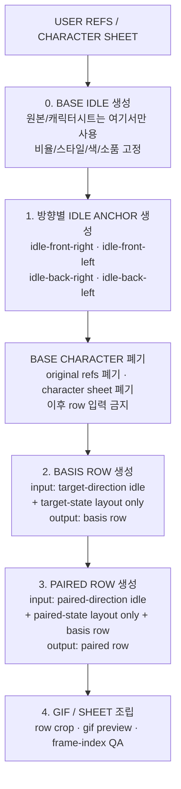

# sprite-gen — Implemented Architecture

> Status: reference (describes the code as it actually is, v1.10.x, 2026-07-08).
> Canonical behavior contract lives in [`../SKILL.md`](../SKILL.md); this doc
> explains *how* the scripts realize that contract. If this doc and `SKILL.md`
> ever disagree, `SKILL.md` wins and this doc is the bug.

## 1. One sentence

A character image plus a numeric request becomes a transparent sprite atlas by
generating **one horizontal strip per animation state**, cleaning chroma,
extracting poses as connected components, refitting each pose into a fixed cell
(optionally through the deterministic pixel-perfect path), and packing the
cells into a single sheet described by a runtime manifest.



## 2. Stage ownership (each script does one job)

| Stage | Script | Input | Output |
|---|---|---|---|
| Prepare | `prepare_sprite_run.py` | base image + request flags/JSON | `sprite-request.json`, per-state layout guide, per-state prompt, empty `raw/`+`frames/` |
| Generate | `kuma:image-gen` (external) | `prompts/<state>.txt` + refs | `raw/<state>.png` strip |
| Extract | `extract_sprite_row_frames.py` | `raw/<state>.png` | `frames/<state>/frame-N.png` (+ `.plain.png` twin on pixel-perfect runs), `frames/frames-manifest.json` |
| Curate (opt) | `serve_curation.py` + `curation.py` | `frames/` | `curation.json` sidecar |
| Compose | `compose_sprite_atlas.py` | `frames/` + `curation.json` | `sprite-sheet-alpha.png`, `manifest.json`, `*.report.json` |
| QA | `preview_animation.py` | `frames/` | `qa/<state>-contact.png`, `qa/<state>.gif` |
| GIF export | `compose_sprite_gif.py`, `gif_utils.py` | selected frames | clean transparent GIF |
| Selected cycle | `compose_selected_cycle.py` | `curation.json` / `--frames` | selected-cycle manifest + QA |
| Inverse / import | `unpack_atlas_run.py` | finished atlas **or** `--pngs-dir` | curator-ready run dir |
| Export stills | `export_curated_pngs.py` | curated `frames/` | named PNGs under `<run-dir>/curated/` |
| Chroma guard | `check_visible_magenta.py` | screenshot | leakage warning |

The scripts are explicit pipeline commands, not hidden imports. The shared
imports are `curation.py` (schema + transform math + the `frame_variant`/
`frame_filename` resolver, kept single-source so the webview server and the
compose scripts cannot drift) and `runio.py` (safe run-dir IO: a single-writer
lock file `.sprite-gen.lock` taken by the extract/compose/export/unpack
writers, plus atomic temp+`os.replace` writes for frames, atlas, and
manifests). The lock enforces the "one worker owns one character folder" rule
at runtime — a second writer on the same run dir fails loudly with the holder's
pid; a dead holder's lock is reclaimed automatically. `curation.json` stays
outside the lock: the webview writes it atomically and compose reads one
consistent snapshot, so human edit sessions never block on a running compose.

## 3. The numeric SSoT: `sprite-request.json`

Every run starts here. It owns the recipe consumed by both prompts and scripts:

```json
{
  "version": 1,
  "kind": "sprite-gen-request",
  "engine": "component-row",
  "character": { "id": "howl", "description": "...", "base_image": "base-source.png" },
  "cell": { "shape": "square", "size": 256, "safe_margin": 24 },
  "chroma_key": { "name": "magenta", "hex": "#FF00FF", "rgb": [255, 0, 255] },
  "states": { "idle": { "frames": 4, "fps": 4, "loop": true, "action": "..." } },
  "fit": { "pixel_perfect": true, "logical_height": 64, "palette_size": 24, "align_x": "foot-centroid", "align_y": "bottom" },
  "style": "...",
  "motion_phase_guides": false
}
```

- `character.base_image` is the canonical identity source for the *pre-idle*
  phase only (see §5).
- `chroma_key` is chosen by sampling the base image (`--chroma-key auto`) unless
  forced. The key is picked **away from the subject's dominant hue** because
  extraction eats chroma-adjacent tint (behavior contract:
  [`chroma-alpha.md`](chroma-alpha.md)).
- `states` is a free map; `frames`/`fps`/`loop`/`action` per state.
- `fit` is optional (absent = legacy behavior): `resample`/`align_x`/`align_y`
  tuning, or the full deterministic `pixel_perfect` mode (§6.1). Behavior
  contract: [`pixel-perfect.md`](pixel-perfect.md).
- `motion_phase_guides` only does something for 8-frame locomotion states.

## 4. The cell model (read this — it is the most misunderstood part)

There is exactly **one** `cell` object, and it drives **all three** geometry
stages identically:

1. **Generation** — `draw_guide()` renders a guide of `frames * cell_width`
   wide × `cell_height` tall, and `row_prompt()` tells the model to treat the
   strip as "invisible `cell_width`×`cell_height` frame slots".
2. **Extraction** — `fit_to_cell()` refits each extracted pose into a
   `cell_width`×`cell_height` transparent cell.
3. **Atlas** — `compose_sprite_atlas.py` places every frame into a
   `cell_width`×`cell_height` slot; the sheet is
   `max_frames*cell_width` × `num_states*cell_height`.

### 4.1 Square vs rect — variabilized, but a single shape

`size` is a variable, not a hidden constant. The cell may be square or rect:

```json
"cell": { "shape": "square", "size": 256, "safe_margin": 24 }
"cell": { "shape": "rect", "width": 192, "height": 208, "safe_margin_x": 18, "safe_margin_y": 16 }
```

`normalize_cell()` derives `shape` from `width == height`. **Default is square
256.** Picking `rect` makes the cell taller (hatch-pet-style) — but that one
shape is then used end-to-end, generation *and* output alike.

### 4.2 Design note: one cell, NOT a two-stage tall→square transform

A common mental model is "generate in a tall/portrait cell to save image area,
then cut/place into a square cell for the final atlas." **The code does not do
this.** There is no separate `gen_cell` vs `atlas_cell`; the generated strip and
the final atlas share the same `cell`. If you generate rect, the atlas is rect;
if you generate square, the atlas is square.

What *is* true, and what makes a two-stage model only a small step away:
extraction is **content-based, not slot-based**. `connected_components()` finds
each pose blob, groups blobs by x-center, and `fit_to_cell()` crops the content
bbox, rescales it preserving aspect ratio (`scale = min(...) ≤ 1.0`), and
centers it in the target cell. So the refit already decouples a pose from the
strip's pixel dimensions — a future change could feed a tall `gen_cell` to the
guide/prompt and a square `atlas_cell` to `fit_to_cell`/compose without touching
the extraction core. Today, that separation is not wired.

## 5. Idle-anchor architecture (identity ownership)

Stage 0 is a BLOCKING gate (the gate question and the five lock criteria live
in [`../SKILL.md`](../SKILL.md)). The ownership rule:

```text
identity truth = accepted idle anchor
motion truth   = layout guide + paired/basis row when needed
base truth     = used only to create idle anchors, then dropped from row inputs
```

Base character images, original character sheets, and broad style references
are allowed **only** before idle anchors are accepted. Once an idle anchor
exists for the requested direction, later state rows must not attach the base
character image as insurance. Re-attaching base makes the row model solve
identity again and weakens the purpose of the idle-anchor workflow.

Reference ownership flow:



- The prompt text in `row_prompt()` enforces this ("Anchor lock" block):
  identity comes from the anchor, the row owns motion only.
- Default/simple states (`idle`/`jump`/`attack`/`wave`) skip the multi-anchor
  chain. Directional / 45° / locomotion use the chain documented in
  [`directional-anchor-workflow.md`](directional-anchor-workflow.md).

## 6. Extraction internals (`extract_sprite_row_frames.py`)

1. `remove_chroma_background()` — drop near-key pixels (color-distance ball,
   `--key-threshold` default 96), clear fully-transparent RGB, then solve
   chroma-tinted boundary blends into despilled RGB + soft alpha. In-band
   blends are limited to key-distance `<= 2`; out-of-band blends use
   `--fringe-unmix-reach` (default 4). Small trapped spill clusters are
   despilled in place, while deeper key-tinted subject material survives.
2. `connected_components()` — flood-fill alpha blobs, record bbox + area +
   x-center.
3. `extract_component_frames()` — pick `frame_count` seed blobs by area, sort by
   x-center, attach smaller noise blobs to the nearest seed; one group = one
   pose. If it cannot find `frame_count` poses, the row is **blocked** (no
   silent fallback). `--allow-slot-fallback` exists for debugging only and is
   reported as `method: slots-explicit`.
4. `fit_to_cell()` — crop, aspect-preserving downscale (`resample`:
   lanczos | nearest | kcentroid), `align_x`/`align_y` placement, into the
   cell. On `fit.pixel_perfect` runs this legacy path still runs once per
   frame to produce the `.plain.png` twin (§6.1); the canonical frame goes
   through the pixel-perfect path instead.
5. `inspect_frames()` — per-frame QA: empty/sparse, edge bleed, chroma-adjacent
   pixels, size outliers → `frames-manifest.json`.

This is intentionally closer to hatch-pet's cleanup than to a plain
`magick -transparent`.

### 6.1 Pixel-perfect path (`fit.pixel_perfect`, deterministic)

The behavior contract is [`pixel-perfect.md`](pixel-perfect.md); this is how
the code realizes it. The path is unfake.js/pixeldetector-style and contains
**no model call and no non-integer resampling** — same input, same output:

1. **Pitch detection** — `detect_pixel_pitch()` scores each candidate pitch by
   edge-to-gridline alignment (the fraction of color boundaries landing within
   ±w of grid lines, minus the chance expectation `(2w+1)/p`) and takes the
   argmax. Detection runs **per frame**; the **median** across frames becomes
   the consensus pitch (multiple-of-pitch traps are avoided, outlier frames are
   warned). If detection confidence is too low, `fit.pitch_hint` (usually the
   base image's detected pitch) is used.
2. **Grid-phase snap** — `_grid_phase()` re-derives the grid offset **per
   frame**, then `grid_snap_downscale()` collapses each detected pixel block to
   one output pixel via `_dominant_block_color()` voting. `detail_bias`
   (default true) prefers a near-black minority cluster (share ≥ 0.40,
   luma < 70/255) so eyes and 1px outlines survive dominant voting.
3. **Conform to logical size** — `conform_row_logical()` scales every frame of
   the row to `logical_height` (kCentroid, `_kcentroid_downscale()`);
   `logical_height` omitted = cell height 1:1.
4. **Alpha binarization** — `binarize_alpha()`, applied on the snap/conform
   outputs so every logical pixel is fully opaque or fully transparent.
5. **Inter-frame registration** — `register_row_frames()` aligns frames on the
   stable upper body (alpha overlap, small slack), so locomotion rows don't
   jitter on per-frame content changes.
6. **Shared palette** — `build_shared_palette()` + `apply_palette()`: one
   run-wide median-cut palette (`palette_size`) kills frame-to-frame color
   flicker.
7. **Outline** — `enforce_outline()` draws a uniform 1px silhouette outline.
8. **Integer placement** — `fit_pixel_perfect()` / `row_placement()` upscale by
   the integer factor `cell_height // logical_height` (NEAREST) and place with
   row-constant offsets honoring `align_x`/`align_y`.

Alongside each canonical `frame-N.png`, the extractor writes the pre-pixel-
perfect twin `frame-N.plain.png` (same strip through the legacy fit path; if
twin production fails it is a warning, only the plain twin is dropped). The
curation webview toggles between the two for display, and
`curation.json.pixel_perfect: false` makes compose/GIF/PNG export bake the
`.plain.png` variant — missing plain files are a hard error, not a silent
fallback. The chosen variant is recorded as `frame_variant` in reports and the
manifest.

## 7. Curation sidecar (`curation.json`)

Optional, **non-destructive**. Written by the webview (`serve_curation.py`),
consumed by `compose_sprite_atlas.py` and `compose_selected_cycle.py`. The
original `frames/<state>/frame-N.png` files are never rewritten.

```json
{ "version": 1, "kind": "sprite-gen-curation",
  "pixel_perfect": true,
  "states": { "idle": { "selected": [0,2,3], "order": [0,2,3,1],
    "transforms": { "0": { "rotate": 15, "scale": 1.2, "dx": 10, "dy": -8, "flipX": 0 } } } } }
```

- `pixel_perfect` — top-level bake decision: `false` → compose/export bake the
  `.plain.png` twins (§6.1); absent/`true` → canonical `frame-N.png`.
- `selected` — 0-based indices in play order; absent → all frames in order.
- `order` — webview-owned full display order (sequence row then candidate-pool
  row) so reopening the curator restores both rows; compose ignores it and
  keys off `selected`.
- `transforms` — per-index affine (`rotate`, `scale`, `dx`/`dy`, `shx`/`shy`
  shear, `flipX`), applied at compose time **inside** the cell so atlas
  geometry never changes.
- A state missing from the sidecar uses the all-frames identity default — an
  explicit default, not a silent fallback.
- `curation.py` owns the schema + transform math (single source for server and
  compose). Full field semantics: [`curation.md`](curation.md).

## 8. Runtime contract (`manifest.json`)

`manifest.json.frame_layout` is the runtime SSoT. Game code consumes absolute
rectangles and must not recover frame rects from alpha at runtime.

Required fields:

- `game_input: "sprite-sheet-alpha.png"`
- `degraded_static_fallback: false`
- `animation.rows.<state>` → `{ row, frames, fps, loop }`
- `frame_layout.rows.<state>[i]` → `{ x, y, w, h }` absolute atlas rects
- `frame_layout` also carries `sheetWidth/sheetHeight/cellWidth/cellHeight`
- `curation_applied` records whether a sidecar was baked; `frame_variant`
  records which frame variant (canonical / plain) was baked

Static fallback is allowed only as explicit survival output when generation is
blocked; it must not create `sprite-sheet-alpha.png` and is not a pass.

## 9. Output directory (one worker owns one character folder)

```text
<target>/assets/generated/sprites/<character-id>/
  sprite-request.json
  base-source.<ext>
  references/layout-guides/<state>.png
  prompts/<state>.txt
  raw/<state>.png
  frames/<state>/frame-N.png
  frames/<state>/frame-N.plain.png   # pixel-perfect runs only (pre-fit twin)
  frames/frames-manifest.json
  curation.json                 # optional sidecar
  sprite-sheet-alpha.png
  sprite-sheet-alpha.report.json
  manifest.json
  qa/<state>-contact.png, qa/<state>.gif
  qa-notes.md
  curated/                      # only when export_curated_pngs.py runs
```

## 10. Inverse paths (editing finished assets)

- `unpack_atlas_run.py` rebuilds a curator-ready run dir from a finished atlas
  (layout source priority: `--grid` > `--manifest` > auto-detect), or imports a
  folder of separate PNGs via `--pngs-dir` (carries a sibling `meta.json` for
  iso tile/anchor grid overlay).
- `export_curated_pngs.py` bakes the curation transform back into named PNGs
  (the deliverable for imported still sets like furniture); the single atlas is
  the deliverable for animation frames / runtime perf.

## 11. Relationship to hatch-pet

`sprite-gen` is inspired by the Apache-2.0 `hatch-pet` skill but ships no pet
assets. Shared DNA: one image-gen job **per row/state**, layout-guide grounding,
chroma cleanup, deterministic assembly scripts, contact-sheet/video QA.

Key differences:

| | hatch-pet | sprite-gen |
|---|---|---|
| Atlas | fixed 8×9, fixed 192×208 cell, 9 fixed pet states | variable state list, variable cell (square default 256) |
| Cell shape | fixed rect 192×208 | square or rect, one config end-to-end (§4) |
| Frame cut | slot-based geometry | content-based connected components + refit (+ pixel-perfect path) |
| Identity | canonical base reference reused on every row | idle-anchor ownership; base dropped after anchors |
| Curation | n/a | non-destructive `curation.json` + webview |
| Inverse | n/a | unpack atlas / import PNG pack / export stills |
| Packaging | `pet.json` + `spritesheet.webp` into `~/.codex/pets/` | runtime `manifest.json` `frame_layout` |

Both generate **row-by-row, one state per image-gen call** — neither produces a
whole atlas in a single generation.

## Related

- [`../SKILL.md`](../SKILL.md) — canonical behavior contract
- [`pixel-perfect.md`](pixel-perfect.md) — `fit`/`pixel_perfect` behavior contract
- [`curation.md`](curation.md) — webview usage + `curation.json` field semantics
- [`chroma-alpha.md`](chroma-alpha.md) — chroma key selection + alpha cleanup contract
- [`directional-anchor-workflow.md`](directional-anchor-workflow.md) — 방향성/45도 앵커 체인
- [`locomotion-curation.md`](locomotion-curation.md) — selected-cycle + clean GIF export
